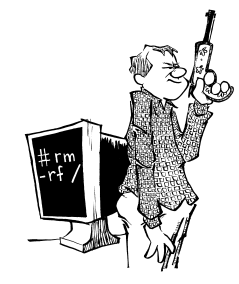

# Unix 痛恨者手册中文版

本文档由 FreeBSD 中文社区译制。

*The UNIX Hater's Handbook*

Simson L. Garfinkel、Daniel Weise、Steven Strassmann 等编著

IDG Books Worldwide, Inc. 于 1994 出版

ISBN：978-1568842035

---

伯克利最著名的两大产物是 LSD（麦角酸二乙胺，一种毒品）和 Unix。

我认为这并非巧合。

---

献给 Ken 和 Dennis，若没有他们，本书将无从谈起。
