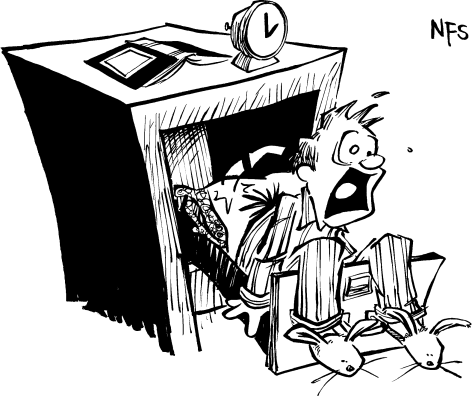

# NFS：噩梦文件系统（Nightmare File System）




> NFS（Network File System，网络文件系统）中的 “N” 代表 Not（不是），或 Need（需要），或者也许是 Nightmare（噩梦）。
> 
> — Henry Spencer

在 1980 年代中期，Sun Microsystems 开发了一个系统，让计算机能够通过网络共享文件。这个系统叫做网络文件系统，简称 NFS，该系统在很大程度上促成了 Sun 作为计算机制造商的成功。NFS 使 Sun 能够销售低价的“无盘”工作站，这些工作站将文件存储在更大的“文件服务器”上，这一切都得益于 Xerox[^1] 以太网技术的魔力。当硬盘变得足够便宜时，NFS 依然受到青睐，因为它让用户共享文件变得轻松。

如今，随着大容量存储价格的显著下降，NFS 仍然很受欢迎：它允许人们将个人文件存放在一个集中且统一的位置——网络文件服务器，并可以从本地网络的任何地方访问这些文件。NFS 甚至发展出了自己的复杂神话体系：

* NFS 文件服务器简化了网络管理，因为只需要定期对一台计算机进行备份到磁带。
* NFS 让“客户端计算机”能够将服务器上的磁盘挂载，就像这些磁盘是物理连接到自己一样。网络的存在感消失了，十几台或上百台独立工作站在用户眼中就像是一台大型的时分复用计算机。
* NFS 是“操作系统无关”的。这一点尤其令人惊讶，考虑到它是由 Unix 系统程序员设计，为 Unix 开发的，且实际上在初次发布后多年才在非 Unix 系统上测试过。然而，这也证明了 Sun Microsystems 程序员的智慧：NFS 协议中没有任何 Unix 特有的内容，任何计算机都可以作为 NFS 服务器或客户端。现在有几家公司提供针对 IBM PC 和 Apple Macintosh 等微型计算机的 NFS 客户端，似乎验证了这一说法。
* NFS 用户从不需要登录服务器；只需使用工作站即可。远程磁盘会根据需要自动挂载，文件访问对用户透明。或者，工作站可以设置为开机时自动挂载服务器上的磁盘。

但当“噩梦文件系统”发挥作用时，实践往往与理论大相径庭。


[^1]: 猜你一定不知道 Xerox 拥有以太网的专利权，对吧？

## 无法完全正常运行

NFS 基于“魔术 cookie”的概念。文件服务器上的每个文件和目录都由一个魔术 cookie 表示。要读取文件，客户端向文件服务器发送包含该文件魔术 cookie 和想要读取的字节范围的数据包。文件服务器则返回包含这些字节的数据包。同理，要读取目录内容，客户端发送目录的魔术 cookie，服务器返回远程目录中包含的文件列表及每个文件的魔术 cookie。

整个过程的起点是需要远程文件系统根目录的魔术 cookie。NFS 使用一个叫 MOUNT 的独立协议实现这一点。客户端向文件服务器的 mount 守护进程发送想要挂载的目录名，服务器返回该目录的魔术 cookie。

从设计上讲，NFS 是无连接且无状态的，但实际运行中并非如此。这种设计与实现的冲突是大多数 NFS 问题的根源。

“无连接”意味着服务器不为每个客户端保持连接。NFS 使用互联网 UDP 协议在客户端和服务器之间传输信息。了解网络协议的人知道 UDP 是“不可靠的数据报协议”，因为它不能保证数据包一定会被送达。但没关系：如果请求的回复没收到，NFS 客户端会等待几毫秒然后重发请求。

“无状态”意味着客户端保存挂载远程文件系统所需的全部信息，而服务器不存储额外信息。一旦文件的魔术 cookie 发出，只要文件存在且服务器配置没有重大改变，这个文件句柄就一直有效，即便服务器重启。

Sun 曾宣称无连接、无状态系统的优点是：服务器崩溃重启时，客户端仍能继续使用网络文件服务器，因为无需重新建立连接，所有远程挂载的状态信息都存储在客户端。事实上，这主要是为了 Sun 工程师的方便——他们无需写额外代码来优雅处理服务器和客户端的崩溃与重启。这在 Sun 早期频繁崩溃时非常重要。

然而，无连接无状态系统只有一个问题：它根本不管用。文件系统本质上是有状态的。你只能删除文件一次，删除后它就不存在了。因此，查看 NFS 代码时，你会发现大量的临时补丁和折中方案，都是为了在无状态协议上强行加上状态。

### Cookie 失效

多年来，Sun 发现了许多 NFS 崩溃的情形。Sun 并没有从根本上重新设计 NFS，而只是对其进行了各种补丁式的修改。下面我们来看几个典型场景，看看 NFS 的模型是如何崩溃的：

**示例一：**

NFS 是无状态的，但许多 Unix 系统的程序为了保证数据库一致性，需要记录锁（record locking）。

**NFS 补丁方案一：**
Sun 发明了一个网络锁协议和一个锁守护进程 lockd。这套网络锁机制具备所有 NFS 设计上要避免的“状态”及其相关问题。

**补丁为何无效：**
如果服务器崩溃，锁就会丢失。为此，必须在崩溃后执行一套复杂的重启恢复过程。显然，当初将 NFS 设计为无状态的目的，就是为了避免需要这种恢复过程。如果一开始就把这个复杂性纳入主协议中进行处理，而不是藏在一个鲜有人测试、仅对锁有用的 lockd 程序里，它本可以被彻底调试并对所有程序都可用。


**示例二：**

NFS 基于 UDP 协议；如果客户端的请求没有得到响应，它就会不断重发请求，直到收到答复。如果服务器正在为一个客户端执行耗时任务，其他客户端会继续对服务器进行重复或多次的 NFS 请求轰炸，而不是排队等待。

**NFS 补丁方案二：**
当客户端没收到服务器响应时，会先暂停几毫秒再重发请求。若仍无回应，则等待时间翻倍，再次重发。依此类推，指数级回退。

**补丁为何无效：**
问题在于该策略需要针对每个 NFS 服务器、每张网络单独调整。多数情况下，这种“调优”并不会进行。于是延迟累积，性能下降，系统变慢。最终系统管理员只能抱怨，公司也只能掏钱换更快的 LAN、租线或网络集中器，试图用堆钱的方式摆平问题。


**示例三：**

在 Unix 中，如果删除了一个仍然被打开的文件，其文件名会从目录中移除，但磁盘块仍会保留，直到该文件被关闭。这一恶心的 hack 允许程序创建其他程序无法访问的临时文件。（Unix 创建临时文件的另一个办法是使用 `mktmp()` 函数，在 `/tmp` 目录下以进程 ID 命名的方式创建临时文件。至于这两种方式哪个更恶心，就留给读者自己判断了。）但这个 hack 在 NFS 中是行不通的。由于协议无状态，它无法知道文件是“已打开”的——一旦删除，就彻底没了。

**NFS 补丁方案三：**
当客户端删除一个正在打开的文件时，它实际上会将该文件重命名为一个类似 `.nfs0003234320` 这种名字的文件。由于文件名以句点开头，它不会出现在正常的文件列表中。当客户端关闭文件时，会发送 Delete-File 命令删除该 NFS 点文件。

**补丁为何无效：**
如果客户端崩溃了，这个点文件就永远不会被删掉。因此，NFS 服务器必须每天运行夜间“清理” shell 脚本，查找所有像 `.nfs0003234320` 这种名字、存在时间超过几天的文件，并自动删除。这就是为什么大多数 Unix 系统每天凌晨 2 点突然卡顿——它们正在拼命跑 `find`。如果你出去度假前忘记关掉还在运行的 `mail(1)` 程序，你的邮件文件可能等不到你回来。（不是开玩笑！）


所以，尽管 NFS 以“无状态”文件系统自居，这一切都是谎言。服务器满满都是状态——整个磁盘都是。客户端的每一个进程也都带着状态。真正“无状态”的，只有 NFS 协议而已。而那些已经变成 NFS “标准”的每一个恶心补丁，都是试图掩盖这个谎言、美化它、让人觉得“其实也没那么糟”。

### 没有文件安全性

把你的计算机连接到网络，就等于潜在地允许世界上每一个长满青春痘的十岁小黑客读取你的情书、在你的源代码里随意插入逗号，甚至伪造一封你的辞职信投递到你老板的邮箱里。你最好确保你的网络文件系统内建了某种安全机制，能防止这类攻击。

不幸的是，NFS 并不是为安全而设计的。事实上，这个协议根本没有安全性。

如果你给一个 NFS 文件服务器提供了某个文件的有效句柄（handle），服务器就会毫无保留地让你为所欲为。尽情去写吧、去改吧：服务器甚至没有能力记录下是哪一台工作站对这个文件下手了。

麻省理工学院的 Athena 项目曾试图通过一个叫 **Kerberos** 的网络安全系统为 NFS 增加安全性。结果，正如它的名字所示，这个混合系统简直就是一只真正的狗屎堆，Alan Bawden 就是这样发现的。

> 日期：1991 年 1 月 31 日 星期四 12:49:31 EST
> 
> 发件人：Alan Bawden [alan@ai.mit.edu](mailto:alan@ai.mit.edu)
> 
> 收件人：UNIX-HATERS
> 
> 主题：巫师与 Kerberos
>
> 当你去找 Unix 痴迷者寻求建议时，他永远不会一次性告诉你你需要知道的一切，真是太棒了。你必须一次次地回去找他，他才能根据你不断遇到的问题，像按需分页一样把必要的信息告诉你。
>
> 举个例子：我刚开始在 LCS 使用 Unix 机器时，发现自己无法通过 NFS 修改远程文件。内行人告诉我，我得去找一位“至尊大巫师”，他会把我的名字和密码加进 “Kerberos” 数据库。于是我就去了。至尊大巫师告诉我，一切都设置好了：从现在起，每次登录我都会自动获得适当的网络权限。
>
> 然而第一次尝试时，并没有成功。于是我又去找 Unix 内行人打听。哦，对了，他们忘了告诉我：要使用 Kerberos 权限访问 NFS，还必须运行 `nfsauth` 程序。
>
> 好吧，我编辑了我的 `.login` 文件来运行 `nfsauth`。让我略感恼火的是，`nfsauth` 要求我列出计划使用的所有 NFS 服务器的名称。还有个奇怪的地方是，`nfsauth` 并不是只运行一次，而是会一直在后台运行直到我注销。显然，它需要每隔几分钟更新某些权限。这一切的后果暂时还看不出来，不过一切看起来似乎运行良好，于是我继续工作。
>
> 八小时过去了。
>
> 是时候收拾回家了，我尝试把文件写回网络，结果被拒绝访问。该死。但这次我不需要再去找 Unix 痴迷者了，因为当初设置 Kerberos 数据库时他们确实提醒过我：Kerberos 权限会在八小时后过期。他们甚至还提到，我可以运行 `kinit` 程序来续期。所以我运行了 `kinit`，再次输入了用户名和密码。


### Export 列表

NFS 不可能在毫无安全保障的情况下推向市场，因此它的设计者给它加上了表面上的安全性，却没有走完实现安全协议所需的正规流程。

还记得吗，如果你没有某个文件的 magic cookie，你就无法对它进行任何修改。所以在 NFS 的理论中，只要你控制了 magic cookie 的获取，你就控制了对文件的访问。

而要获得某个文件系统根目录的 magic cookie，你需要先挂载该文件系统。所谓的“安全性”就是从这里开始的。服务器上的一个特殊文件 `/etc/exports` 记录了哪些文件系统可以被导出，以及允许导出到哪些客户端机器。

但不幸的是，没有任何机制阻止恶意程序去猜测这些 magic cookie。而且在实践中，猜测 cookie 并不太困难。从不在导出列表中开始攻破 NFS 服务器，所需时间从几秒钟提升到了几个小时——但也仅此而已。而且，由于服务器是无状态的，一旦一个 cookie 被猜到（或合法获得），它就会永久有效。

在现代通过防火墙保护的网络环境中，NFS 最大的安全风险并不来自外部攻击者，而是来自拥有授权访问权限的内部用户：他们可以利用 NFS 的结构，不仅访问自己的文件，还能轻易地访问别人的文件。

由于是无状态的，NFS 服务器对“登录”这个概念一无所知。当然，你确实在你的工作站上登录了，但服务器并不知道。当你向服务器发送 magic cookie 请求读写文件时，你同时告诉服务器你的用户 ID。想读 George 的文件？只要把你的 UID 改成 George 的，就能直接读！反正大多数工作站都可以轻松进入单用户模式。

NFS 的“妙处”在于：一旦你攻破了一台客户端机器，你也就等于攻破了服务器。

不想费劲去把工作站重启到单用户模式？也没关系！你只需要写个 500 行的 C 程序，或者从网上随便找一份现成的，就能运行用户态程序直接向 NFS 服务器发请求，访问任何人的文件。

但事情还不止于此。

因为伪造网络数据包非常简单，很多 NFS 服务器都配置为禁止网络上的超级用户操作。所有网络上的 root 请求都会自动映射为一个叫做 `nobody` 的用户，该用户毫无权限。

结果就是：在 NFS 工作站上，超级用户的权限反而比普通用户还少。如果你以超级用户身份登录，却想修改服务器上某个 root 拥有的只读文件，你几乎无能为力：没有可以运行的程序，没有可以输入的密码，除非你直接登录到服务器本机上，或干脆把服务器的操作系统打补丁以移除这些“安全机制”。

Ian Horswill 在 1990 年 12 月的一个讨论中对此做了总结，当时有一位用户试图在一台机器上运行带 SUID 的邮件投递程序 `/bin/mail`，而把邮件文件放在另一台机器的 `/usr/spool/mail` 上，并通过 NFS 挂载。这一想法最后当然以安全性灾难收场。

> 日期：1990 年 12 月 7 日 星期五 12:48:50 EST
> 
> 发件人：“Ian D. Horswill” [ian@ai.mit.edu](mailto:ian@ai.mit.edu)
> 
> 收件人：UNIX-HATERS
> 
> 主题：计算宇宙论，以及 Unix 神学
>
> 事情是这样的。Sun 有个挺炫的网络文件系统。不幸的是，它没有真正的访问控制理论。这部分是因为 Unix 自己也没有。它只有两个等级：凡人和神。神（也就是 root）可以为所欲为。问题在于网络让一切变得多神论化：我的工作站上的神是否可以把你的工作站变成一根盐柱？哎呀，这就得看我的神和你的神是否关系良好，或者其实他们根本就是同一个神。这是个深刻又重要的神学问题，人类为此困惑了千百年。
>
> Sun 的内核有个用户可打补丁的宇宙论设计。它包含一个叫作 “nobody” 的多神论位。当网络文件请求以 root（也就是神）的身份发来时，它会将这些请求映射为来自 “nobody” 这个内核变量的值。这个值在发行版中设置为 -1，按约定表示根本不是任何用户，而不是 0，即神的二进制表示（\*）。默认情况下，这对应于一个希腊式的万神殿，其中有很多神，而他们都在想方设法搞别人（在希腊神话里是字面意义上的“搞”）。
>
> 然而，如果你使用 adb 将内核变量 “nobody” 设置为 0，也就是在神圣的启动映像中把它改成 0，你就可以过渡到一种巴哈伊式宇宙论，其中所有的神实际上都是唯一根神 Zero 的不同显现，从而发明了“一神论”。
>
> 因此，当神圣灵体 binmail 试图在远程服务器上创建一个邮箱时，在一神论 Unix 上，它将能调用神圣的 `chown` 命令，让邮箱足够“世俗”，以便你能触摸它而不会自燃，也不会让你的灵魂永堕地狱。而在多神论 Unix 上，binmail 并非神圣的，因此你的邮件文件会由 “nobody” 创建；当 binmail 调用神圣的 `chown` 命令时，它会收到一个错误码，但它并不会检查这个错误码，因为它相信自己事实上是无误的。
>
> 所以，要么给文件服务器打补丁，要么就在服务器上运行 sendmail。
>
> ——Ian
>
> —————————————————————
>
> （\*）神拥有二进制表示这一事实，再次清楚地表明 Unix 极具神秘主义色彩，很可能是由 Aleister Crowley 的门徒写出来的。


## 非特定于某文件系统？（不完全是）

NFS 的设计者认为他们设计了一个可以与运行非 Unix 操作系统的计算机配合使用、且能够支持非 Unix 文件系统的网络文件系统。不幸的是，他们在发布初始实现之前并没有验证这一想法，结果使该协议成为了一个无法更改的标准。如今，我们只能接受这一现实。虽然确实有为 DOS PC 和 Macintosh 等微型计算机编写的 NFS 服务器和客户端，但事实是，这些实现没有一个运行得很好的。

> 日期：1989 年 7 月 19 日 19:51:45 GMT
> 
> 发件人：[tim@hoptoad.uucp](mailto:tim@hoptoad.uucp) (Tim Maroney)
> 
> 主题：回复：NFS 和 Mac II
> 
> 新闻组：comp.protocols.nfs, comp.sys.mac[^2]
>
> 可能对一些人感兴趣的是，TOPS（Sun Microsystems 的一家公司）自被 Sun 收购起，就被指定要开发一款 Macintosh NFS，并用这款 Macintosh NFS 替代其现有产品 TOPS。去年，这一尝试被放弃了。
>
> 生产一个与 Macintosh 文件系统兼容的优质 NFS 客户端或服务器存在太多技术障碍。RPC 模型带来的效率限制是一个主要问题；NFS 协议缺乏灵活性是另一个问题。
>
> TOPS 确实与 Sun 就修改 NFS 协议以实现与 Macintosh 文件系统高效运行进行了协商。但这些协商由于 Sun 方面的阻碍而未果。
>
> 在没有对 NFS 协议进行重大修改的情况下，永远不会有一个好的 Macintosh NFS 产品。而这些修改也不会发生。
>
> 我不是想一再重复这个观点，但事实是 NFS 并不适合用于异操作系统环境。它在 Unix 系统间工作得非常好，在 Unix 与同样极其简单的 MS-DOS 文件系统间也还能勉强用。但当涉及复杂文件系统如 Macintosh 或 VMS 时，效果就不好了。虽然可以让它工作，但需要付出极大的努力，并且用户会明显感受到性能损失。
>
> NFS 所谓的跨操作系统特性，不过是 Sun 那些充满幻想的工程师们（虽然真诚）的一种臆想；这个协议特性在任何非 Unix 实现之前就已经被宣布了。
>
> Tim Maroney，Mac 软件顾问，[tim@toad.com](mailto:tim@toad.com)

[^2]: 由 Richard Mlynarik 转发给 UNIX-HATERS，附言：“许多人（但不是知名网络人物）多年来一直知道这一点。”

### 虚拟文件损坏

有什么比一个会破坏你文件的网络文件系统更糟糕的呢？一个不是真的破坏文件，而只是让它们看起来像被破坏的文件系统。NFS 有时就会这样做。

> 日期：1990 年 1 月 5 日 14:01:05 EST
> 
> 发件人：[curt@ai.mit.edu](mailto:curt@ai.mit.edu) (Curtis Fennell)[^3]
> 
> 主题：回复：NFS 问题
> 
> 收件人：[all-ai@ai.mit.edu](mailto:all-ai@ai.mit.edu)
>
> 正如大家所知，我们一直在因 Suns 操作系统中的一个 bug 遇到 NFS 问题。这个 bug 会导致看起来 NFS 挂载的文件被破坏，实际上文件是没问题的。我们已经采取了推荐的措施来解决此问题，但在 Sun 给出修复之前，这种情况偶尔仍会发生。
>
> 此问题的症状是：当你登录或访问文件时，文件看起来像是垃圾文件或完全不同的文件。它也可能影响你的 .login 文件，使你登录时看到不同的提示符或收到没有登录文件/目录的错误信息。这是因为系统在网络上加载了错误的文件指针。你的原始文件可能依然完好，但看起来是坏的。
>
> 如果你遇到这种情况，首先检查服务器上的文件是否正常。你可以直接登录到存放你文件的服务器上查看文件。
>
> 如果发现文件在本地被认为是损坏的，但服务器上的文件正常，只需在本地登出并重新登录即可。重新登录后应该一切正常。请不要尝试在本地删除或擦除这些损坏的文件，以免误删服务器上的好文件。
>
> 请记住，这个问题只是让文件看起来像是被破坏了，实际上文件并没有被破坏。
>
> 我们应该很快会有修复补丁。与此同时，请尝试我推荐的步骤。如果这些方法无效或你有任何问题，随时向我寻求帮助。
>
> ——Curt


[^3]: 由  David Chapman 转发至 Unix 痛恨者


NFS 会悄无声息地破坏文件的原因之一是，默认情况下，NFS 使用的 UDP 校验和错误检测系统是关闭的。这听起来合乎逻辑，不是吗？毕竟，计算校验和需要很长时间，而网络通常是可靠的。至少，在 1984 年和 1985 年做出这些决定时，这就是当时的技术水平。
NFS 应该能够区分文件和目录。不幸的是，不同版本的 NFS 彼此之间以奇怪的方式交互，偶尔会产生难以解释的结果。

> NFS 应该能够区分文件和目录。不幸的是，不同版本的 NFS 之间会以奇怪的方式相互作用，有时会产生无法解释的结果。
>
> 日期：1991 年 1 月 15 日 14:38:00 EST
> 
> 发件人：Judy Anderson [yduj@lucid.com](mailto:yduj@lucid.com)
> 
> 收件人：UNIX-HATERS
> 
> 主题：Unix / NFS 又来了……
> 
>```sh
> boston-harbor% rmdir foo
> rmdir: foo: 不是目录
> boston-harbor% rm foo
> rm: foo 是目录
>```
> 哎？我到底怎么做到的？？？
>
> 事情是这样的：
>```sh
> boston-harbor% mkdir foo
> boston-harbor% cat > foo
>```
> 我确实从 cat 那儿收到了错误，说 foo 是目录，不能输出。可是，由于 NFS 的“魔法”，它删除了那个目录，然后为我的 cat 输出创建了一个空文件。
>
> 当然，如果目录里有文件，那些文件就会消失得无影无踪。哎呀。这真让我的一天变得更加“愉快”…… 多么设计得如此完美的计算机系统啊。
>
> yduJ（Judy Anderson） [yduJ@lucid.com](mailto:yduJ@lucid.com)
> 
> `yduJ` 与 `fudge` 押韵

### 冻结画面！

NFS 经常会让你的计算机突然死机。这种冻结现象在许多不同版本的 NFS 下、各种不同情况下都会发生。有时这是因为文件系统被硬挂载，而文件服务器宕机了。那为什么不软挂载服务器呢？因为如果服务器是软挂载的，而且负载过重，NFS 的写回缓存问题就会导致数据损坏。

NFS 还可能因为某些程序而导致系统冻结，这些程序期望能够使用带有 POSIX 标准“排他创建”标志的 Unix 系统调用 creat()。GNU Emacs 就是这样的程序之一。当你尝试通过 NFS 挂载目录 /usr/lib/emacs/lock 时，情况就是这样的：

>日期：1991 年 9 月 18 日 02:16:03 GMT
>
>发件人：[meuer@roch.geom.umn.edu](mailto:meuer@roch.geom.umn.edu)（Mark V. Meuer）
>
>机构：明尼苏达超级计算机研究所
>
>主题：回复：NeXT 上 Emacs 文件查找延迟问题
>
>收件人：[help-gnu-emacs@prep.ai.mit.edu](mailto:help-gnu-emacs@prep.ai.mit.edu)[^4]
>
>在文章 [1991Sep16.231808.9812@s1.msi.umn.edu](mailto:1991Sep16.231808.9812@s1.msi.umn.edu) 中，
[meuer@roch.geom.umn.edu](mailto:meuer@roch.geom.umn.edu)（Mark V. Meuer）写道：
>
>>我有一台运行系统版本 2.1 的 NeXT 机器。我们运行的是 Emacs 18.55。（请不要告诉我升级到 18.57，除非你能同时提供差异说明或者至少是适用于 NeXT 的 sand m- 文件。）我们网络里有几台机器，并且使用 yellow pages。问题是，每当我尝试查找一个文件（无论是通过 “C-x C-f”，“emacs 文件” 还是通过客户端向服务器请求）时，Emacs 都会完全冻结 15 到 30 秒。然后文件才加载，一切才正常。大约十分之一的时间，文件加载是立即完成的，没有任何延迟。
>
>有好几个人给我发来了建议（谢谢！），但最终那个讨厌的延迟问题是由这里中心的一位非常聪明的同事 Scott Bertilson 解释清楚并解决的。
>
>对于遇到这个问题的人来说，一个快速的解决办法是把 `/usr/lib/emacs/lock` 做成指向 `/tmp` 的符号链接。以下是详细解释。
>
>我追踪发现，在 `/usr/lib/emacs/lock` 目录下有一个名为 `!!!SuperLock!!!` 的文件，当这个文件存在时，延迟问题就会发生；文件不存在时，延迟通常也不会出现。我们找到了导致问题的代码段。当 Emacs 尝试打开一个文件进行编辑时，它会尝试对 superlock 文件执行排他性创建（exclusive create）。如果排他性创建失败，它会再试 19 次，每次尝试之间间隔一秒钟。20 次尝试结束后，它就忽略锁文件的存在，打开用户想要编辑的文件。如果排他性创建成功，它会打开用户的文件，然后立即删除锁文件。
>
>我们遇到的问题是 `/usr/lib/emacs/lock` 通过 NFS 挂载，而显然 NFS 对排他性创建的支持不如人意。这个命令会创建文件，但返回一个错误，表示它没有创建成功。由于 Emacs 认为锁文件没有被创建成功，所以它从不删除锁文件。但实际上文件已经创建了，之后所有打开文件的尝试都会遇到这个锁文件，导致 Emacs 必须经过 20 秒的等待循环才能继续操作。这就是延迟的原因。
>
>我们用的解决办法是让 `/usr/lib/emacs/lock` 指向 `/tmp` 的符号链接，这样它总是指向本地目录，避免了 NFS 排他性创建的这个 bug。我知道这远非完美，但到目前为止它工作正常。
>
>感谢所有回应我求助的人，知道网络上有这么多好心人真的很令人感动。

任何需要获取当前目录名称的程序都会使系统冻结问题更加严重。

Unix 仍然没有提供一个简单的机制让进程发现它的“当前目录”。如果你有一个当前目录“.”，唯一知道其名称的方法是打开包含它的目录“..”（实际上是父目录），然后在那个目录中搜索一个 inode 号与当前目录“.”相同的目录，这就是你的目录名称。（注意，这个过程在目录是符号链接目标时会失败。）

幸运的是，这个过程由一个名为 getcwd() 的函数自动完成。不幸的是，使用 getcwd() 的程序会意外地导致冻结。MIT AI 实验室的 Carl R. Manning 在 1990 年底遇到了这个 bug。

>日期：1990 年 12 月 12 日 15:07 EST
>
>发件人：Jerry Roylance [glr@ai.mit.edu](mailto:glr@ai.mit.edu)
>
>主题：Emacs 需要所有文件服务器？（原主题：AB 宕机）
>
>收件人：[CarlManning@ai.mit.edu](mailto:CarlManning@ai.mit.edu)[^5]
>
>抄送：[SYSTEM-HACKERS@ai.mit.edu](mailto:SYSTEM-HACKERS@ai.mit.edu)，[SUN-FORUM@ai.mit.edu](mailto:SUN-FORUM@ai.mit.edu)
>
>>日期：1990 年 12 月 12 日 14:16 EST
>>
>>发件人：Carl R. Manning [CarlManning@ai.mit.edu](mailto:CarlManning@ai.mit.edu)
>>
>>出于好奇，为什么 Emacs 在任何文件服务器宕机时都不能启动（比如在 rice-chex 上）？
>>
>>例如，最近 AB 或 WH 因磁盘问题宕机时，我无法在 RC 上启动 Emacs，尽管我根本不打算访问 AB 或 WH 上的任何文件。
>
>这是 Sun 的脑残设计。Emacs 调用了 getcwd，而 getcwd 会遍历 /etc/mtab 中挂载的文件系统。如果其中任何一个文件系统没有响应，Emacs 就会等待超时。像 RC 这样面向公共用户的机器上，文件系统宕机是很常见的。（重启 RC 就能解决这个问题。）

启动 rice-chex 能解决问题。真不错！但希望你当时没有在这台机器上做其他重要的事情。

[^4]: 由 Michael Tiemann 转发至 Unix 痛恨者

[^5]: 由 Steve Robbins 转发至 Unix 痛恨者


### 不支持多架构


Unix 是在一个同质化的环境中设计的。不幸的是，维护一个异构环境（即使所有主机都来自同一厂商）需要非常复杂的挂载表和文件系统结构，尽管如此，有些目录（例如 /usr/etc）仍包含架构特定和架构依赖的文件混杂在一起。与其他网络文件系统（例如 Andrew File System）不同，NFS 并未考虑到不同类型的客户端可能需要在其文件系统的同一位置“看到”不同的文件。与其他操作系统（如 Mach）不同，Unix 也没有为将多种架构特定的目标模块塞入同一个文件做准备。

你能想象由此产生了怎样的问题：


>日期：1990 年 1 月 5 日 14:44 CST
>
>发件人：Chris Garrigues [7thSon@slcs.slb.com](mailto:7thSon@slcs.slb.com)
>
>主题：多架构的烦恼
>
>收件人：UNIX-HATERS
>
>我一直在搭建来自 NYSERnet 的 X.500 系统（按 Unix 标准来说，这其实是个相当不错的系统）。运行服务器需要很多代码。我把所有代码都编译了，经过一番努力，终于让它运行起来。大部分困难在于尝试编译一个跨文件系统的系统，并且假设你会以 root 身份来编译。看起来有人意识到你永远不能信任另一台系统上的 root，因此在这种情况下，root 的权限反而比我自己登录时要少。
>
>服务器运行起来后，我看到一份文档说，只要运行用户端，就需要把某些文件复制到客户端主机。由于我们使用 NFS，这些文件已经放在合适的位置，所以在所有相同架构的机器（这里是 SUN3）上都搞定了。
>
>然而，我们很多机器是 SUN4。文档里没有说明如何只编译客户端，所以我给原作者发了邮件问。他说没什么简单的方法，只能从 `./make distribution` 开始重建全部。由于这是一个庞大的系统，花了几个小时才完成，但我成功了。然后发现还有些数据文件需要复制（当然文档没写），最后才让系统正常运行。
>
>同时，我在为系统建立数据库。如果尝试加载有重复条目的数据库，系统会崩溃，但他们提供了一个程序用来扫描数据文件检查是否有问题。Makefile 里有编译这个程序的条目，但没有安装条目，所以它留在源码目录里。
>
>昨晚，我由于载入了一个损坏的数据库，把 X.500 服务器弄挂了。我手动清理了数据库，然后理智地打算用他们的程序跑一遍。可是找不到那个程序（路径极其深且恶心）。结果它被 `./make distribution` 删除了（这不就是你用来删除所有东西的命令么？）。我想，“没关系，重新编译它。”结果也失败了，因为它依赖的一些中间文件是针对另一个架构重新编译的。
>
>所以……以下几个失去的 Unix 特性让我吃了苦头：
>
>1）没有合理的用户权限位方案，只有一个万能的超级用户。
>
>2）Unix 是在没有网络的世界设计的，大多数运行在它上的系统都在某种程度上假设你只用一台主机。
>
>3）NFS 假设除了 root 访问外，客户端已经完成了用户验证；对于 root，它假设用户是恶意且不可信的。
>
>4）Unix 有种奇怪的想法，就是先在一个地方构建系统，然后把需要的东西搬到另一个地方。通常这意味着你永远找不到某个二进制对应的源码，但在异构环境下更麻烦，因为中间文件只能保留一个版本。
>
>昨晚原作者还给我发邮件让我放松，说这本该是有趣的。我在想，Usenix 参会者会不会坐在酒店房间里用美工刀扎自己腿当乐子。也许在 Usenix 会议上，他们会聚集在酒店宴会厅一起扎自己腿。

