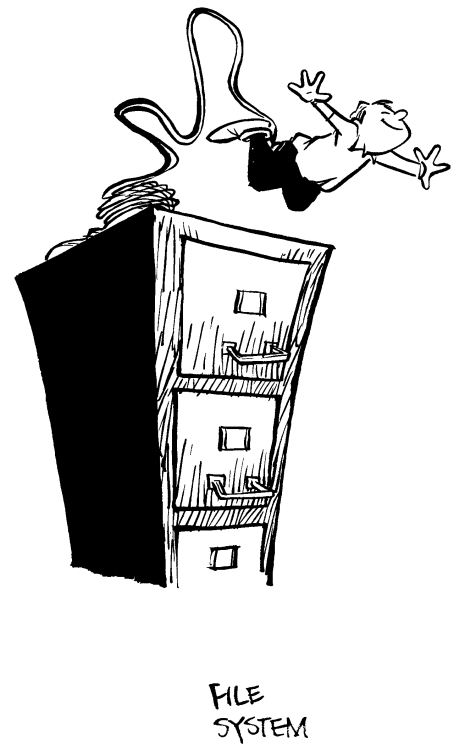

# 文件系统：它确实会损坏你的文件，但你看看它有多快！




>你把重要文件存储在 Unix 系统上，胆子还挺肥。
>
>—— Robert E. Seastrom


传统的 Unix 文件系统是一种怪诞的 hack，多年来由于其被广泛使用而被奉为“标准”。事实上，经过多年的灌输和洗脑，人们如今已经将 Unix 的缺陷奉为圭臬。这就像癌症患者的免疫系统把癌细胞奉为理想细胞一样，因为身体实在太擅长制造它们了。

早在“欢迎，新用户”那一章中，我们就开始列举 Unix 文件系统的问题。对用户而言，我们写道，最明显的缺陷是文件系统没有版本号，而 Unix 也没有“撤销删除”（undelete）功能——这两个缺陷在大多数用户手中结合起来，就像钠和水的反应一样危险。

但 Unix 文件系统真正的缺陷远不止这两个功能的缺失。它的问题不是执行层面的问题，而是意识形态的问题。在 Unix 的世界中，我们经常被告知“一切皆文件”。因此，Unix 的很多根本性缺陷也就不足为奇地根源于它的文件系统。

## 什么是文件系统？

文件系统是计算机操作系统中管理文件存储于大容量存储设备（如软盘和硬盘）上的部分。每条信息都有一个名称，称为文件名，并且（希望）在硬盘上有一个唯一的位置。文件系统的职责就是将诸如 `/etc/passwd` 这样的名称转换成硬盘上的具体位置，比如 `硬盘＃2 的块 32156`。它还支持文件块的读写操作。

尽管从概念上讲，文件系统是操作系统中可分离的一部分，但实际上，几乎所有现今使用的操作系统都带有其独特的文件系统。

### 认识一下它的亲戚们

在过去的二十年里，邪恶的继母 Unix 产生了不仅仅一款，而是四款不同的文件系统。这些继子系统在相同程序、相同环境下运行时，表现却各不相同。

开创性的 Unix 文件系统（Unix File System，UFS），这位长姐，是由贝尔实验室原始 Unix 团队在七十年代初“孕育”出来的。它最显著的特点是对文件名的自由放任：除禁止使用斜杠字符（“/”）和 ASCII NUL 外，对文件名中的字符没有限制。因此，文件名中可以包含大量不可打印（且不可输入）的字符，这个“特性”常被用于所谓的“安全”应用。哦，UFS 还限制文件名长度为 14 个字符。

加州大学伯克利分校对 UFS 进行了基因编辑，诞生了伯克利快速（但随意）文件系统（FFS）【Berkeley Fast (and loose) File System】。虽然它不算“快”，但相比它所替代的 UFS，确实快了不少，就像乌龟跑得比蛞蝓快一样。

伯克利做了很多实际而合理的改进。最重要的是，FFS 取消了 UFS 臭名昭著的 14 字符文件名限制。它还引入了许多新的且不兼容的功能，其中最重要的是符号链接——文件系统中的条目可以指向其他文件、目录、设备等。然而，伯克利的这些“修复”本来非常棒，若能回传给贝尔实验室就好了。但 AT\&T 典型地表现出“非我所创”的态度，拒绝了伯克利的新代码，导致两个文件系统不断分歧，文件语义上也相互不兼容。整个八十年代，一些“标准”Unix 程序知道文件名可以超过 14 个字符，有些不知道；一些程序知道文件系统中的“文件”可能是符号链接，有些不知道。一些程序按预期运行，但大多数没有 [^1]。

Sun 公司诞生了网络文件系统 NFS（Network File System）。NFS 声称让不同的联网 Unix 计算机“透明地”共享文件。使用 NFS，一台计算机被指定为“文件服务器”，另一台是“客户端”。目标（多少有点问题）是让服务器上的文件和文件层级，在客户端上看起来差不多和服务器上一样。尽管 Apollo Computers 早在 NFS 商业化之前几年就有比 NFS 更好的网络文件系统，但由于 NFS 被宣传为“操作系统独立”的“开放标准”，它成为了主流。直到几年后，程序员尝试为非 Unix 操作系统开发 NFS 服务端和客户端时，才意识到 NFS 其实高度依赖操作系统且并不开放。

安德鲁文件系统（Andrew File System，AFS）是最年轻的义妹，同样是一款声称操作系统独立的网络文件系统。它由卡内基梅隆大学开发（基于 Unix 系统），但包含了太多 Unix 特性，无法真正做到操作系统无关。虽然 AFS 技术上优于 NFS（或许正因如此），但它永远无法在 Unix 市场普及，因为 NFS 已被广泛采纳并成为标准。AFS 的另外两个问题是它由大学开发（在许多 Unix 公司眼中不够靠谱），且由第三方厂商分发，不是免费提供，而是试图出售软件。安装 AFS 很复杂，还需要重格式化硬盘，所以你可以预见它最终会以失败者的身份消失。

[^1]: 试着用 `cp -r` 复制一个包含指向 `..` 的符号链接的目录，你就会明白其中的道理（希望你在用完磁盘空间之前能明白）。


### 文件系统可视化

花点时间想象一下，好的文件系统可能会为操作系统提供哪些功能，你很快就会发现本章所述所有文件系统共有的问题。

好的文件系统对其所包含的数据施加的结构应当尽可能少，或者在必要时提供足够的结构。它应该适应你的需求，而不是要求你去调整数据和程序以配合其特殊性。

好的文件系统应该提供字节级的粒度——能让你打开文件并读取或写入单个字节——同时也支持基于记录的操作：按记录读写或锁定数据库（这可能是大多数 Unix 数据库公司绕过 Unix 文件系统、自行实现数据库的原因之一）。

不仅仅是简单的数据库支持，成熟的文件系统还允许应用程序或用户为每个文件存储带外信息。至少，文件系统应能让你为每个文件存储一个“文件类型”，该类型指示文件内部存储的是程序代码、可执行的目标代码段，还是图形图像。文件系统还应存储每条记录的长度、访问控制列表（即允许访问文件内容的用户及其权限）等信息。真正先进的文件系统甚至允许用户为每个文件存储注释。

先进的文件系统还会利用现代硬盘驱动器和控制器的特性。例如，由于大多数磁盘驱动器能够一次性传输高达 64K 字节的数据，先进文件系统会将文件存储在连续的块中，以便能够一次性读取或写入。大多数文件存储在单个磁道内，使得文件的读取或更新无需移动磁头（这是一个相对耗时的过程）。它们还支持 scatter/gather 操作，可以将许多独立的读写操作批量执行。

最后，先进的文件系统设计时就考虑了网络访问，底层采用高性能且可靠的网络协议。一个能够容忍文件服务器或客户端崩溃，且最重要的是不改变文件内容或破坏写入信息的网络文件系统，才算是先进的系统。

所有这些功能都已在商业操作系统中实现，而 Unix 一点也没有。


## UFS：万恶之源

随你怎么称呼它，UFS 占据着 Unix 内核中的第五层地狱，深深埋藏其中。UFS 是贝尔实验室的原始 Unix 团队在几个月内匆忙编写的一个快速黑客程序，其怪癖和误称如今已被计算机科学的“常识”神化，要批评它，首先得扭曲自己的思维，熟悉它们的术语。

UFS 生活在一处奇怪的世界里，计算机的硬盘被划分为三部分：inode、数据块和空闲列表。inode 是磁盘上的指针块。它们存储文件的所有重要信息——内容、所有者、所属组、创建时间、修改时间、最后访问时间——除了文件名之外的所有信息。这是疏忽吗？不是，这是一个刻意的设计决定。

文件名存储在一种特殊的文件类型中，称为目录，目录指向 inode。一个 inode 可以出现在多个目录中。Unix 将这称为“硬链接”，据说这是 UFS 的一大优点：一个文件可以出现在多个位置。实际上，硬链接是调试的噩梦。你将数据复制到一个文件中，突然——惊喜——它变了，因为这个文件实际上和另一个文件硬链接在一起。是哪个文件？没有简单的方法能告诉你。一个三楼上办公室里的二流傻子在动你的数据位，但你找不到他。

善恶、阴阳之间的斗争在 Unix 文件系统的磁盘上上演，因为系统管理员必须在系统运行之前决定如何划分磁盘上的坏（inode）空间和好（可用文件）空间。这个决定一旦做出，就成了铁律。系统运行时不能在好与坏之间进行调换，但我们都知道，无论哪一方太多或太少都不太好。

Unix 的情况是，当文件系统耗尽了 inode 时，即使磁盘还有大量空间，也无法再创建新文件！这在给软盘装 Unix 文件系统时经常发生。因此大多数人倾向于谨慎起见，过量分配 inode 空间。（当然，这意味着他们会用完磁盘块，但还有大量 inode 剩余……）Unix 厂商为了继续宣传 Unix“易于使用”，干脆将默认的 inode 空间设得很大。结果就是分配了太多 inode 空间，减少了可用的磁盘空间，从而提高了每兆字节的成本。

UFS 维护着一个双向链表的空闲数据块列表，用来记录当前未被使用的数据块。Unix 需要这个空闲列表，因为磁盘上任何时刻空闲块太多，无法全部在线跟踪。不幸的是，保持空闲列表的一致性代价很高：创建新文件时，内核需要从空闲列表中找到一个数据块 B，通过调整 B 前后块的指针将其从空闲列表中移除，然后创建一个目录项指向新释放块的 inode。

为保证文件不丢失或损坏，这些操作必须是原子且按顺序执行，否则如果在更新过程中计算机崩溃，数据可能会丢失（中断这些操作就像在约翰·麦肯罗（美国职业网球运动员）发球时打断他：结果令人震惊且不可预测）。

没关系！设计 Unix 文件系统的人并不认为计算机会频繁崩溃。他们没有花时间设计一款既快又能保持磁盘一致性的 UFS（这是可以做到的），而只是设计成运行快。因此，硬盘通常处于不一致状态。只要你没在这类时刻崩溃，就没问题。有序的 Unix 关机不会出问题。

那断电、故障呢？弱智技术员和其他无能人士拔错机房的服务器电源呢？芝加哥下水道里的洪水呢？结果就是你文件系统所在的地方只剩一堆湿乎乎的面条。试图从这堆湿面条中重建文件系统的工具是 `fsck`（发音“Fsick”），即文件系统一致性检查器。它会扫描整个文件系统，寻找 Unix 崩溃后对磁盘造成的损坏。通常 `fsck` 能修复这些损坏，有时不能。（如果你遇到间歇性硬件故障、SCSI 终端问题、不完整的块传输，往往修复不了。）无论如何，`fsck` 可能需要 5、10 或 20 分钟来检测。在此期间，Unix 实际上是把你的计算机扣为人质。

下面这条信息是由 MLY 转发给 Unix 痛恨者的，最初于 1990 年 7 月出现在 Usenet 新闻组 comp.arch 上：

> 日期：9016 年 7 月 13 日 16:58:55 GMT
>
> 发件人：[aglew@oberon.crhc.uiuc.edu](mailto:aglew@oberon.crhc.uiuc.edu)（Andy Glew）[^2]
>
> 主题：快速重启
>
> 新闻组：comp.arch
>
> 几年前，一位客户为一款实时操作系统提出了电源循环后启动时间小于 30 秒的要求。他们希望能在 10 秒内。
>
> 这台 DECstation 3100 配备了 16MB 内存和大约 300MB 的本地 SCSI 硬盘，重启时间为 8 分 19 秒（八分十九秒），包括对磁盘的 fsck。这个时间是从我打开电源开关到能登录的时间。这在 Unix 标准下可能算不错，但并不算好。


现代文件系统使用日志记录、回滚以及为大规模数据库发明的其他文件操作方法，以确保计算机硬盘上存储的信息始终保持一致——以防电源在不合时宜的时候中断。IBM 将这项技术集成到了其日志文件系统（最早出现在 RS/6000 工作站上的 AIX V 3 中）。日志记录技术也存在于 USL 新的 Veritas 文件系统中。日志记录会在整个 Unix 世界普及吗？很可能不会，毕竟它并非标准。

[^2]: 由 Richard Mlynarik 转发至 Unix 痛恨者

### 自动损坏文件

有时 `fsck` 也无法完全修复你的文件系统。以下是一个典型的情况：

> 日期：1991 年 5 月 29 日 星期三 00:42:20 EDT
>
> 发件人：[curt@ai.mit.edu](mailto:curt@ai.mit.edu)（Curtis Fennell）[^3]
>
> 主题：邮件混乱
>
> 收件人：[all-ai@ai.mit.edu](mailto:all-ai@ai.mit.edu)
>
> Life [^4] 似乎出现了硬件问题，导致多个用户的邮箱被错误分配。起初似乎是部分邮箱的所有权被更改，但后来发现大多数情况下所有权是正确的，问题在于文件名错误。
>
> 例如，出现了如下问题：
>
> ```sh
> -rw------- 1 bmh user 9873 May 28 18:03 kchang
> ```
>
> 但是名为 kchang 的文件内容实际上是用户 bmh 的邮件内容。不幸的是，这个问题并不完全一致，有些文件似乎既不属于文件名对应的所有者，也不属于内容的拥有者。我已经尽力理顺并重新分配了所有权。（许多人抱怨无法读取自己的邮箱，这应该已被修复。）请注意，我是根据文件所有权并通过 grep 查找“TO:”头信息确认归属的；我没有翻阅私人邮箱的内容。
>
> 请花点时间检查您的邮箱。
>
> 我未能分配名为“sam”的文件。它本该属于 sae，但我认为已经正确关联了该用户的真实邮箱。我将该文件放在了 `/com/mail/strange-sam` 中。该用户会收到发往 bizzi、motor-control、cbip-meet、whitaker-users 等的邮件。
>
> 在开始处理此问题不久，Life 崩溃了，包含 `/com/mail` 的分区在文件系统检查时失败。尝试重启时删除了几个邮箱文件。Jonathan 有被删除文件的列表，如有数据丢失请联系他。
>
> 如果需要进一步说明，请随时与我联系。以下是最有可能受影响的 60 个用户列表。
>
> 祝好运。

我们与 MIT AI 实验室当前的系统管理员就此问题进行了交谈。他告诉我们：

> 日期：1993 年 10 月 4 日 星期一 07:27:33 EDT
>
> 发件人：[bruce@ai.mit.edu](mailto:bruce@ai.mit.edu)（Bruce Walton）
>
> 主题：Unix 痛恨者
>
> 收件人：[simsong@next.cambridge.ma.us](mailto:simsong@next.cambridge.ma.us)（Simson L. Garfinkel）
>
> 嗨 Simson，
>
> 我还记得那次事件；当时我是实验室的新手。事实上，那种情况发生过不止一次（我真想忘了它！:-)）。Life 会出现文件系统错误并崩溃，重启后邮件分区就会被彻底搞乱。我们确实写了一些脚本来分析 To: 地址并尝试给文件分配用户 ID，但情况相当糟糕，因为没人能确信自己收到了全部邮件。这个问题在我们购买了更可靠的磁盘硬件后消失了……

[^3]: 由 Gail Zacharias 转发至 Unix 痛恨者

[^4]: “Life”是 MIT AI 实验室的 NFS 和邮件服务器的主机名。

### 无文件类型

对于 UFS 以及所有 Unix 衍生的文件系统来说，文件不过是一长串字节（按传说是“字节袋”，尽管它们在技术上不是袋子，而是流）。程序可以自由地按照自己的意愿去解释这些字节。为了简化这个过程，Unix 不会在每个文件中存储类型信息。相反，Unix 让用户必须在文件名中编码这些信息！以 `.c` 结尾的文件是 C 源代码文件，以 `.o` 结尾的是目标文件，等等。这样在重命名文件时很容易出错。

为了解决这个问题，部分 Unix 文件会在文件开头的几个字节中包含“幻数”。只有部分文件——如 shell 脚本、`.o` 文件和可执行程序——才有幻数。当文件的“类型”（由扩展名指示）和幻数不一致时，会发生什么？这取决于你运行的具体程序。加载器可能会抱怨并退出，而内核的 `exec()` 函数族可能会尝试启动 `/bin/sh`，将你的文件作为输入交给该 shell。

文件类型的缺失已经深入 Unix 传说以及学术计算机科学领域，以至于很少有人能想象文件类型的必要性。少数例外是 Macintosh 用户，他们从 1984 年起就知道并享受文件类型带来的便利。

### 无记录长度

尽管许多数据库存储在 Unix 系统上，但 Unix 文件系统设计上并没有为文件存储记录长度的机制。记录长度的存储和维护完全交给程序员来处理。如果处理错误，会发生什么？这取决于你使用的程序。有些程序会注意到记录长度的不一致，但大多数程序不会。这意味着你可以用一个程序将文件以 100 字节的记录存储，然后用另一个期望 200 字节记录的程序读取，且大多数情况下都不会察觉差别，当然这只是“可能”。Unix 自身的内部数据库——如密码文件、组文件和邮件别名文件——都是以文本文件形式存储的。通常这些文件在访问时必须从头到尾进行处理。文件中的“记录”就变成了以换行符结束的行。

当这些数据库行数很少（比如 20 到 30 行）时，这种方法还算勉强够用。但当 Unix 进入“现实世界”，人们开始尝试向这些文件添加数百甚至数千条条目时，结果就是访问这些系统数据库时立刻出现瓶颈，性能大幅下降。用户数量翻倍时，性能会减半，造成真正的严重拖慢。一个真正的系统应当不会因增加新用户而被拖累。现在，为了缓解这个问题，已经开发出不止四种互不兼容的缓存方案，用于缓存 `/etc/passwd`、`/etc/group` 等关键数据库信息，但这些方案都有各自的缺陷。这就是为什么运行 Unix 需要一台高速计算机。


### 文件和记录锁定

“记录锁定”并不是用来防止 IRS（美国国税局）查你财务记录的方法，而是一种在你处理数据时防止他人同时访问的技术。IRS 只能看到干净的快照，否则他们会发现你到底在干什么。计算机也是如此：两个或更多用户想访问同一条记录，但每个人都希望在自己操作时拥有独占访问权限，防止别人同时操作。虽然 Unix 缺少直接的记录支持，但它确实有实现记录锁定的机制。事实上，许多人惊讶地发现，现代 Unix 不止有一个，而是有三个完全不同的记录锁定系统。

在早期，Unix 根本没有记录锁定功能。锁定违反了这个设计上简洁操作系统的“自由放任”精神。Ritchie 认为操作系统不该强制执行记录锁定，应该由用户程序来实现。所以当 Unix 黑客们最终意识到必须创建和维护锁文件时，他们想出了“锁文件”的办法。

构建锁定系统需要“原子操作”，即不可中断的操作。Unix 下的程序就像争夺玩具的兄弟姐妹，这个玩具就是“CPU”，它不断被争抢。关键在于不要在关键时刻放弃 CPU。原子操作保证操作能完整执行，不会被打断。

Unix 有个权宜之计叫锁文件，其基本思想是创建文件是原子操作——当文件已存在时不能重复创建。程序想修改名为 `losers` 的关键数据库时，先尝试创建一个锁文件 `losers.lck`。如果创建成功，则认为获得锁，可以安全操作 `losers` 文件。操作完成后，删除 `losers.lck` 文件。其他程序想同时修改 `losers` 文件时无法创建 `losers.lck`，只能睡眠几秒后重试。

这个“解决方案”有个明显缺点：进程不断尝试创建锁，浪费 CPU 资源。更严重的是系统或创建锁文件的程序崩溃时，锁文件会一直存在，导致文件永远被锁住。后来有人改进，锁文件内存放创建它的进程 ID，类似乘客给行李挂名牌。程序遇到锁文件时，会查找对应进程是否还存在。找不到则说明进程已死，删除锁文件，再试图获得锁。这是又一个权宜之计，也是 Unix 运行缓慢的原因之一。

经历多次失败后，伯克利提出了“建议锁”概念。引用 flock(2) 手册页（这可不是我编的）：

>建议锁允许合作的进程对文件执行一致性的操作，但并不保证一致性（也就是说，进程仍然可以在不使用建议锁的情况下访问文件，可能导致不一致的情况）。

与此同时，AT\&T 试图将 Unix 推向企业市场，而企业市场要求必须有记录锁定功能。于是他们提出了强制记录锁定的概念。一切看似顺利，直到 SVR4 出现，Sun 和 AT\&T 必须将这两种不同的方法合并到一个臃肿的内核中。

> 日期：1990 年 5 月 17 日 星期四 22:07:20 PDT
>
> 发件人：Michael Tiemann \<cygint\>
>
> 收件人：Unix 痛恨者
>
> 主题：发现新的 Unix 脑残
>
> 我正坐在另一个 Unix 受害者旁边。我们多年来一直是朋友，分享过许多关于“世界上最糟糕的操作系统”（对你们这些 Unix 狂热者来说就是 Unix）的激烈争论。他最喜欢吐槽的一点是所谓的文件锁定缺失。他总是在说，在真正的操作系统（例如 ITS 和 MULTICS）下，从不用担心丢失邮件、丢失文件、每次重启都得运行 `fsck`……而 Unix 狂热者则像修道士那样热衷于自我鞭笞，忍受这些小麻烦。
>
> 出于某些我不愿提及的原因，他正试图修复一段运行在 Unix 下的代码（谁会注意到呢？）。多年吸食笑气和听 Grateful Dead 乐队似乎对他的头脑影响不大，但发现 Unix 并不缺少锁机制这一事实给了他极大震惊。
>
> 实际上，Unix 不仅没有缺锁机制，反而有两个！当然，这两个锁机制彼此毫不相关，彼此并不知道对方的存在。但最精彩的是，需要第三个系统调用才能告诉你到底是哪一个锁机制（或两者）正在起作用。
>
> ——Michael


这当然并不意味着你今天在 Unix 系统上找不到锁文件。许多现代 Unix 工具（例如当前实现的 UUCP 和 cu）仍然依赖锁文件。此外，锁文件在 Unix 中有着悠久的历史，许多程序员至今仍在使用它们，却未意识到其中存在的问题。


### 只有最完美的磁盘组才能应聘

Unix 常见的问题之一就是追求完美：它自身毫无完美可言，却要求运行它的硬件必须完美。原因在于 Unix 程序通常不会检查硬件错误——当硬件开始出现故障时，它们只是盲目地继续运行，直到崩溃并触发 panic。（虽然现在这种情况不常见，因为大多数 SCSI 硬盘能检测并在块开始损坏时自动屏蔽这些块。）

词典里 panic 的定义是“突然的强烈恐慌；尤其是伴随着集体逃跑的无理性恐惧。”这非常贴切地描述了 Unix 的 panic：计算机会在系统控制台上打印“panic”字样并停止运行，同时破坏你的文件系统。我们在图 4 中列出了一些较为有信息量（？）的 panic 示例。

| 信息                  | 意义                |
| ------------------------------------------ | ------------------------------ |
| `panic: fsfull`                                | 文件系统已满（写入失败），但 Unix 不知道原因。                   |
| `panic: fssleep`                               | 无明显原因调用了 `fssleep()`。                          |
| `panic: alloccgblk: cyl groups corrupted`      | Unix 无法根据块号确定请求的磁盘柱面。                        |
| `panic: DIRBLKSIZ > fsize`                     | 目录文件小于最小目录大小，或类似情况。                          |
|`dev = 0xXX, block = NN, fs = ufs`             |                                              |
| `panic: free_block: freeing free block`       | Unix 试图释放一个已在空闲列表中的块。（这情况出现频率令你惊讶，或者你也不会惊讶。） |
| `panic: direnter: target directory link count` | Unix 意外地将目录的链接计数降为零或负数。                      |

**图 4．Unix 文件系统报错信息**

对完美磁盘包的要求在最后两个 panic 消息中表现得尤为明显。在这两种情况下，UFS 从磁盘读取一块数据，对其执行某种操作（例如减少结构中存储的数字），结果得到一个无意义的值。该怎么办？

Unix 可以中止操作（向用户返回错误）。Unix 可以将设备标记为“坏”并卸载它。Unix 甚至可以尝试“修复”该值（比如做一些合理的操作）。Unix 选择了第四种、最简单的出路：它直接放弃，让你以后去修复（毕竟，系统管理员的职责不就是这个吗？）。

近年来，Unix 文件系统看似对磁盘问题稍显宽容，这主要是因为现代磁盘驱动器带有控制器，能够制造出一个完美硬盘的假象（事实上，当现代 SCSI 硬盘控制器检测到某块数据损坏时，它会将数据复制到磁盘的其他块上，然后重写映射表。Unix 根本不知道发生了什么）。

但正如 Seymour Cray（超级计算机之父）曾说的，“你无法伪造你没有的东西。”迟早，磁盘会坏，而这时 UFS 的“美丽”便显现出来。

### 别动那个斜杠

UFS 允许文件名中出现任何字符，除了斜杠（`/`）和 ASCII 的 NUL 字符。（某些版本的 Unix 允许使用最高位（第 8 位）被设置的 ASCII 字符，另一些则不允许。）

这个特性非常棒——尤其是在基于伯克利的快速文件系统（Fast File System，FFS）的 Unix 版本中，允许文件名长度超过 14 个字符。这意味着你可以自由构造信息丰富且易于理解的文件名，比如这些：


```sh
1992 Sales Report
Personnel File: Verne, Jules
rt005mfkbgkw0.cp
```

不幸的是，Unix 其他部分并没有那么宽容。在上面展示的文件名中，只有 rt005mfkbgkw0.cp 能够被大多数 Unix 工具正常处理（因为这些工具通常无法处理文件名中的空格）。

不过，别担心：Unix 能让你构造包含控制字符或图形符号的文件名。（某些版本甚至允许你创建没有名字的文件。）这反而可以成为一个强大的安全特性——尤其是当你的键盘上有别人没有的控制键时。没错，你可以字面意义上创建别人无法访问的文件名。这在一定程度上弥补了 Unix 其余部分缺乏严密安全访问控制的不足。

回想一下，Unix 对文件名确实有一个硬性限制：文件名绝对不能包含神奇的斜杠字符（`/`），因为 Unix 内核用斜杠来表示子目录。为了强制执行这一规则，Unix 内核根本不会让你创建包含斜杠的文件名（不过，你可以创建一个设置了 0200 位的文件名，在某些 Unix 版本中这被列为斜杠字符）。

绝对不能？嗯，几乎是这样。

> 日期：1990 年 1 月 8 日 星期一 18:41:57 PST
>
> 发件人：sun!wrs!yuba\ (Steve Sekiguchi)
>
> 主题：Info-Mac Digest V8 #35[^5]
>
> 我这里遇到了一个相当棘手的问题。我们有一台运行 NFS/AFP 转换的 Gator Box，用它来连接 Macs 和 Suns。Sun 作为 AppleShare 文件服务器。这一切运行得很好！
>
> 现在的问题是，Mac 允许在 Sun/Unix 文件服务器上创建带有 `/` 字符的文件名。这本来没问题，直到你试图从“dump”备份带恢复这些文件时。“restore”程序在遇到文件名中带有 `/` 的文件时会发生核心转储。据我所知，备份带本身是正常的。
>
> 有谁能提供建议，如何从备份带上取出这些文件吗？
>
> 先谢谢了，
>
> Steven Sekiguchi
> Wind River Systems
>
> sun!wrs!steve, [steve@wrs.com](mailto:steve@wrs.com)
> Emeryville CA, 94608


显然，Sun 大约 1990 年的 NFS 服务器（运行在内核内部）假设 NFS 客户端绝不会发送包含斜杠（`/`）的文件名，因此根本没去检查这个非法字符。我们对这些文件竟然能被写入备份磁带感到惊讶（不过，也许根本没写进去。毕竟，真的没法确定，对吧？）。


 [^5]: 由 Steve Strassmann 转发至 Unix 痛恨者


### 移动你的目录

在过去，Unix 并未提供用于维护递归目录结构的工具。这相当令人惊讶，因为 Unix（错误地）自诩为发明了层次文件系统。例如，十多年来，Unix 缺少一款标准程序来将目录从一个设备（或分区）移动到另一个设备（或分区）。虽然某些版本的 Unix 现在有了 `mvdir` 命令，但多年来，移动目录的标准方法仍然是使用 `cp` 命令。事实上，许多人至今仍用 `cp` 来完成这项工作（尽管该程序不能保留修改日期、作者或其他文件属性）。但是，使用 `cp` 也可能会让你吃苦头。

> 日期：1992 年 9 月 14 日 星期一 23:46:03 EDT
> 发件人：Alan Bawden [Alan@lcs.mit.edu](mailto:Alan@lcs.mit.edu)
> 收件人：Unix 痛恨者
> 主题：还想怎样？
>
> 有没有想过把整个文件层次结构复制到一个新位置？我最近想做这个，查了 cp(1) 命令的 man 页，发现了以下内容：
>
>> 名称
> >
>> cp - 复制文件
>>
> >……
> >
> >cp -rR \[ -ip ] 目录 1 目录 2
> >
>> ……
> >
> >-r
> >
>> -R 递归。如果任何源文件是目录，则连同其文件（包括所有子目录及其文件）一起复制该目录；目标必须是一个目录。
> >
> >……
>
> 听起来这正是我想要的，对吧？（此刻我有一半的观众可能已经在痛苦地尖叫——“不！别打开那扇门！那是外星人藏身的地方！”）
>
> 于是我还是输入了那个命令。嗯……确实花了很长时间。然后我想起了 cp(1) 手册页里后面那段可怕的描述：
>
> > BUGS
> >
>> cp(1) 复制符号链接所指向的文件内容，而不复制符号链接本身。这可能导致目录层次结构复制时出现不一致。原始层次结构中被链接的文件名，在复制品中不再是链接状态……
>
> 这实际上大大低估了该 bug 的严重程度。问题不仅仅是“数据不一致”——事实上，如果源层次结构中的符号链接存在循环，复制出来的内容可能无限庞大。
>
> 解决办法，正如任何经验丰富的 Unix 老手都会告诉你的，如果你想复制一个层次结构，就用 tar [^6]。不是开玩笑。简单而优雅，对吧？


[^6]: “tar”是 tape archiver（磁带归档器）的缩写；它是 Unix 中用于将硬盘上的信息备份到磁带上的“标准”程序之一。早期版本的 tar 无法写出超过一盘磁带长度的备份。

### 磁盘使用率 110%？

Unix 文件系统在磁盘使用率达到较高水平时会变慢。磁盘使用率超过 90% 后，系统几乎会陷入瘫痪。Unix 解决这个问题的方式有点像政治家的手段——数字造假。Unix 的 df 命令会把磁盘使用率达到 90% 的磁盘报告为“100%”，80% 的磁盘报告为“91%”等等。所以，即使你的 1000MB 磁盘上还有 100MB 可用空间，Unix 也可能告诉你文件系统已经满了。对于 PC 级别的计算机来说，100MB 是相当大的空间，但对于 Unix 来说，这只是“零头”而已。

想象一下全世界数以百万计的 Unix 系统上浪费的磁盘空间。为什么要动脑子去优化，买更大的磁盘岂不是更简单？据估计，全球因 Unix 浪费的磁盘空间高达 100,000,000,000,000 字节（约 100TB）。用这些浪费的空间，几乎可以装满每台 Unix 机器上的更好操作系统副本。

不过，如果你是超级用户，或者是以 root 身份运行的守护进程（通常是这样），情况就不一样了。Unix 会允许你继续写入文件，尽管这会严重影响性能。所以当磁盘还有 100MB 空间时，如果超级用户写入了 50MB 的新文件，磁盘使用率就会飙升到“105%”。很怪吧？这有点像某人把手表调快了 5 分钟，结果总是迟到，因为他知道手表走得快。

### 不要忘记 write(2)

大多数 Unix 工具不会检查 write(2) 系统调用的返回码——它们只是假设设备上还有足够的空间，继续盲目写入。默认的假设是，如果一个文件能够被打开，那么其中所有的字节都能被写入。

Lenny Foner 这样解释这个问题：

>日期：周一，89 年 11 月 13 日 23:20:51 EST
>
>发件人：[foner@ai.mit.edu](mailto:foner@ai.mit.edu)（Leonard N. Foner）
>
>收件人：Unix 痛恨者
>
>主题：天哪……
>
>我真是喜欢这样一个事实：本质上只是文件系统薄薄外衣的操作系统，居然连它的文件系统基础都无法正常运作。我特别着迷于这样一个想法：随着文件系统越来越满，它损坏的数据也越来越多。我猜这有点像音频放大器中的“软削波”：不是存储数据的容量突然达到极限，而是越来越难存储任何数据……今天我看到大约十条来自各种 Sun 机器的消息，都抱怨文件系统出现了严重的数据丢失。
>
>这一定和为什么 `mv` 和其他程序现在试图从文件中读取 shell 命令，而不是实际移动文件有关；而且那些 shell 命令对应的是原本在其他文件中的数据，但实际上并不在‘mv’正在操作的文件里……

### 性能

那为什么还要费心这么折腾呢？Unix 的死忠粉只有一个答案：性能。他们希望相信 Unix 文件系统是有史以来最快、性能最高的文件系统。

可惜，他们错了。不管你运行的是最初的 UFS 还是改进后的 FFS，Unix 文件系统都有不少设计缺陷，导致它永远无法实现高性能。

不幸的是，Unix 文件系统的整个底层设计——目录几乎不含内容，inode 缺少文件名，文件内容散布在磁盘的各处——为任何符合 POSIX 标准的文件系统设定了效率的终极上限。研究人员在对 Sprite 等其他文件系统的实验中报告，其性能比 UFS、FFS 或任何其他实现 Unix 标准的文件系统快 50% 到 80%。但因为这些文件系统不符合标准，它们很可能永远只能待在研究实验室里。

>日期：1991 年 5 月 7 日 星期二 10:22:23 PDT
>
>发件人：Stanley’s Tool Works [lanning@parc.xerox.com](mailto:lanning@parc.xerox.com)
>
>主题：“efficient”怎么拼写？
>
>收件人：Unix 痛恨者
>
> 想想 Unix 是建立在处理文件的理念之上。想想 Unix weenies 花大量时间对代码进行微观优化。想想他们一提到低效工具，比如垃圾收集器，就会大发牢骚。然后再看看这里最近一次演讲的公告：
>
> ……我们实现了一个原型日志结构文件系统，名为 Sprite LFS；它在小文件写入方面的性能比现有 Unix 文件系统高出一个数量级，同时在读取和大文件写入方面的性能也能匹敌或超过 Unix。即使考虑了清理的开销，Sprite LFS 仍能利用磁盘带宽的 70% 用于写操作，而 Unix 文件系统通常只能利用 5-10%。
>
> ——smL

那么，为什么人们认为 Unix 文件系统性能很强呢？因为伯克利给他们的文件系统起名叫“快速文件系统”。确实，它比 Thompson 和 Ritchie 编写的原始文件系统要快。


