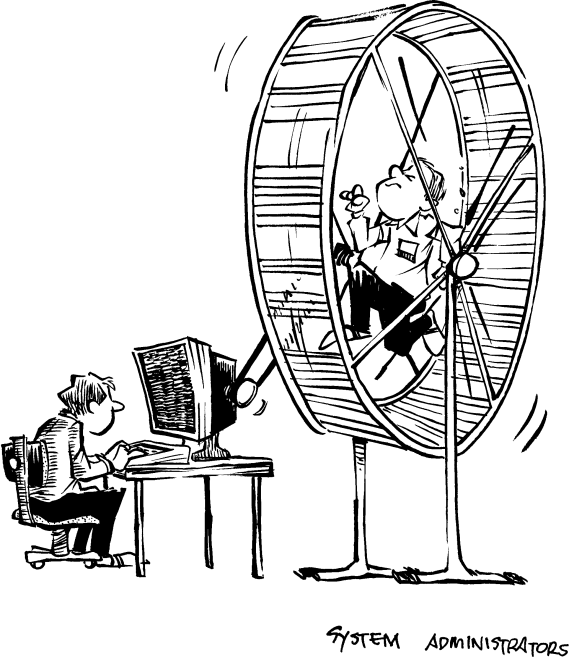

# 系统管理：Unix 的隐形成本


---




>如果汽车的发展与计算机相同，那么今天一辆劳斯莱斯的价格会是 100 美元，油耗每加仑能跑一百万英里，并且每年爆炸一次，杀死车内所有人。
>
>—— Robert Cringely, InfoWorld

所有 Unix 系统都需要一名系统管理员，亲切地被称为 Sysadmin。Sysadmin 的职责包括：

* 启动系统
* 安装新软件
* 管理用户账户
* 调优系统以获得最大性能
* 监督系统安全
* 执行常规备份
* 关闭系统以安装新硬件
* 帮助用户解决问题

Unix sysadmin 的工作与负责 IBM 大型主机或基于 PC 的 Novell 网络的 sysadmin 没有根本区别。但与其他操作系统不同，Unix 使得这些任务比其他操作系统更加困难且昂贵。本章的主题是，维护一个 Unix 系统的经济性非常差，保持 Unix 运行的总体成本远高于维护其承载硬件的成本。

网络化的 Unix 工作站比独立的 Unix 工作站需要更多的管理，因为 Unix 偶尔会在网络上乱丢垃圾。据估计，每 10-25 台 Unix 工作站就会创造至少一个全职系统管理员职位，这使得系统管理员成为一个有前景的职业。当然，类似的网络，如果是 Mac 或 PC，也需要有人来执行 sysadmin 工作。但这位人员通常并不会全职维持系统的正常运行，也不会将 Unix 的熵水平控制在一个可用的范围内。

这个人通常有其他工作，或者是多种应用的顾问。有些 Unix sysadmin 被自己的工作压得喘不过气来。

> 日期：1991 年 6 月 5 日 星期三 14:13:38 EDT
>
> 发件人：Bruce Howard [bhoward@citi.umich.edu](mailto:bhoward@citi.umich.edu)
>
> 收件人：Unix 痛恨者
>
> 主题：我的故事
>
> 过去两天里，我收到了成百上千封来自 Unix uucp 邮件系统的“您的邮件尚未送达”消息，该系统无法正确地退回邮件。我被攻击、侮辱、挫败，情感受到了伤害，因为 sendmail 进程未能检测到，或者更糟的是，正是这些进程导致了以下各种问题：邮件循环、重复的未知错误号 1 消息，以及神秘且任意修改的邮件头，其中包括各个字段中的所有地址和日期。
>
> Unix 让我整天忙个不停，做安装、重装、重格式化、重启，似乎特别喜欢在周五结束时肆意破坏我的文件系统。我的女朋友已经离开我（她喃喃道：“黑客是个肮脏的习惯，Unix 就是黑客的毒品”），而我已经忘记了 Shift 键的位置。我的表达已经不再正常，绝望成了我的伴侣。
>
> 我求你们，帮帮我，拜托了。


每年支付 \$40,000 来维护 20 台机器，相当于每台机器每年的费用为 \$2000。典型的低端 Unix 工作站价格在 \$3000 到 \$5000 之间，并且大约每两年就会更换一次。如果将这些费用与机器和软件的成本结合起来，就很明显，所谓的“开放系统”解决方案，并不真的具有成本效益。


## 保持 Unix 运行和调优

系统管理员是高薪的保姆。就像婴儿把本来好的输入转化为排泄物，然后把它丢进尿布里，Unix 也会以核心转储、无效的临时文件、癌症般的日志文件和不合法的网络重播的形式，把“排泄物”撒遍其文件系统和网络。但与婴儿不同，婴儿可能会把这些“排泄物”涂抹到周围，但通常会把它们保持在尿布里，而 Unix 却与它的垃圾玩起了躲猫猫。如果没有经验丰富的系统管理员去清理这些垃圾，系统会慢慢耗尽空间，开始发臭，变得不舒适，最终报错或直接崩溃。

有些系统的“排泄物”多到需要自动更换“尿布”：

> 日期：1990 年 9 月 20 日 04:22:36 GMT
>
> 发件人：[alan@mq.com](mailto:alan@mq.com) (Alan H. Mintz)
>
> 主题：Re: uucp 核心转储文件
>
> 新 sgroups：comp.unix.xenix.sco
>
> 在文章 [2495@polari.UUCP](mailto:2495@polari.UUCP) 中，[corwin@polari.UUCP](mailto:corwin@polari.UUCP) (Don Glover) 写道：
>
> 很长一段时间以来，我一直收到来自 uucp 转储文件的消息，位于 `/usr/spool/uucp`，确实，我过去查看时发现有一个核心转储文件，我把它删掉了，它又回来了……
>
> 是的。SCO HDB uucp 的发布说明中指出：“uucico 通常会生成核心转储文件。”这很正常。事实上，默认的 SCO 安装包含一个 cron 脚本，它会定期删除 `/usr/spool/uucp` 中的核心转储文件。


保姆在宝宝不活跃时浪费时间看电视（其中一些人做作业）；而系统管理员则坐在电视前，阅读网络新闻，同时观察警告、错误和用户投诉（其中一些人也做作业）。大型 Unix 系统网络不喜欢离他们的“母亲”——系统管理员太远，管理员经常在晚上从家里拨打电话给系统，给它“拍嗝”。


### Unix 系统在几周内变得老态龙钟，而不是几年

Unix 最初是在一个研究环境中开发的，在那个环境里，系统很少能保持连续运行几天。它并没有被设计成能够长时间运行，更不用说持续不断地运行了。加剧这个问题的是，Unix 工具和应用程序（尤其是伯克利的那些）似乎是这样开发的：程序员编写一些代码，编译它，运行它，然后等待它崩溃。没有崩溃的程序被假定为正确运行。对于第三方应用程序开发者至关重要的生产质量保证，并不是开发文化的一部分。

虽然这种方法对于操作系统课程中的学期项目足够了，但它根本无法发现生产代码中出现的“代码癌症”，这些代码必须能够持续运行数天、数周或数月。难怪大多数主要的 Unix 系统都会出现内存泄漏、垃圾积累和地址空间缓慢腐败的问题——这些问题通常只有在程序运行了几天后才会显现出来。

由于难以将调试器附加到正在运行的程序上（而将调试器附加到崩溃的程序上几乎是不可能的），这使得无法调查一个已经运行多天、然后突然失败的程序。因此，通常 bug 无法修复（甚至无法追踪），而定期重启 Unix 是保持其不表现出阿尔茨海默病的最可靠方式。

> 日期：1992 年 2 月 29 日 17:30:41 PST
>
> 发件人：Richard Mlynarik [mly@lcs.mit.edu](mailto:mly@lcs.mit.edu)
>
> 收件人：Unix 痛恨者
>
> 主题：我还以为是闰年呢
>
>
> 所以，我现在在 2 月 29 日因为 Unix 而陷入困境：
>
>```sh
>% make -k xds
>sh: Bus error
>make: Fatal error: The command `date "+19%y 13
>* %m + 32 * %d + 24 * %H + 60 * %M + p" | dc'
>returned status `19200'
>Compilation exited abnormally with code 1 at
>Sat Feb 29 17:01:34
>```
>
>我开始真的很想写一封激烈的邮件，抱怨 Unix 在处理闰年日期时出错，但经过进一步检查——而且，哪个 Unix 故障不让人忍不住进行更多无谓、得不到结论、令人沮丧的检查呢？——我发现实际的 bug 是这台机器已经运行太久了。
>
> 我发现这一点是因为 ispell 程序告诉我：
>
>```sh
>swap space exhausted for mmap data of
>/usr/lib/libc.so.1.6 is not a known word
>```
>
>现在，突然之间，显而易见，实际上这台可怜的机器已经在 11 天、1 小时和 10 分钟的核心转储和调试调试过程中，填满了它的分页空间，里面充满了没有垃圾回收、没有压缩的“吐司饼屑”。
>
> 现在，已经远远超出了“该重启的时候”！

Richard Mlynarik 的信息中，最令人惊讶的，当然是他所使用的那版 Unix 系统竟然还没有自行重启。


### 你没法优化一条鱼


Unix 有许多参数可以根据不同的需求和操作条件来调节其性能。这些参数中的一些设定了某些系统资源的最大值，这些资源在更先进的操作系统中并没有类似的参数，因为它们会动态地为大多数系统资源分配存储空间。一些参数非常重要，例如系统进程的相对优先级。Sysadmin 的工作之一就是将默认参数设置为正确的值（你不得不想，为什么大多数 Unix 厂商不在其软件中预先设置好与硬件配置匹配的默认值）。这个过程被称为“系统调优”。关于这个主题，已经写了整本书。

系统调优有时需要重新编译内核，或者，如果你使用的是那些商业的“开放系统”且无法获取源代码，那么就需要使用调试器手动修补操作系统。普通用户和 sysadmin 往往无法了解到重要的参数，因为文档很差。

幸运的是，经验非常丰富的 sysadmins（那些对 Unix 保持健康的不敬态度的人）能够赢得这场战斗。


> 日期：1993 年 1 月 12 日 星期二 2:17 AM
>
> 发件人：Robert E. Seastrom [rs@ai.mit.edu](mailto:rs@ai.mit.edu)
>
> 收件人：Unix 痛恨者
>
> 主题：真是个愚蠢的算法
>
> 我知道通过这封邮件提供有用的信息有点走在薄薄的边缘，但没关系，人生只有一次，不是吗？
>
> 无论如何，我有一台 Sparcstation ELC，是我在一时愚蠢下买来供个人使用的。它有一块 760MB 的硬盘和 16MB 的内存。我想 16MB 应该足够了，实际上，pstat 报告显示，在一个典型的工作日，运行 Ecch Windows、几个 Emacs、xterm 和偶尔的 xload 或 xclock 时，我的内存使用量顶多为 12 到 13MB。
>
> 但我今天并不是来谈论为什么 2 个 Emacs 和一个窗口系统要占用比已故的 AI KS-10 多五倍的内存。不，我今天是来谈论虚拟内存系统的。
>
> 为什么，当我离开我那台可靠的 "jerkstation" 一段时间，回来后，轻触鼠标，突然间，“嗡，嗒嗒，嗒嗒，嗡”，所有进程都被交换回内存了？
>
> 我的意思是，为什么它们一开始就被交换出内存呢？并不是说系统需要这些内存——说实话，它还剩下 3 或 4MB 的空闲内存！
>
> 好吧，事情是这样的。我从 Usenet 上的间谍那里听说（在查看分页代码时找不到任何东西）内核的交换部分有一个神奇的参数叫做 maxslp（对于不懂元音的朋友来说，就是“最大休眠”），它告诉系统一个进程可以休眠多久，才会被认为是一个“长时间休眠者”，并被强制交换出去，无论是否需要。
>
> 这个参数的默认值是 20。所以如果我离开 Sparcstation 20 秒钟，或者接个电话什么的，它非常“贴心”地把所有等待键盘输入的进程都交换出去。这样它就有了很多空闲内存，可以用来启动新进程，或者作为缓冲区（无疑是用于已经被交换出去的进程的 I/O）。非常棒。所以我使用了那种高性能、功能强大的调试工具（adb），将 maxslp 增加到一个更合适的值（比如 2,000,000,000）。
>
> 该死的，如果系统没有内存不足的情况，就不应该进行分页或交换！就是这么简单！
>
> 为什么没人告诉 Sun，他们的工作站不是那种内存只有 2MB 的 VAX，而现在也不是 1983 年，强制交换不必要的东西只是为了让你有大量空闲内存并没有任何好处？你说什么？哦，对，我忘了——Sun 想让他们那台崭新、速度飞快的工作站感觉像是那台只有 2MB 内存的 VAX 11/750，负载因子是 6。真是充满怀旧情怀，不是吗？
>
> 呵。


## 磁盘分区与备份


磁盘空间管理是所有计算机系统的繁重任务；在 Unix 上，它是一项艰巨的工作。在将 Unix 安装到磁盘上之前，你必须为 Unix 的每个分区决定一个空间分配。Unix 假装你的硬盘是一个个更小的磁盘的集合（每个磁盘包含一个完整的文件系统），这与其他系统（如 TOPS-20）不同，后者允许你通过集合多个小物理磁盘来创建一个更大的逻辑磁盘。

每个所谓的磁盘分区特性实际上都是为了掩盖某些 bug 或设计缺陷。例如，磁盘分区允许你选择性地转储或不转储磁盘的某些部分，而无需转储整个磁盘。但这个“特性”之所以需要存在，是因为转储程序只能转储完整的文件系统。磁盘分区被称为硬盘配额，可以限制一个失控的进程或用户在程序停止之前可以使用的空间量。这个“特性”掩盖了一个缺乏为目录或文件系统的某些部分设置磁盘配额限制的文件系统缺陷。

这些“特性”引发了更多的 bug 和问题，毫不奇怪，修复这些问题需要一个 sysadmin（以及额外的持续成本）。Unix 常常会在程序或用户填满 `/tmp` 目录时失败，导致大多数其他需要临时磁盘空间的进程也失败。大多数 Unix 程序不会检查写入磁盘是否成功；相反，它们只是愉快地继续前进，把你的电子邮件写入一个已满的磁盘。这时，sysadmin 会出现，通过重启系统来“解决”问题，因为启动过程会清除 `/tmp` 目录中积累的垃圾。现在你知道为什么启动过程会清除 `/tmp` 目录了。

为 `/tmp` 目录创建一个“较大”的分区，以防某个程序确实需要所有空间才能正常工作，只是把问题转移到其他地方，并没有真正解决任何问题。这是一个骗术。为该分区专门保留的空间在绝大多数时间都闲置，不能用于其他分区中的用户文件。嘿，现在磁盘很便宜了。但无论你将 `/tmp` 分区做得多大，总会有用户想要对一个需要临时文件比 `/tmp` 分区大小大 36 字节的文件进行排序。怎么办？让你的昂贵的 sysadmin 在单用户模式下将整个系统转储到磁带上，然后重新分区以扩大 `/tmp`（并把其他分区弄小一些，除非你购买额外的磁盘），然后从磁带上重新加载整个系统。更多的停机时间，更多的成本。

交换分区是另一个固定大小的磁盘块，通常会发现它不够大。在过去，当磁盘容量较小且快速磁盘比慢速磁盘贵得多时，将整个交换分区放到一个小且快速的磁盘上是有意义的。但现在让交换空间的大小固定已经不再有意义了。将一个新程序（尤其是 X 程序！）添加到系统中通常会让系统超出交换空间限制。Unix 会在没有交换空间时变得不开心吗？就像宝宝喝完巧克力牛奶想要更多时会哭吗？当 Unix 系统用尽交换空间时，它变得很暴躁。它会毫无预警地杀掉进程。你工作站上的窗口消失得无影无踪。系统崩溃并恐慌了。想通过增加交换空间来修复消失的进程问题吗？让你的昂贵的 sysadmin 在单用户模式下将整个系统转储到磁带上，然后重新分区以扩大 `/swap`，接着重新从磁带上加载整个系统。更多的停机时间，更多的成本。（听起来熟悉吗？）

固定大小磁盘分区的问题仍然存在，尽管现在的标准设备是千兆字节级别的磁盘。制造商会为机器配备足够大的磁盘分区，以避免问题。这是一个相对昂贵的解决方案，但比修复 Unix 更容易实现。一些 Unix 厂商现在同时向文件系统和交换分区进行交换，这稍微有点帮助，尽管从文件系统交换要慢得多。所以，Unix 确实在进步。某些 Unix 厂商做得对，允许分页系统动态地侵占文件系统，直到一个固定的限制。而另一些厂商做得不好，坚持使用一个固定的交换文件，这比重新格式化磁盘来改变交换空间更灵活，但继承了所有其他问题。它还会对使用 dump 进行的增量夜间备份造成严重干扰，通常会使备份使用的磁带容量增加三倍或四倍。这又是运行 Unix 系统的一个额外成本。

### 分区：双倍的乐趣


由于 Unix 系统倾向于损坏其自身的文件系统，早期的 Unix 大师们开发了一个变通方法，以防止他们的文件经常被丢失：将磁盘划分为不同的空间。如果系统崩溃，而你运气好，可能只有一半的数据会丢失。

文件系统之所以会被破坏，是因为磁盘上的空闲列表通常是一致性的。当 Unix 崩溃时，最活跃的磁盘会受到最多的损坏，因为它们是最不一致的磁盘——也就是说，它们在内存中的信息量最大，但并未及时写入磁盘。因此，Unix 大师们决定将磁盘进行分区，将一个物理磁盘划分为多个较小的虚拟磁盘，每个虚拟磁盘拥有自己的文件系统。

分区的理性依据是：在系统崩溃后，保留足够的操作系统数据以确保能够重新启动（重新启动后，文件系统会被修复）。从同样的角度看，让崩溃的 Unix 系统损坏用户的文件比损坏操作系统要好，因为恢复操作需要操作系统。（当然，用户文件可能没有备份，而操作系统的副本保存在发行磁带上，这些与当时的决策并没有关系。）Unix 的最初版本在贝尔实验室外发放时并没有发行磁带：Dennis Ritchie 会亲自制作每一份，并附上一张纸条，上面写着：“这是你的 rk05，爱你的 Dennis。”（rk05 是一种早期的可移动磁盘包。）根据 Andy Tannenbaum 的说法：“如果 Unix 在你的 rk05 上出了问题，你就写信给 Dennis，要求他再发一套 [^1]。”

大多数 Unix 系统都配备了一个称为“交换分区”的特殊分区，用于虚拟内存。早期的 Unix 并没有使用文件系统进行交换，因为 Unix 文件系统太慢。拥有交换分区的问题是，这个分区要么太小，当你尝试处理过大的问题时，Unix 会崩溃；要么交换分区太大，99% 的时间里你都在浪费空间，因为你并不需要运行 800MB 的量子场动力学模拟。

在分区磁盘时 [^2]，有两个简单的规则必须遵守：

1. 分区不得重叠。
2. 每个分区必须只分配一个用途。

否则，Unix 就会像储蓄贷款协会（S\&L）一样，开始将相同的磁盘空间借给多个用户。当多个用户使用“他们”的磁盘空间时，灾难就会发生。

1985 年，麻省理工学院媒体实验室有一台大型 VAX 系统，配备六个大磁盘驱动器和超过 64MB 的内存。他们注意到，磁盘 #2 上的“c”分区没有被使用，便允许 Unix 使用这个分区进行交换。

几周后，VAX 系统发生了系统恐慌崩溃。两三天后，某个在磁盘 #2 上存储文件的用户报告了文件损坏。一天后，VAX 又一次崩溃。

系统管理员（由三名本科生组成）最终发现，磁盘 #2 上的“c”分区与磁盘 #2 上另一个存储用户文件的分区重叠。

这个错误一直处于潜伏状态，因为 VAX 的内存非常大，交换的机会较少。直到有一个新用户开始处理一个大型图像处理项目，需要大量内存时，VAX 才开始交换到磁盘 #2 上的“c”分区。此时，它破坏了文件系统，通常会导致系统恐慌。

这是四年后，Michael Travers 在媒体实验室的音乐与认知组遇到的类似问题。他将一位系统管理员的消息转发给了 Unix 痛恨者（现在这个职位已经由三名全职工作人员填补）：


> 日期：1989 年 11 月 13 日 星期一 22:06 EST
>
> 发件人：[saus@media-lab.mit.edu](mailto:saus@media-lab.mit.edu)
>
> 主题：文件系统
>
> 收件人：[mt@media-lab.mit.edu](mailto:mt@media-lab.mit.edu)
>
> Mike，
>
> 我在构建文件系统 `/bflat` 和 `/valis` 时犯了一个错误。这两个文件系统存在重叠，并且彼此完全破坏了对方。不幸的是，我找不到任何办法可以恢复这些文件系统。
>
> 我已经修复了这个问题，但恐怕这对你没有帮助。那些原本在上面的东西已经彻底消失了。我对此感到很抱歉，但现在已无能为力。
>
> 如果你在 `/bflat` 上的内容不是最近才写的，我们也许可以从磁带中找回它。我会检查一下我们最近一次备份磁带的时间。


[^1]: Andy Tannenbaum，《UNIX 的政治》，华盛顿特区 USENIX 大会，1984 年。（转载自《与 Unix 同行》中的引用，第 13 页）

[^2]: 的确，Unix 中关于分区的问题如此之多，以至于至少有一个厂商（NeXT 公司）建议硬盘只配备一个分区。这可能是因为 NeXT 的 Mach 内核可以直接将交换空间分配到 Unix 文件系统中，而不需要在系统的硬盘上预留特殊的空间。


### 宕机与备份


磁盘文件系统通常会定期备份到磁带上，以避免在磁盘崩溃时丢失数据。通常，磁盘上的所有文件会在每周一次，或至少每月一次时复制到磁带上。每天晚上也会对当天更改过的文件进行一次备份。然而，不幸的是，并没有任何保证 Unix 的备份一定能救你一命。


> 发件人：[bostic@OKEEFFE.CS.BERKELEY.EDU](mailto:bostic@OKEEFFE.CS.BERKELEY.EDU)（Keith Bostic）
>
> 主题：V1.95（丢失的错误报告）
>
> 日期：1992 年 2 月 18 日 20:13:51 GMT
>
> 新闻组：comp.bugs.4bsd.ucb-fixes
>
> 组织机构：加州大学伯克利分校
>
> 我们最近用于存储 4BSD 系统错误报告的磁盘出现了问题，导致大约一年的报告全部丢失。我们非常希望大家能重新提交自 1991 年 1 月以来发送给我们的任何错误报告。
>
> ——计算机系统研究小组 [^1]

 人们几乎能察觉出一种新兴智能的迹象，就像电影《科洛萨斯：福尔宾计划》那样。Unix 成功地从自身清除掉了能证明它有 bug 的文档。

 Unix 在更新磁盘上所存储的数据和指针的方式，会在创建或修改文件的过程中，造成磁盘上的指针错误和不一致的情况。当系统在还未将所有变更写入磁盘前崩溃（这几乎是必然的），磁盘上的文件系统映像就会变得损坏且不一致。


系统崩溃后的重启过程中，可以看到这种损坏：Unix 启动脚本会自动运行 fsck 来尝试将文件系统修复回来。

许多 Unix 系统管理员并不了解：在向磁带进行系统转储时也会发生这种不一致。备份程序会对当前文件系统进行快照。如果在备份过程中有用户或进程在修改文件，磁盘上的文件系统就会在短时间内变得不一致。由于转储不是瞬时完成的（通常需要数小时），快照结果便会是一张模糊图像。

这就像你用 1 秒快门速度去拍印第 500 赛车比赛一样，结果可想而知：那些最关键的文件——也就是用户正在频繁修改的文件——恰恰是你无法恢复的那部分。

因为 Unix 缺乏对“在线”文件系统进行备份的机制，若想进行一次完整的备份，就必须将系统切换到独立或单用户模式，也就是磁盘上没有任何进程会在备份时修改文件。在拥有数 GB 磁盘空间的系统上，这意味着每天要停机数小时。（而管理员只能坐在那里看着磁带转。）

很显然，Unix 并不适用于需要持续在线运行的应用系统。有一批 Unix 系统原本要求持续在线运行，不得不在它们的 `/etc/motd` 中告诉用户：“在备份期间请预期异常行为”。

```sh
SunOS Release 4.1.1 (DIKUSUN4CS) #2: Sun Sep 22 20:48:55 MET DST 1991
--- BACKUP PLAN ----------------------------------------------------
Skinfaxe: 24. Aug, 9.00-12.00 Please note that anomalies can
Freja & Ask: 31. Aug, 9.00-13.00 be expected when using the Unix
Odin: 7. Sep, 9.00-12.00 systems during the backups.
Rimfaxe: 14. Sep, 9.00-12.00
Div. Sun4c: 21. Sep, 9.00-13.00
--------------------------------------------------------------------
```

把数据写入备份磁带只是工作的一半。为了取回这些数据，Berkeley Unix 赐予我们一个名叫 restore 的程序。restore 有一个奇妙的交互模式，让你可以在一个虚拟文件系统中 `chdir` 来 `chdir` 去，并标记你想要恢复的文件，然后输入一个神奇的命令就能让磁带开始旋转起来。但如果你想像一个真正的 Unix 高手那样从命令行恢复文件，那就要小心了。

> 日期：1991 年 5 月 30 日 星期四 18:35:57 PDT
>
> 发件人：Gumby Vinayak Wallace [gumby@cygnus.com](mailto:gumby@cygnus.com)
>
> 收件人：Unix 痛恨者
>
> 主题：Unix 的 Berkeley FFS
>
> 你是否曾经不幸地试图从备份中恢复文件？除了过程缓慢且痛苦之外，我们这里有人更倒霉地发现：当你把一个通配符传递给 `restore` 程序时，它只会恢复第一个匹配到的文件，而不是所有匹配的文件！
>
> 不过也许这算是某种带特色的“极简主义”，毕竟这是一个连备份位都不具备的文件系统。


[^1]: 这条信息未经 Keith Bostic 的许可转载，他表示：“就我看来，\[转载这条信息] 对计算机系统研究小组或我本人都没有任何好处。”他说得没错：这些备份是用伯克利的磁带备份程序做的，也同样坏掉了。

### 继续用更多的胶带修补

假设你想复印一份 500 页的文件。你想要一份完美的副本，所以买了一包新的复印纸，然后一页一页地复印，确保每一页都完美无瑕。如果你发现某一页有污点，该怎么办？如果你比保龄球球头还聪明，你会重印那一页然后继续。但如果你是 Unix，你会彻底放弃，买一包新的复印纸，然后重新开始。真的，不开玩笑。即使文件有 500 页，而你已经成功复印了前 499 页。

Unix 用磁带来备份磁盘，而不是用纸，但这个比喻非常贴切。偶尔，磁带上会有一小段坏点，导致无法写入。有时候，Unix 会在花费几小时转储了 2GB 数据之后才发现这个坏点。Unix 会很开心地报告坏点，要求你换一盘新磁带，销毁坏磁带，然后重新开始。是的，Unix 只要磁带上一英寸有坏点，就认为整盘磁带无法使用。其他更健壮的操作系统会利用这些“坏”磁带，遇到坏点时跳过继续使用。Unix 这种做法意味着浪费时间和金钱。

Unix 给磁带设备取了很多名字。你可能会以为只用 `/dev/tape` 这样简单的名字。伯克利 Unix 可不会这样，它会把磁带驱动的具体参数编码进设备名。Unix 不用一个统一名字叫“tape”，而是针对每种磁带驱动接口用不同名字，比如 `/dev/mt`、`/dev/xt`、`/dev/st`。换了接口，系统管理员就得花时间修改所有备份脚本。是的，备份脚本，每个 Unix 站点都会写自定义脚本来做备份，因为不同厂商使用不同的磁带设备名，而且没人记得正确的参数组合，导致移植性极差。再在名字后面加一个设备号，比如 `/dev/st0` 或 `/dev/st1`。但是别被设备号迷惑了，`/dev/st8` 实际上就是 `/dev/st0`，`/dev/st9` 是 `/dev/st1`。录制密度由设备号加一个偏移量来选择。其实是同一驱动器，不同名字。更复杂的是，名字前面加个“n”表示关闭设备时不回卷磁带，前面加“r”表示这是原始设备（raw device），而非块设备（block device）。所以，`/dev/st0`、`/dev/rst0`、`/dev/nrst0`、`/dev/nrst8`、`/dev/st16` 都指向同一个设备。让人头大吧？

因为 Unix 不提供设备的独占访问，程序之间就玩起了“争夺资源”的游戏，没人能活着出来。举个简单例子，假设系统有两台磁带驱动器，分别叫 `/dev/rst0` 和 `/dev/rst1`。你或系统管理员刚花了几个小时在 `/dev/rst0` 上制作了某些重要文件的 `tar` 或 `dump` 备份。走廊另一头的随机某某先生把设备号输错，把 1 输成了 0，结果在 `/dev/rst0` 上做了一个短暂的备份，覆盖并破坏了你的备份！为什么会这样？因为 Unix 不允许用户获得磁带驱动器的独占访问权限。备份程序在备份过程中会多次打开和关闭磁带设备，每次关闭后，其他用户都可以使用这个磁带驱动器。这样，Unix 的“安全”控制完全被绕过。磁带上有私密文件时，直到磁带被取下之前，任何系统用户都能读取这些文件。唯一的解决办法就是禁止除系统管理员之外的所有人访问磁带驱动器。

## 配置文件

系统管理员需要管理大量的配置文件。那些对微软 Windows 的四个系统配置文件过敏的人，最好别接近 Unix，否则可能会出现过敏性休克。Unix 拥有数十个配置文件，每个文件都需要精确的字母和符号组合才能正确配置和运行系统。

每个 Unix 配置文件控制着不同的进程或资源，并且每个文件都有自己独特的语法。字段分隔符有时是冒号，有时是空格，有时是（未文档化的）制表符，如果你非常幸运的话，还有可能是空白字符。如果你选错了分隔符，读取配置文件的程序通常会悄无声息地崩溃，破坏它自己的数据文件，或者忽略文件剩余部分。很少会优雅地退出并报告确切的问题。每个文件不同的语法确保了系统管理员的工作安全。高薪的 Unix 系统管理员可能会花几个小时去找出以下常见配置文件中空格和制表符的区别。小心那些声称修改这些文件是在“提高安全性”的系统管理员；他指的是他的工作安全，而不是你的系统安全：

* /etc/rc
* /etc/services
* /etc/motd
* /etc/rc.boot
* /etc/printcap
* /etc/passwd
* /etc/rc.local
* /etc/networks
* /etc/protocols
* /etc/inetd.conf
* /etc/aliases
* /etc/resolv.conf
* /etc/domainname
* /etc/bootparams
* /etc/sendmail.cf
* /etc/hosts
* /etc/format.dat
* /etc/shells
* /etc/fstab
* /etc/group
* /etc/syslog.conf
* /etc/exports
* /etc/hosts.equiv
* /etc/termcap
* /etc/uucp/Systems
* /etc/uucp/Devices
* /etc/uucp/Dialcodes

### 多台机器意味着更多的疯狂

许多组织的网络规模过大，一台服务器无法满足需求。对于大多数服务器来说，大约二十台机器是极限。系统管理员们现在面临着噩梦般的任务：保持所有服务器之间的新版本和配置文件同步。虽然编写了 shell 脚本来自动化这个过程，但一旦出错，就会导致难以追踪的混乱，以下几位系统管理员对此深有体会：

> 发件人：Ian Horswill [ian@ai.mit.edu](mailto:ian@ai.mit.edu)
>
> 日期：1992 年 9 月 21 日 星期一 12:03:09 EDT
>
> 收件人：[SYSTEM-HACKERS@ai.mit.edu](mailto:SYSTEM-HACKERS@ai.mit.edu)
>
> 主题：Muesli 的 printcap
>
> 昨晚，Muesli 的 printcap 条目被某人覆盖成了别人的 printcap。这导致本该为 Thistle 提供服务的 Muesli 行式打印守护进程，被告知每当有人尝试向 Thistle 发送打印任务或执行 lpq 时，都应该生成一个子进程来连接自己。可想而知，Muesli、lpd 和 Thistle 都非常不高兴。现在已经修好了（我想是这样），但我们得确保没有什么自动守护进程每晚都来覆盖它。我根本无法追踪谁拥有哪个版本的配置，何时、为什么、怎么把它施加给谁。（Unix 网络术语实在太奇怪了。“那个守护进程，本应为 Thistle 服务，却被告知它应该生成子进程连接自己”——这句话的词汇暗示，Unix 网络应该叫做“撒旦式乱伦产仔”。）
>
> rdist 工具（远程分发）用于通过网络在多个系统间安装同一文件的副本，以保持配置文件同步。然而，要让它完全正常工作，通常需要极大的耐心和大量时间：
>
> > 发件人：Mark Lottor [mkl@nw.com](mailto:mkl@nw.com)
> >
> > 主题：rdist 配置失效
> >
> > 日期：1992 年 9 月 24 日 星期四 14:33
> >
> > 最近有人编辑了我们的 rdist Distfile，意外在某行末尾多加了一个括号。运行 rdist 时，出现了：
> >
> > ```sh
> > fs1:> rdist  
> > rdist: line 100: syntax error  
> > rdist: line 102: syntax error  
> > ```
> >
> > 当然，检查这些行根本没有错误。实际上，这些行都是注释！花了几个小时搜索整个文件，查找诸如空格代替制表符之类的可能错误（我们没法用差异比较与之前版本，因为 Unix 没有版本号功能）。最后，在文件第 110 行发现了那个多余的括号。Unix 为什么数数都数不对呢？？？
> >
> > 事实证明，这个文件有续行（以 `\` 结尾的行），rdist 会把这些续行当作一行来计数。我提这事，是因为我确定没人会去修它；Unix 迷们大概认为它这样做是对的。


这就是典型的 Unix 损失感：你能感受到维护熵以指数级增加。

甚至很难给接下来的这封信分类：

> 发件人：Stanley Lanning [lanning@parc.xerox.com](mailto:lanning@parc.xerox.com)
>
> 日期：1993 年 1 月 22 日 星期五 11:13AM
>
> 收件人：Unix 痛恨者
>
> 主题：RCS
>
> 作为开明的人，我们也使用 RCS。作为黑客，我们写了许多 shell 脚本和 elisp 函数以便更方便地使用 RCS。我用的是 Solaris 2.x。结果发现我们这里用的 RCS 版本有点老，在 Solaris 上跑不了。它也不能运行在 Binary Compatibility 包里；反而会静默地在某个随机目录下生成 core dump。但最新版本的 RCS 能在 Solaris 上跑，所以我拿了最新源码，编译安装后继续工作。
>
> 后来发现我们的 Emacs RCS 包不兼容最新版本的 RCS。为什么？RCS 其中一个改动是对 rlog 输出格式做了一个明显多余且不兼容的修改。谢谢。于是我修改了 elisp 代码，继续工作。
>
> 接着发现我们的 shell 脚本也因为同样的改动出问题了。顺便修正了几个别的问题，比如 Solaris 下用“echo … | -c”替代“echo -n …”的问题。Sun 机器（现在不再快启动了）的一大优点是它们相互兼容。有时是这样。修修补补，继续工作。
>
> 一切看似正常，直到某个用旧版本 RCS 的人试图签出我签入的文件。事实证明，RCS 一个改动是从本地时间改为 GMT。旧版本 RCS 看时间戳时，认为文件根本不存在，因此不允许别人访问文件。现在只能升级所有 RCS 版本，统一用 GMT。编译、测试、修改、编译、安装，继续工作。
>
> 然后发现这里漂浮着多个 Emacs RCS 代码副本，而我只修了其中一个。为什么？因为 Emacs 有多个副本。为什么？我不问为什么，直接修复，继续工作。
>
> 这里还有一些 HP 机器，所以它们也需要最新 RCS。编译、测试、修改、编译、安装，继续工作。差不多吧。编译 RCS 是魔法般的体验。有个庞大缓慢丑陋的脚本，用来生成针对具体架构的头文件。它测试系统的各种特性，试图在大部分机器上做正确的事，看起来好像有效。但那只是“看起来”。HP 机器其实不支持 mmap。mmap 存在但不工作，官方建议不要用。但 RCS 配置脚本没读文档，只看 mmap 存不存在，既然存在就用了它。结果，HP 机器上的 RCS 签出文件时会崩溃。机器恐慌、停机、重启。
>
> 当然，这只发生在运行过那次配置脚本的 HP 机器上。如果你在更新的 HP 机器上签出，一切正常。于是我们看了配置脚本结果，发现它用了 mmap，捶头，改配置脚本不再考虑 mmap，再试一次。顺便提下，配置脚本跑一次大约需要 15 分钟，每次改东西（包括 Makefile）都得重新跑。Makefile 还得改才能编译出可测试的 RCS 版本。我还有真工作要做。编译、测试、修改、编译、安装，继续工作。
>
> 几天后，又是一堆 RCS 问题。记得那些让 RCS 更好用的 shell 脚本吗？发现它们也有多个副本，而我只修了一个。修修补补，继续工作。
>
> 最后，有个人根本用不了那些脚本。别人用没问题，唯独他不行。为什么？原来他用的是 Sun 的 cmdtool。cmdtool 有个“兼容性极好”的特性：它不设置 \$LOGNAME。实际上好像还特意把它清空了。而脚本用的是 `$LOGNAME`，不是 `$USER`（HP 上不行），也不是那种 `who am i | awk '{print $1}' | sed ‘s/*\\!//` 这类丑陋命令。所以脚本又改，用了优雅的写法 `${LOGNAME:-$USER},`，我继续工作。
>
> 到现在，已经 24 小时没收到新的 RCS 报告了。我祈祷着。

## 维护邮件服务

Sendmail，是最流行的 Unix 邮件传输程序，极其复杂。当然，它本不需要这么复杂（参见邮件传输程序章节）。不仅 sendmail 的复杂性保障了系统管理员的就业，还保障了系统管理员培训师的就业，并且让你的系统管理员远离实际工作。看看图 3，这是一则来自网络的真实广告。

如果只有一种 Unix（该课程涵盖四种不同的 Unix 版本），或者 Unix 有完善的文档支持，这类培训课程就不那么必要了。上面列出的所有任务本应简单易懂且易于执行。这是 Unix 的另一个隐藏成本。有趣的是，如果你的系统管理员搞不定 sendmail，邮件系统就不能正常工作！听起来像是敲诈勒索。

```
Sendmail 简明研讨会

该研讨会面向希望了解 sendmail 工作原理及如何为其环境配置 sendmail 的系统管理员。内容涵盖 sendmail 的运行机制、如何阅读 sendmail.cf 文件、如何修改 sendmail.cf 文件以及如何调试 sendmail.cf 文件。课程提供了一对用于单个 UUCP 邮件网关网络客户端的简单 sendmail.cf 文件示例，并讨论了 SunOS 4.1.1、ULTRIX 4.2、HP-UX 8.0 和 AIX 3.1 的 sendmail.cf 文件。

经过一天的培训，你将能够：

* 理解 sendmail 的运行机制。
* 理解 sendmail 如何与邮件、SMTP 和 UUCP 协同工作。
* 理解 sendmail.cf 文件的功能与操作。
* 创建自定义的 sendmail 重写规则，以处理特殊地址和邮件传输程序的投递。
* 设置企业电子邮件域及部门子域。建立通往互联网邮件网络和其他商业电子邮件网络的网关。
* 调试邮件地址和投递问题。
* 调试 sendmail.cf 配置文件。
* 理解各厂商特定 sendmail.cf 文件的运行机制，包括 SunOS 4.1.2、DEC Ultrix 4.2、HP-UX 8.0 和 IBM AIX 3.1。
```

**图 3. Sendmail 研讨会互联网广告**


## 我哪做错了？

> 日期：1990 年 12 月 20 日 星期四 18:45 CST
>
> 发件人：Chris Garrigues [7thSon@slcs.slb.com](mailto:7thSon@slcs.slb.com)
>
> 收件人：Unix 痛恨者
>
> 主题：对 Unix 机器的支持
>
> 前几天我在想，自从这里宣布 Lisp 机器不受欢迎后，我的生活发生了多大变化。
>
> 两年前，我一个人负责支持大约 30 台 Lisp 机器。我既做硬件支持，也做软件支持。我还有时间自己写点东西。每天离开前，我总能把日报看完，常常午饭前也能看完。我午休时间长，下班通常不晚于下午 5 点，几乎不超过 6 点。那一年半里，我只加班过一个周末。刚来时，觉得环境一团糟，所以利用那个周末整理了命名空间（那里面东西神秘地丢失），还调整了环境。我向 Symbolics 报告了漏洞，虽然经常被忽视，但修复最终还是被合并进系统。
>
> 后来情况变了。现在我们四个人负责支持大约 50 台 Sun 机器。硬件支持由 Sun 提供，所以我们只做软件支持。我还负责少数剩下的 Lisp 机器和 Cisco 网关，但它们几乎不需要维护。我们还有台 Auspex，不过它只是设计成服务器的 Sun。我经常加班，很多周末也得工作，甚至牺牲了整个感恩节周末。两年过去了，我们还在清理环境中的烂摊子，里面充满了我们完全不理解的东西。
>
> 有多个相同数据的副本，我们一直无法合并（主要是我们站点的主机列表）。买了 Auspex 后，我们从多个单点故障变成了一个巨大的单点故障。虽然有所改进，但过去人们经常不知道服务器宕机，直到它恢复为止。即使如此，邮件服务器宕机时，“pwd”命令也会失败，没人（包括 root）能登录。
>
> 在操作系统及其以下的软件中同时运行多个版本，顶多是不方便，通常是不可能的。新版本操作系统会因为共享库导致程序崩溃。我向 Sun 报告漏洞，虽然有时不被忽视，但他们告诉我，这本来就是设计如此。
>
> 我到底哪做错了？


