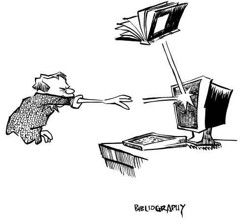

# 参考文献：正当你以为已经脱离困境时

* Allman, Eric. “Mail Systems and Addressing in 4.2bsd.” January 1983, USENIX.
* Allman, Eric, and Miriam Amos. “Sendmail Revisited.” Summer 1985, USENIX.
* Costales, Bryan, Eric Allman, and Neil Rickert. *sendmail*. O’Reilly & Associates, 1993.
* Comer, Douglas. 《用 TCP/IP 进行网际互连第一卷》, 电子工业出版社, 2009-8, ISBN: 9787121091612
* Coplien, James O. 《Advanced C++ 中文版》. 中国电力出版社, 2004-2, ISBN: 9787508319155
* Crichton, Michael. 《细菌》. 时代文艺出版社, 2008-6, ISBN: 9787538724165
* Crichton, Michael. 《侏罗纪公园》. 文汇出版社, 2018-4, ISBN: 9787549622016
* Doane, Stephanie M., et al. “Expertise in a Computer Operating System.” *Journal of Human-Computer Interaction*, Vol. 5, Numbers 2 and 3.
* Gabriel, Richard P. “Lisp: Good News, Bad News, How to Win Big.” *AI Expert*, April 1991.
* Garfinkel, Simson, and Gene Spafford. 《UNIX 与 Internet 安全实践指南》. 机械工业出版社, 2005-10, ISBN: 9787111165590
* Jones, D. F. *Colossus*. Berkeley Medallion Books, 1966.
* Kernighan, B., and Mashey. 《UNIX 编程环境》, 人民邮电出版社, 2014-4, ISBN: 9787115338358
* Libes, Don, and Sandy Ressler. *Life with UNIX: A Guide for Everyone*. Prentice-Hall, 1989.
* Liskov, Barbara, et al. 《C 语言参考手册》. 机械工业出版社, 2011-6, ISBN: 9787111346845
* Miller, Fredriksen, and So. “An Empirical Study of the Reliability of Unix Utilities.” *Communications of the ACM*, December 1990.
* Norman, Donald A. 《设计心理学 1》. 中信出版社, 2015-5, ISBN: 9787508648330
* Norman, Donald A. “The Trouble with Unix: The User Interface is Horrid.” *Datamation*, Vol. 27, No. 12, pp. 139–150, November 1981.
* Pandya, Paritosh. “Stepwise Refinement of Distributed Systems.” *Lecture Notes in Computer Science*, No. 430, Springer-Verlag.
* Stoll, Cliff. 《杜鹃蛋：电脑间谍案曝光录》. 新华出版社, 1992-2, ISBN: 9787501116577
* Tannenbaum, Andy. “Politics of UNIX.” Washington, DC USENIX Conference, 1984.
* Teitelman, Warren, and Larry Masinter. “The Interlisp Programming Environment.” *IEEE Computer*, April 1981.
* Vinge, Vernor. 《银河界区三部曲Ⅰ深渊上的火》, 北京联合出版公司, 2019-7, ISBN: 9787559629821
* Zorn, B. *The Measured Cost of Conservative Garbage Collection*. Technical Report CU-CS-573-92, University of Colorado at Boulder, 1992.
