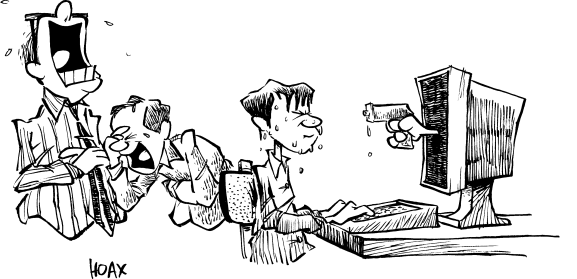

# 作者坦言 C 和 Unix 是骗局。新闻稿：立即发布




在一项令整个计算机业震惊的声明中，Ken Thompson、Dennis Ritchie 和 Brian Kernighan 坦白，他们所创造的 Unix 操作系统和 C 编程语言其实是一个精心设计的愚人节恶作剧，这个玩笑已经维持了二十多年。在最近举行的 UnixWorld 软件开发论坛上，Thompson 透露了以下内容：


>“1969 年，AT&T 刚刚终止了他们与 GE/AT&T Multics 项目的合作。Brian 和我刚开始使用来自瑞士 ETH 实验室 Nichlaus Wirth 教授发布的早期 Pascal 版本，我们对其优雅的简洁性和强大功能印象深刻。Dennis 刚读完《Bored of the Rings》，这是一本对托尔金《魔戒》三部曲的搞笑 National Lampoon 模仿作品。作为一时兴起，我们决定制作 Multics 环境和 Pascal 的模仿作品。Dennis 和我负责操作环境。我们研究了 Multics，设计了一个尽可能复杂和晦涩的新系统，以最大限度地增加普通用户的挫败感，称其为 Unix，既是对 Multics 的戏仿，也包含其他更大胆的暗示。”
>
>“然后 Dennis 和 Brian 开发了一个非常怪异的 Pascal 版本，叫做‘A’。当我们发现其他人竟然真的试图用 A 来编写真实程序时，我们迅速增加了更多晦涩难懂的特性，并演变出了 B、BCPL，最终是 C。我们在以下语法能够干净编译时就停止了：
>
>```c
>for(;P("\n"),R=;P("|"))for(e=C;e=P("_"+(*u++/8)%2))P("|"+(*u/4)%2);
>```
>
>“竟然有人现代程序员会尝试使用允许这样语句的语言，真是让我们无法理解！我们当时甚至考虑把它卖给苏联，让他们的计算机科学进展倒退 20 年甚至更久。想象一下，当 AT\&T 和其他美国公司真的开始尝试使用 Unix 和 C 时，我们是多么惊讶！他们花了 20 年时间才培养出足够的技术，能够用这套 1960 年代的技术恶搞产生哪怕是勉强有用的应用程序，不过我们对普通 Unix 和 C 程序员的韧性（尽管不一定有常识）还是感到佩服。”
>
>“不管怎样，过去几年里，Brian、Dennis 和我一直专注于在苹果 Macintosh 上使用 Lisp 编程，对于我们那场愚蠢恶作剧所引发的混乱、困惑以及真正糟糕的编程，我们感到非常愧疚。”

主要的 Unix 和 C 供应商及客户，包括 AT\&T、Microsoft、Hewlett-Packard、GTE、NCR 和 DEC，目前均拒绝发表评论。Borland International 作为领先的 Pascal 和 C 工具供应商，其产品包括流行的 Turbo Pascal、Turbo C 和 Turbo C++，表示他们多年来一直怀疑此事，并将继续加强他们的 Pascal 产品，停止进一步开发 C。IBM 的一位发言人忍不住大笑，不得不推迟匆忙召开的有关 RS/6000 命运的新闻发布会，仅表示“Workplace OS 很快就会发布”。瑞士联邦理工学院（ETH）教授、Pascal、Modula 2 和 Oberon 结构化语言之父 Wirth 教授在一份晦涩的声明中，仅表示 P. T. Barnum 说得对。
