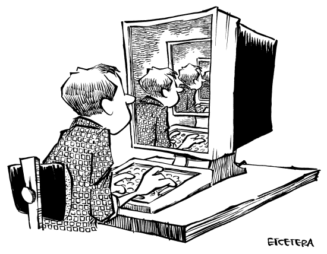

# 尾声：通过 Unix 获得的启示

> 发件人：Michael Travers [mt@media-lab.media.mit.edu](mailto:mt@media-lab.media.mit.edu)
>
> 日期：1990 年 12 月 1 日 星期六 00:47:28 -0500
>
> 主题：通过 Unix 获得启示
>
> 收件人：Unix 痛恨者
>
> Unix 教会我们万物皆无常，从而摆脱轮回的执着，加速启蒙。例如，当我试图理解别人给我的一个 X 初始化脚本时，看到一行看似普通的 Unix shell 命令，前面带有“exec”一词。出于好奇，我在 shell 窗口输入了 `exec ls`。它列出了目录，然后接着终止了这个 shell 和我打开的所有其他窗口，屏幕几乎一片黑暗，底部挂着一个小小的白色非活动光标，提醒我没有什么是绝对的，万物皆含其反面。
>
> 过去我可能会因这种情况而生气或沮丧。但那是在我通过 Unix 获得启示之前。现在，我不再执着于我的进程。进程和进程的消失都是幻象。世界就是 Unix，Unix 就是世界，不断劳作，为所有有情众生的解脱而努力。
