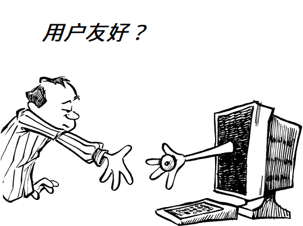
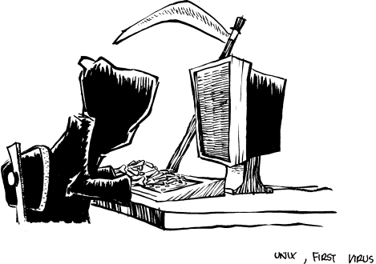

# Unix：世界上第一款计算机病毒

>“伯克利最著名的两项产物是 LSD（麦角酸二乙胺，一种毒品）和 Unix。
>
>我认为这并非巧合。”
>
>——**佚名**

病毒之间的竞争依靠的是尽可能地小巧和提升适应性。它们并不复杂：与其携带完成呼吸、新陈代谢和运动等深奥任务所需的累赘，它们只携带足以实现自我复制的 DNA 或 RNA。例如，任何一种特定的流感毒株，其体积都远远小于它所感染的细胞，但它每隔一个流感季节就能成功变异成一种新毒株。偶尔，它的毒性会大幅提升，进而诱发一场疫情，导致几百万人死亡——这些人免疫系统的反应不够迅速，在杀死入侵者前就已被其杀死。但大多数时候，病毒不过是个无足轻重的烦恼——无法避免，却无处不在。

优秀病毒的特征包括：

• **小巧的体积**
病毒本身并不做太多事情，因此无需很大。一些人甚至争论病毒到底算不算是生命体，抑或只是一些具有破坏性的核酸与蛋白质片段。

• **可移植性**
单一病毒能侵入多种不同类型的细胞，并且通过少量改动，就能感染更多种类。动物和灵长类动物的病毒经常会变异，从而攻击人类。有证据显示，艾滋病毒可能起源于猿类病毒。

• **夺取宿主资源的能力**
如果宿主无法为病毒提供安全的繁殖环境以及复制所需的能量，病毒也无法生存。

• **快速变异**
病毒会频繁变异，形成多种不同的形态。这些变异体在结构上具有共性，但差异又足以混淆宿主的防御机制。

Unix 拥有高度成功病毒的所有典型特征。在它最初的形态中，体积非常小，功能极少。设计上的“极简”被视为至高原则。由于它缺乏那些能让它成为真正操作系统的特性（比如内存映射文件、高速输入/输出、健壮的文件系统、记录/文件/设备锁、合理的进程间通信机制，等等等等），所以它反而具备了可移植性。功能更完整的操作系统，反而会难以移植。

Unix 靠吸取宿主的能量生存；如果没有系统管理员全天候看护，它就会定期崩溃、转储核心、并停机。Unix 经常发生变异：为了让一个版本表现正常而做出的权宜之计与修复，在另一个版本上通常就行不通。如果《天外来菌》（Andromeda Strain）是款软件，那它一定就是 Unix。

Unix 是一款带用户界面的计算机病毒。

## 瘟疫史

Unix 瘟疫的根源可以追溯到 1960 年代，当时美国电话电报公司（American Telephone and Telegraph）、通用电气（General Electric）以及麻省理工学院（Massachusetts Institute of Technology）联合发起了一项名为“信息公用设施（information utility）”的计算机系统研发项目。在美国国防部高级研究计划局（当时称为 ARPA）的重金资助下，这一项目的目标是打造一个像发电厂一样可靠的计算系统：为成百上千的人不间断地提供计算资源。

这个信息公用设施将配备冗余的中央处理器、内存组和输入/输出处理器，以便某一组件可以在不影响系统运作的情况下进行维护。系统的设计还追求最高级别的计算机安全性，确保单个用户的行为不会影响到另一个用户。它的目标甚至写在了名字里：Multics，即 MULTiplexed Information and Computer System（多路复用信息和计算服务）的缩写。

Multics 被设计用于存取大规模数据集，供许多用户同时使用，并帮助他们进行通信。同时，它也能保护用户免受外部攻击。它的构造如同一辆坦克。使用 Multics，就像在驾驶一辆坦克。

Multics 项目最终实现了它所有的目标。但在 1969 年，由于项目进度落后，AT\&T 怯场了：他们终止了参与计划，留下三位研究员——Ken Thompson、Dennis Ritchie 和 Joseph Ossanna——突然闲了下来。三人曾尝试说服管理层采购一台 DEC System 10（这是一台强大的分时计算机，配有成熟的交互式操作系统），但未果。于是 Thompson 和他的朋友们退而求其次，在实验室角落一台闲置的 PDP-7 计算机上编写并玩起了一款叫太空旅行的游戏。

起初，Thompson 利用贝尔实验室的 GE645 计算机交叉编译 PDP-7 版的太空旅行程序。但不久后，他合理化地认为：与其在 GE645 这种舒适环境中继续开发星际大战，不如干脆给 PDP-7 写个操作系统来玩这游戏会更快。于是，他为 PDP-7 写了汇编器、文件系统和一款最简的内核。就这样，为了玩太空旅行，Unix 被酿造了出来。

就像搞生化武器研究的科学家（那也是同期的另一个 ARPA 资助项目），早期的 Unix 研究员并未意识到自己行为的全部后果。但不同于那些生化实验者，Thompson 和 Ritchie 没有任何隔离措施。事实上，他们非但没有防护，还自视为福音传播者。Thompson 等人天真地写了几页文档，称其为“说明书”，然后真的把它寄了出去。

起初，Unix 感染仅限于贝尔实验室内部的几个小圈子。碰巧，实验室的专利办公室需要一款文本处理系统。他们购买了一台 PDP-11/20（此时 Unix 已经变异并感染了第二台主机），成为第一个自愿感染该毒株的受害者。到了 1973 年，Unix 已扩散到实验室内的 25 台不同计算机上，AT\&T 被迫成立 Unix 系统小组来提供内部支持。

哥伦比亚大学的研究员得知 Unix 的存在，联系了 Ritchie 请求拷贝。在人们意识到发生了什么之前，Unix 已经逃逸了。

文献声称 Unix 的成功源于其技术上的优越性。事实并非如此。Unix 的优势是进化上的，而不是技术上的。Unix 成为商业上的成功者，是因为它是一种病毒。它唯一的进化优势在于体积小、设计简单，从而具有可移植性。后来，它之所以流行并获得商业成功，是因为它搭上了三个非常成功的宿主：PDP-11、VAX 和 Sun 工作站（事实上，Sun 的设计就是为了成为病毒的载体）。

正如一位 DEC 员工所说：

>发件人: CLOSET:: E:: PETER 29-SEP-1989 09:43:26.63
>
>收件人: closet:: t\_parmenter
>
>主题: Unix
>
>在我上一份推销 Lisp 机器的工作中，人们经常问我关于 Unix 的事。如果听众中没有女性，我有时会把 Unix 比作疱疹——很多人都有，没有人想要，得上的时候都被坑了，要是能摆脱它，他们早就摆脱了。听到这番话，大家会心一笑，点头附和，通常这也就终结了关于 Unix 的讨论。

在当时（1970 年代末到 1980 年代初）冒出来或已经存在的至少 20 家商业工作站制造商中，只有少数几家——Digital、Apollo、Symbolics、惠普——抵制了 Unix。到了 1993 年，Symbolics 已经申请破产保护（Chapter 11），Apollo 则被收购了（由惠普收购）。其余的公司如今都已坚定地投入 Unix 的怀抱。

## 随机遗传物质的积累

染色体会积累随机的遗传物质；这些物质被快乐而又杂乱无章地复制，并代代相传。若完全绘制出来了人类基因组，我们也许会发现，实际上只有少数百分比的部分描绘了正常的人类功能；其余的部分描述的可能是猩猩、新的突变体、电视布道者，和二手电脑推销员。

Unix 亦如此。尽管最初体积小巧，但 Unix 以惊人的速度积累了大量的垃圾基因组。例如，现在几乎找不到没有内置 Linotronic 或 Imagen 排字机驱动的 Unix 版本，尽管大多数 Unix 用户甚至不知道这些机器长什么样。正如 Olin Shivers 所指出的那样，Unix 最初所受到的进化压力已经放松，这一菌株已经完全失控。

>日期：1991 年 4 月 10 日 星期三 08:31:33 EDT
>
>发件人：Olin Shivers [shivers@bronto.soar.cs.cmu.edu](mailto:shivers@bronto.soar.cs.cmu.edu)
>
>收件人：UNIX-HATERS
>
>主题：Unix 进化
>
>我一直在思考自 Unix 在贝尔实验室诞生以来的整体进化（这里的“进化”一词用得比较宽泛），我认为可以这样描述。
>
>在早期 PDP-11 时代，Unix 程序设计有以下参数：
>
>规则 1：程序不必优秀，甚至不必正确，
>
>但：
>
>规则 2：程序必须小巧。
>
>因此采用了工具包方法，诸如此类。
>
>当然，随着时间推移，计算机硬件变得越来越强大：处理器速度提升，地址空间从 16 位扩展到 32 位，内存成本降低，诸如此类。
>
>所以规则 2 变得宽松。

附加的遗传物质随着病毒的传播不断变异。基因是如何进入其中其实并不重要；它们被忠实地一代代复制，远房亲戚之间的相似程度就像伍迪·艾伦和迈克尔·乔丹之间的相似度一样低。这种行为已在多本书中被提及。例如，在一本关于网络的优秀著作《Internetworking with TCP/IP》（作者 Douglas Comer）中，第 183 页第 15.3 节“路由信息协议（RIP）”描述了劣质基因如何在 Unix 的网络代码中存活并变异（第 3 段）：

>尽管相较于其前身有些许改进，RIP 作为内部网关协议（IGP）流行起来，并非因为其技术优点。相反，这主要是因为伯克利将 routed 软件与流行的 4.X BSD UNIX 系统一同发布。因此，许多互联网站点采用并安装了 routed，开始使用 RIP，却压根没有考虑其技术优劣或局限性。

下一段接着说：

>也许关于 RIP 最令人吃惊的事实是，它是在没有正式标准的情况下构建并广泛分发的。大多数实现都是基于伯克利代码，互操作性受到程序员对未文档化细节和微妙之处理解的限制。随着新版本的出现，问题也越来越多。

就像一家播放跨越数十年经典曲目的广播电台，Unix 同时展现出其混杂且过时的传承。有杂乱无章时代的图形界面；有披头士时代的两个字母命令名；还有系统程序（例如 `ps`），其简洁晦涩的输出是为缓慢的电传打字机设计的；还有宾·克罗斯比时代的命令编辑（`#` 和 `@` 仍然是默认的行编辑命令），以及斯科特·乔普林时代的 core dump（核心转储）。

也有人注意到，Unix 在进化上优于其竞争对手，而非技术上优越。理查德·P·加布里埃尔在他的文章《劣者胜利的崛起》中详细阐述了这一主题（见附录 A）。他的论点是，Unix 的设计哲学要求所有设计决策都倾向于实现的简易性，而非正确性、一致性和完整性。他称之为“劣者胜利”哲学，并展示了它如何产出技术上不如那些以正确性和一致性为首要原则设计的程序，但却因更易移植而在进化上更具优势。就像病毒一样。

病毒并不优雅，但它们非常成功。事实上，你很可能会死于一种病毒。

一个令人宽慰的想法。

## 性、毒品与 Unix

虽然 Unix 像病毒一样传播，但它被如此广泛采纳只能用另一种比喻来形容：设计师药物。

像任何一名优秀的毒贩一样，AT\&T 在 1970 年代免费向大学人员发放 Unix 样本。研究人员和学生从 Unix 中获得的“兴奋感”超过了任何其他操作系统。它便宜、方便修改，能运行在相对廉价的硬件上。对于他们的需求来说，它比他们能获得的任何其他系统都要优越。那些很快会与 Unix 竞争的更好操作系统，要么需要大学买不起的硬件，要么不是免费的，要么还未从实验室中走出，仍在忙着合成。AT\&T 的政策无偿培养出大量新晋的 Unix 黑客，他们在心理上（虽非化学上）对 Unix 产生了依赖。

当 Motorola 68000 微处理器出现时，数十家工作站公司纷纷涌现。很少有公司具备深厚的操作系统专业知识，几乎所有公司都使用 Unix，因为它可移植，而且有大量无其他途径获得修复方案且成本低廉的 Unix 黑客。这些程序员能够临时拼凑（有时称为“移植”）Unix 到不同平台上。对这些工作站厂商来说，经济上的选择就是 Unix。

用户是否想要一款漏洞得不到修复的操作系统？不太可能。用户是否想要糟糕的工具集？大概也不想。用户是否想要没有自动命令补全的系统？不想。用户是否真的想要糟糕且危险的用户界面？绝不。用户是否想要没有内存映射文件的系统？不想。用户是否想要一款只能运行几天（有时几小时）的系统？不想。用户是否想要唯一一款没有智能预读的操作系统？当然不想。用户是否想买到市场上最便宜、又能支持编译器和链接器的工作站？绝对想。他们愿意做出一些牺牲。

用户声称他们选择 Unix 是因为它比过去三十年一直使用的“石刀熊皮”式的 FORTRAN 和 Cobol 开发环境更好。但在选择 Unix 的同时，他们无意中忽视了多年来的操作系统研究，这些研究本可以更好地解决他们的问题。他们认为这没什么关系：Unix 总比他们之前用的要好。到 1984 年，根据 DEC 自己的数据，美国有四分之一的 VAX 安装运行的是 Unix，尽管 DEC 并不支持它。

Sun Microsystems 成功，正是因为它生产了最便宜的工作站，而不是因为它们是最好的或提供了最好的性价比。高质量的操作系统需要太多计算能力来支持。所以，经济上的选择，而非技术上的选择，是 Unix。Unix 被写入了 Sun 的商业计划，资深 Unix 黑客是创始成员之一，客户得到了他们所付出的代价。

## 标准化的不一致

>“标准的奇妙之处就在于有如此多的标准可供选择。”
>
>—— Grace Murray Hopper

自从 Unix 在 1980 年代变得流行以来，Unix 厂商们一直在努力“标准化”这一操作系统。尽管这项努力往往看起来更多是在新闻发布会上进行，而非程序员的屏幕上真正落实，但像 Sun、IBM、惠普和 DEC 这样 的 Unix 巨头实际上已经为此投入了数百万美元，而这很大程度上是他们自己造成的麻烦。

### 为什么 Unix 厂商其实并不真正想要标准的 Unix

推动统一 Unix 的主要是客户，他们看到各种繁多的 Unix 版本，觉得过于复杂，最终选择购买 PC 克隆机并运行微软 Windows。当然，客户更愿意购买价格相近的工作站并运行“真正的”操作系统（他们被误导认为这就是 Unix），但总担心关键应用程序无法在所购买的特定 Unix 版本上得到支持。

客户想要兼容版本 Unix 的第二个原因是，他们误以为软件兼容性会迫使硬件厂商在价格和性能上竞争，最终导致工作站价格下降。

当然，这两个理由正是 Sun、IBM、惠普和 DEC 等工作站公司其实不想要统一版本 Unix 的原因。如果每台 Sun、IBM、惠普和 DEC 的工作站都运行相同的软件，那么一家已经投入 300 万美元购买 Sun 产品线的公司就没有理由继续使用 Sun 的产品了：他们完全可能转而购买惠普或 DEC 的工作站，只要其中一家价格更优。

这很讽刺。客户选择 Unix 的原因之一是期待“开放系统”，用以替代他们专有的大型机和小型机。但归根结底，转向 Unix 只是换上了一款新的专有系统——恰好是专有版本的 Unix。

>日期：1991 年 11 月 20 日 星期三 09:37:23 PST
>
>发件人：[simsong@nextworld.com](mailto:simsong@nextworld.com)
>
>收件人：UNIX-HATERS
>
>主题：Unix 命名
>
>或许对大多数人来说，跟踪各种 Unix 版本的不同名称并不是个问题，但今天 NeXTWORLD 这里的校对编辑问我，AIX 和 A/UX 有什么区别。
>
>“AIX 是 IBM 的 Unix，A/UX 是 Apple 的 Unix。”
>
>“它们有什么区别？”他问。
>
>“我不确定。它们都是 AT\&T System V 加上无意义的改动。还有 HP-UX，是惠普的 System V 版本，也加了无意义的改动。DEC 称他们的系统为 ULTRIX，DGUX 是 Data General 的。别忘了 Xenix——那是 SCO 的。”
>
>与此同时，NeXT 称他们的 Unix 版本为 NEXTSTEP（其实是以 Mach 为内核，外面包了一层死板的 Unix）。但要定义 NEXTSTEP 根本不可能：它是窗口系统吗？Objective-C？还是环境？Mach？到底是什么？

最初，许多厂商想用“Unix”这个词来描述他们的产品，但被 AT\&T 的律师阻止了，律师们认为“Unix”这个词是某种有价值的注册商标。于是厂商们选择了像 VENIX 和 ULTRIX 这样的名字，以避免可能的诉讼。

然而，如今大多数厂商如果可以选择的话，根本不会用带 U 字母的那个词。他们并不是为了躲避诉讼，而是真的想把他们新改进的 Unix 和那些仅仅满足行业标准的其他 Unix 版本区分开来。

对厂商们严厉批评很难避免。毕竟，他们一方面说想为用户和开发者提供一个统一的 Unix 环境；另一方面却又说想做出自己带有商标的 Unix 版本，比竞争对手稍微好一点：增加几个功能、改进功能性、提供更好的管理工具，然后就可以提高售价。任何认为真相介于两者之间的人，实际上都被蒙蔽了眼睛。

>日期：1990 年 5 月 13 日 星期日 16:06 EDT
>
>发件人：John R. Dunning [jrd@stony-brook.scrc.symbolics.com](mailto:jrd@stony-brook.scrc.symbolics.com)
>
>收件人：[jnc@allspice.lcs.mit.edu](mailto:jnc@allspice.lcs.mit.edu)，UNIX-HATERS
>
>>主题：Unix：不兼容性的终极表现。
>>
>>日期：1990 年 5 月 8 日 星期二 14:57:43 EDT
>>
>>发件人：Noel Chiappa [jnc@allspice.lcs.mit.edu](mailto:jnc@allspice.lcs.mit.edu)
>>
>>\[...]
>>
>>我认为 Unix 和雪花是宇宙中唯一两类没有两个实例完全相同的对象。
>
>我觉得说得很对，这让我想起了另一个故事。
>
>几年前，我作为顾问工作时，有一次受雇于一家软件公司，他们正在开发一款大型图形用户界面应用程序。他们用某种运行在 PDP-11 上的 Unix 进行开发，计划将其连同一块硬件板一起卖给 OEM。我负责评估各种 Unix 变种，这些变种运行在各种类似多总线（multibus）的硬件上，以看看哪个最符合他们的需求。
>
>评估过程主要是试图让他们的测试程序（产品的早期原型）能在各种 \*nix 系统上编译并运行。对我来说，这本该是小菜一碟。结果却发现，一家厂商竟然把这类系统函数的参数顺序全部调换了。更糟糕的是，Xenix 编译器有个 bug，不能直接用字节大小的 frobs，必须用结构体和联合体来“骗过”它。再说 Venix 的伪实时功能根本不管用，得自己写一套。诸如此类，令人头疼。
>
>具体哪个变种出现了什么问题我记不清了，但结果是我测试的五个版本中，没有两个能兼容运行除最简单程序以外的东西！我震惊了，也很失望，同时又佩服这类声称兼容的操作系统家族竟然会出现这种状况。但更让我震惊的是，现场的其他 \*nix 黑客对此毫不意外！他们的态度大概是“生活就是这样，几个 `#ifdef`，几个伪造的库接口函数，有什么大不了？”
>
>我想这个故事的寓意就是：千万别指望任何跟 Unix 有关的东西能和其他 Unix 相关的东西兼容。哦对了，我后来听说那家软件公司最终比原计划晚了两年才完成项目，最后干脆完全抛弃了 Unix，改用 MS-DOS 机器部署。他们声称，只有这样做才能让产品最终发布！

1989 年，Alcoa 实验室应用数学与计算技术部工程师 Pete Schilling 在 Peter Neumann 的 RISKS 邮件列表中发表文章，批评了将“标准”一词应用于 Unix 这类软件系统的整个概念。Schilling 认为，真正的标准是针对物理对象，比如钢梁：它们让设计师能够订购零件，并在设计中预先知道该零件在实际条件下的表现。“如果一根钢梁在使用中断裂，建筑商的律师就会联系钢梁制造商的律师，讨论赔偿和惩罚性赔偿等问题。”显然，责任威胁让大多数公司保持诚信；那些不诚实的公司很可能很快就会倒闭。

而当这个标准概念应用于软件系统时就崩溃了。Unix 的某个版本满足什么样的规范？POSIX？X/Open？CORBA？这些标准有太多模糊空间，以至于让人觉得一家公司因不遵守它们而承担责任简直荒谬。事实上，每家公司都遵循自己设计的标准，但它们的产品却互不兼容。

Sun Microsystems 最近宣布将与 NeXT 合作推广 OpenStep，这是一种面向对象用户界面的新标准。为了实现开放性，Sun 将在 Objective-C 和 NEXTSTEP 之上包裹 C++ 和 DOE。还没决定要遵循哪个标准？没问题，现在你都可以同时遵循它们。

希望你在此期间不需要完成任何工作。

## Unix 神话

吸毒者常常自欺。“大麻不会让我变笨。”“我只打算试一次可卡因。”“我什么时候想停就能停。”如果你碰上卖毒品的，这些谎言你肯定会听到。

Unix 也有自己的一套神话，还有一张推销这些神话的“经销商”网络。也许你以前见过它们：

1. 它是标准的。
2. 它又快又高效。
3. 它是适用于所有用途的正确操作系统。
4. 它小巧、简单且优雅。
5. Shell 脚本和管道是构建复杂问题和系统的绝佳方式。
6. 它有在线文档。
7. 它有文档。
8. 它是用高级语言编写的。
9. X 和 Motif 让 Unix 像 Macintosh 一样用户友好且简单。
10. 进程开销低。
11. 它发明了：

* 分层文件系统
* 电子邮件
* 网络和互联网协议
* 远程文件访问
* 安全/密码/文件保护
* finger 命令
* 对 I/O 设备的统一处理。

12. 它有高效的编程环境。
13. 它是现代操作系统。
14. 它是用户所需。
15. 源代码：

* 可获得
* 能看懂
* 你从制造商买的版本和实际运行的版本一致。

接下来的章节会讨论并揭穿这些大多数神话。

