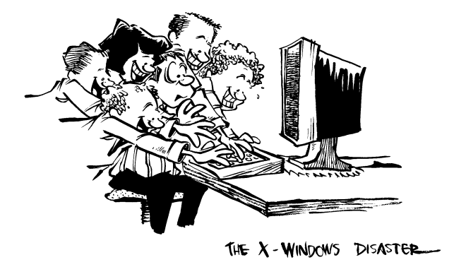

# X-Windows 灾难：教你把 50 MIPS 工作站慢成 4.77MHz IBM PC




> 如果让 X Windows 的设计师来造汽车，驾驶舱里至少会藏着五个方向盘，而且它们各自遵循的原则各不相同——不过你可以用汽车音响来换挡。那真是项实用功能。
> 
> —— Marcus J. Ranum
>
> 数字设备公司（DEC）

X Windows 是图形用户界面的伊朗 - 康特拉事件：一场政治妥协、错综复杂的联盟、营销炒作以及纯粹贪婪的悲剧。X Windows 对内存的消耗，就像罗纳德·里根对金钱的态度一样。多年来的“巫术人体工学”导致了前所未有的庞大内存赤字。分裂的依赖关系、分布式死锁和偏袒性的协议加剧了僵局、恶化了竞态条件，并助长了双重标准。

X 也有过价值 5000 美元的马桶座——比如 Sun 的 Open Look 时钟工具，它吞噬了 1.4 兆字节的真实内存！即使你拿 22 台 Commodore 64 的全部内存来供给时钟工具，它仍然不足以告诉你时间。即使是标准的 X11R4“xclock”工具运行时也要消耗 656K 内存。而且 X 的内存使用量还在不断增加。

## X：第一次完全模块化的软件灾难

X Windows 最初是 MIT 计算机科学实验室五楼一位程序员的个人项目。这位技术高超的黑客熟悉斯坦福大学在 V 项目中开发的 W 窗口系统，决定编写一个分布式图形显示服务器。其理念是允许一个程序（称为客户端）运行在一台计算机上，并在另一台运行特殊程序（称为窗口服务器）的计算机上显示界面。两台计算机可以是 VAX 机或 Sun 机，或者一台是 VAX 机另一台是 Sun 机，只要它们通过网络连接，并且都实现了 X 协议 [^1] 即可。

X 的发展是在一种真空状态中进行的。当时没有公认的 Unix 图形标准，X 提供了一个标准——并且带来了免费的实现版本。X 拉平了竞争的起跑线：对于大多数应用来说，每个人的硬件性能突然都取决于免费的 MIT X 服务器能达到的水平。

直到今天，X 服务器仍然把高速计算机变成了哑终端。要让 X 运行流畅，你需要一台性能相当强劲的计算机——这是硬件厂商所喜欢的。

[^1]: 我们试图避免在本书中使用段落长度的脚注，但 X 系统却让我们不得不破例，因为它颠倒了 client 和 server 的含义。在所有其他的 client/server 关系中，server 是运行应用程序的远程机器（例如，server 提供数据库服务或计算服务）。但出于某种难以理解的怪异原因，X 系统坚持将运行在远程机器上的程序称为“client”。这个程序会将其窗口显示在“window server”上。我们在讨论图形 client/server 时，将遵循 X 的术语使用。因此，当你看到“client”时，请理解为“运行应用程序的远程机器”；而当你看到“server”时，请理解为“显示输出并接收用户输入的本地机器”。


### 非图形化图形用户界面


X 最初设计用来运行三个程序：xterm、xload 和 xclock（窗口管理器的概念是在事后才加上的，这点也显而易见）。在 MIT 开发的最初几年里，这确实是唯一运行在该窗口系统下的程序。请注意，这些程序中没有一个拥有真正意义上的图形用户界面（除了 xclock），只有一个程序实现了剪切和粘贴功能（而且只支持单一数据类型），它们也都不需要特别复杂的颜色管理方法。那么，现代 X 在这些方面表现不佳，难道还让人惊讶吗？

十年后，大多数运行 X 的计算机上只运行四个程序：xterm、xload、xclock 和一个窗口管理器。而大多数 xterm 窗口中运行的则是 Emacs！X 无疑是弹出一个 Emacs 窗口最昂贵的方式。把终端处理放在内核中——它本应在这里——会更便宜、更简单，而不是迫使用户购买昂贵的点阵图终端来运行基于字符的应用程序。另一方面，用户也就得不到那些丑陋的字体了。这就是权衡。

### Motif 自虐工具包

X 给 Unix 供应商带来了他们多年来一直宣称想要的东西：一个允许为不同计算机构建的程序互操作的标准。但它并没有满足更多需求。X 给程序员提供了一种显示窗口和像素的方法，但它并没有涵盖按钮、菜单、滚动条或其他任何图形用户界面所必需的元素。程序员们于是自行发明了这些。很快，Unix 社区出现了大约六种不同的界面标准。一群多年未写过超过十行代码的人，在马萨诸塞州剑桥的一座曾经是失败电脑公司旧址的砖楼里，提出了一个“解决方案”——开放软件基金会（Open Software Foundation，OSF）的 Motif。

Motif 做的事情就是让 Unix 变得缓慢，真的非常慢。Motif 的一个公开设计目标，是给 X 窗口系统提供 1988 年代 HP 窗口管理器的窗口管理能力和微软 Windows 的视觉优雅。我们不是在开玩笑。

灾难配方：从微软 Windows 的隐喻开始——这是用汇编手工编码设计的。在 X 的三四层基础上构建一个类似 Windows 的系统，命名为“Motif”。然后让两台 486 机器并排放置，一台运行 Windows，一台运行 Unix/Motif。看着 Motif 慢得像爬行，看它枯萎，看它像俄国政变一样迅速崩溃。Motif 无法与 Macintosh OS 或 DOS/Windows 作为交付平台竞争。

### 冰块（ICCCM）：致命武器

X 的一个基本设计目标是将窗口管理器与窗口服务器分离。“机制，而非策略”成为其口号。也就是说，X 服务器提供了在屏幕上绘图和管理窗口的机制，但并不实现特定的人机交互策略。这个设计在当时（尤其是在研究社区中，试验不同人机交互方案时）看似是个好主意，但却导致了用户界面领域的“巴别塔”混乱。

你坐在朋友的 Macintosh 电脑前，单个鼠标按钮，使用毫无障碍；坐在朋友的 Windows 机器前，两个按钮，也能轻松使用。但试试在朋友的 X 终端上操作呢？三个按钮，每个按钮的功能每天都可能不一样，还得面对诸如 control-left-button、shift-right-button、control-shift-meta-middle-button 等复杂组合。对程序员来说，情况也好不到哪里去。

因此，X 联盟推出了堪称惊世骇俗的文献——“客户端间通信约定手册”（Inter Client Communication Conventions Manual，简称 ICCCM，也称为“冰块三次方”或“I39L”，意指“I，39 个字母，L”）。它描述了 X 客户端必须遵循的通过 X 服务器相互通信的协议，涵盖窗口管理、选区、键盘和色彩映射焦点、会话管理等诸多内容。简言之，它试图弥补 X 设计者遗漏的内容，修正他们的错误。

但为时已晚——ICCCM 发布时，许多窗口管理器和工具包已经开始开发，每次新版 ICCCM 都不得不兼顾向后兼容那些历史遗留的错误。

ICCCM 极其复杂，必须严格遵守，但即便如此，问题仍未解决。实现 ICCCM 合规是开发 X 工具包、窗口管理器甚至简单应用时最复杂的工作之一。很多时候，其带来的好处远不及合规的麻烦。而一旦有程序不遵守规范，就会破坏其他程序的正常运行。

这就是为什么 X 下的剪切粘贴功能常常无法正常工作（除非只是纯 ASCII 文本），拖拽操作会导致系统死锁，色彩映射闪烁且时机总是不对，键盘焦点滞后于光标，按键发送到错误的窗口，弹出窗口被关闭时甚至可能导致整个应用崩溃。

如果你想写一个兼容 ICCCM 的可互操作应用，你必须和每个其它应用及所有可能的窗口管理器反复测试，然后苦苦请求厂商在下一版本修复他们的问题。

总结来说，ICCCM 是一场技术灾难：它是一堆破碎协议的有毒废墟，是向后兼容噩梦，是对过时无关痛痒问题的复杂无解方案，是一团为了掩盖整个行业标准裸帝的道德与智慧沦丧而拼凑的疤痕与伤痕的混乱大杂烩。


> 使用这些工具包就像试图用土豆泥做书架。
>
> —— Jamie Zawinski

## X 神话

X 是一系列神话的集合，这些神话在计算机行业中传播得如此广泛和深远，以至于许多已被视为“事实”，而无人加以思考或反省。

### 神话：X 展示了客户端/服务器计算的强大力量


一提到网络窗口系统，那些把技术和经济学混淆的某些技术狂热者就会口吐白沫，吹嘘他们的客户端/服务器模型，宣称将来掌上电脑只需运行 X 服务器，而程序的另一半运行在街上的某台 Cray 超级计算机上。他们无意中成了硬件厂商推销新系统的棋子。毕竟，还有什么比给用户提供 X 更能逼迫他们升级硬件的方式呢？在这种模式下，一个应用程序可以同时拖垮客户端、服务器和它们之间的网络！

数据库客户端/服务器模型（服务器存储所有数据，客户端请求数据）是合理的。计算型客户端/服务器模型（服务器是昂贵或实验性的超级计算机，客户端是桌面工作站或便携电脑）也是合理的。但图形客户端/服务器模型在某个任意中点切割界面，就像所罗门执行分婴策略一样：腿、心脏和左眼留在服务器，手臂和肺部在客户端，头颅滚落地上，血液飞溅一地。

X 的客户端/服务器概念的根本问题在于，客户端和服务器之间的合理分工必须基于具体应用来决定。有些应用（比如飞行模拟器）要求所有鼠标动作都发送给应用；有些只需要鼠标点击；还有些则根据程序状态或鼠标所在屏幕区域，需要两者的复杂组合。有些程序需要每秒更新屏幕上的仪表或控件，而有些程序仅仅显示时钟，服务器完全可以负责更新，前提是能告诉它去做。

正确的图形客户端/服务器模型应该是可扩展的服务器。远程机器上的应用程序可以按需下载自己的特殊扩展，并在服务器中共享库。下载的代码可以绘制窗口、跟踪输入事件、提供快速交互反馈，并通过使用动态的高级协议与应用程序通信，从而最大限度减少网络流量。

举个例子，假设有一个基于这种可扩展服务器的 CAD 应用。应用程序可以下载一个绘制集成电路（IC）的程序，并为它关联一个名字。以后，客户端只需发送名字和坐标，就能在屏幕上绘制该 IC。更妙的是，客户端能下载绘制整个原理图的程序和数据结构，这些会自动调用以刷新和滚动窗口，完全不需打扰服务器。用户拖动 IC 时，界面流畅无阻，没有网络流量和上下文切换，交互结束时客户端只需向服务器发送一条消息。这使得在低速（也就是低带宽）通信线路上运行交互式客户端成为可能。

听起来像科幻吗？NeWS（Network extensible Window System）就是采用这种可扩展服务器策略的窗口系统，由 Sun 的 James Gosling 编写。借助这样的可扩展系统，用户界面工具包变成了客户端直接下载到服务器的可扩展服务器类库（比如 Sun 的 TNT 工具包）。不同应用的工具包对象在服务器中共享公共对象，节省时间和内存，创建了一致且可定制的外观和感觉。NeWS 甚至把窗口管理器实现于服务器内，消除了窗口操作的网络开销，同时避免了 X 工具包和窗口管理器中的竞争条件、上下文切换开销和交互问题。

最终，NeWS 在经济和政治上不可行，因为它解决了 X 设计时刻意制造的问题。

### 神话：X 使 Unix“易于使用”

图形界面只能掩盖底层操作系统设计上的缺陷和临时拼凑，无法消除它们。
“拖放”这一隐喻试图掩盖 Unix 文件系统的复杂性，但 Unix 的设计与桌面隐喻相去甚远，这使得拖放成了层层拼凑之上又一层补丁，漏洞和问题不断冒出。或许称其为“塌陷 - 拖放”隐喻更贴切，形容其低效和不可靠的表现。

一个鲜明的例子是 Sun 的 Open Windows 文件管理器，它特意将核心转储文件显示成可爱的小红炸弹图标。双击炸弹图标会打开文本编辑器查看核心转储文件，这无害但并无太大用处。但如果你直觉性地将炸弹图标拖放到 DBX 调试工具上，结果就像恐怖分子所期望的那样：整个系统被绑死，因为核心转储文件（包括一大段未映射的零区）通过服务器泵入调试器的文本窗口，导致窗口膨胀到交换空间的最大容量，然后暴力崩溃，替换掉原始核心文件，填满文件系统，压垮文件服务器，最终把文件管理器炸得支离破碎。（此漏洞后来已修复。）

但事情还不止这些：如果你以 root 身份运行文件管理器，它赋予你的权限更大！当你将一个目录拖放到它自己身上时，它会响铃并在窗口底部打印“rename: invalid argument”，然后立即删除整个目录树，且不会更新图形目录浏览器。

以下消息体现了 X 所谓“通过模糊性实现安全”的做法：


> 日期：1991 年 1 月 30 日 星期三 15:35:46 -0800
>
> 发件人：David Chapman <zvona@gang-of-four.stanford.edu>
>
> 收件人：UNIX-HATERS
>
> 主题：MIT-MAGIC-COOKIE-1  
> 
> 今天我第一次尝试用 X 来完成它本来的用途，也就是跨网络显示。于是我从 boris 上打开了一个 telnet 窗口，我在那登录并运行 X，然后连到 akbar，那儿运行我的程序。程序运行后崩溃了。哦。  
>
> 毫无疑问，我得搞点魔法才能开启跨网络的 X。这真愚蠢。好吧，去问 Unix 巫师。你说 setenv DISPLAY boris: 0。大概这意味着 X 太笨，自己无法判断你来自哪里，或者是 Unix 太笨，没法告诉它。嗯，这就是 Unix。 （最好别去猜那个 0 是干嘛的。）
>
> 再次运行程序。现在它告诉我服务器没有授权跟客户端通信。又去问 Unix 巫师。哦，对，你得运行 xauth，告诉它 boris 可以跟 akbar 通信。出于某种原因，这是基于每个用户来做的。我想了 10 秒钟：这能防什么安全漏洞？想不出任何模型。算了，直接运行 xauth 别管它。xauth 有个命令处理器，想跟你聊个天。它显然操作着一个 .Xauthority 文件。好吧，大概我们想为 boris 添加一个条目。执行：
>
> ```sh
> xauth> help add  
> add dpyname protoname hexkey 添加条目  
> ```
>
> 嗯，这没什么用。大概 dpy 是 unix 里“display”的缩写，protoname 一定是……呃，对，协议名。我他妈应该用什么协议？我为什么得知道？嗯，也许它会有合理的默认值。既然我们把 DISPLAY 变量设成了“boris: 0”，也许那是 dpyname。
>
> ```sh  
> xauth> add boris:0  
> xauth: (stdin):4 bad "add" command line  
> ```
>
> 太棒了。我想我还得知道什么是 hexkey。我还以为那是我用来给吉他上的 Floyd Rose 锁弦的工具呢。算了，看看手册页吧。
>
> 我不会把整页手册贴出来；你们自己 man 一下 xauth，保证你笑死。这里是 add 命令的说明：
>
>> add displayname protocolname hexkey  
>> 用给定协议和密钥数据为指定的显示添加一个授权条目到授权文件。数据以偶数长度的十六进制字符串表示，每对字符代表一个字节。第一个数字给出字节的高 4 位，第二个数字给出低 4 位。协议名仅为单个句点时，被视为 MIT-MAGIC-COOKIE-1 的缩写。  
>
>> 显然这完全失控了。为了跨那个他妈的网络运行程序，我得用一个程序敲入一堆不知道干什么用的十六进制字符串，这个程序还用一个特别的缩写代表 MIT-MAGIC-COOKIE-1？这他妈的网络协议名是什么鬼？为什么它是默认协议名那么重要？
> 
> 显然这是安拉的旨意，要我把这台 Unix 机器扔出窗外。我顺从安拉的旨意。  


任何用过 X 的人都知道，Chapman 的错误在于一开始就试图使用 xauth。他本该更清楚的。（应该责怪受害者，而不是程序。）

> 发件人：Olin Shivers <shivers@bronto.soar.cs.cmu.edu>
> 
> 日期：1991 年 1 月 30 日 星期三 23:49:46 EST
>
> 收件人：ian@ai.mit.edu
>
> 抄送：zvona@gang-of-four.stanford.edu，UNIX-HATERS
>
> 主题：MIT-MAGIC-COOKIE-1  
> 
> 在我们 CMU 这边，我不知道有谁真的在用 xauth。我认识几个人曾盯着它看了很久。我也认识几个挺厉害的 X 高手。比如，那个发过一个程序展示如何从 X 服务器捕捉按键（这样你就可以，比如说，偷看他输入密码）的人，就是我们这儿的研究生。这些人里没有谁在用 xauth。他们只是冒着风险生活，或者在需要开启 X 网络连接时，带着点紧张地切换 xhost 认证。  
> 
> 每当我想到自己花在理解和使用这些系统上的时间，我就觉得它们简直是某种认知黑洞。一个周期黑洞；一个潜伏着、等待诱捕粗心者的恶性实体。  
> 
> 我完全无法在脑海中构建出会设计这种系统的人的样子。他们的大脑究竟在怎样怪异的路径中游走？我唯一能想象的，是一个追求秩序的系统，被外部注入的噪声彻底淹没了 —— 一些精神病患者就表现出这种行为。他们努力想保持连贯、理性，但最终噪声的复杂性压倒了他们。于是就蹦出来了胡言乱语、狂躁挣扎，或者……xauth。  
> 
> 真让人清醒的是，我们竟然生活在一个允许设计出像 xauth 这种系统的人投票、开车、拥有枪支，甚至繁衍后代的社会里。  


### 神话：X 是“可定制的”

……但一块熔化的生铁也是如此。不过情况正在好转；至少你现在不必用徒手操作了。Hewlett-Packard 的 Visual User Environment 如此前沿，甚至还有一个图标，你可以点击它来启动资源管理器：它会在你的 .Xdefaults 文件上弹出一个 vi！确实是一个节省劳力的装置——只要你全知全能，足以理解 X defaults，而且还够古老，愿意使用 vi。下面这条信息描述了 X defaults 所未能提供的令人敬畏的灵活性与无限的表达自由。


> 日期：1991 年 2 月 22 日 星期五 08:17:14 -0800
>
> 发件人：beldar@mips.com（Gardner Cohen）  
> 
> 我猜 josh 刚刚给你发了关于 .Xdefaults 的邮件。我也对答案感兴趣。X 程序是如何处理默认值的？它们都是自己搞一套吗？  
> 
> 如果它们是基于 Xt 的，就会遵循某种形式的标准，而且你可以遍历正在运行的应用程序的 widget 树，来查出有什么可以修改的。如果不是基于 Xt 的，那它们就可以为所欲为。  
> 它们可以调用 XGetDefault，这个函数不会查看任何类名，也不会识别命令行上的 -xrm 参数。  
> 
> 想要搞清楚一个正在运行的程序中某个资源值到底来自哪里，简直太“有趣”了，因为资源可能来自以下任何地方（而且这些来源的优先级顺序是规定过的，从 R2 到 R3 到 R4 都在变）：  
> 
> - `.Xdefaults`（仅当他们没有执行过 xrdb）  
> - 命令行上的 `-xrm 'thing.resource: value'`  
> - `xrdb`，用户在 `.xsession` 或 `.xinitrc` 中运行这个程序；它会对传入的文件名参数运行 `cpp`，因此任何来自其他星球的破烂都可能被 `#include` 进来。哦，对了，它还会 `#define COLOR` 和其他几个东西，所以你最好清楚它运行在什么类型的显示器上。  
> - 由 `XENVIRONMENT` 指定的文件名  
> - `.Xdefaults-hostname`  
> - 一个文件名，该名字是应用程序的类名（通常是完全反直觉生成的，比如 xparty 对应 XParty，mwm 对应 Mwm，xrn 对应 XRn，等等），位于 `/usr/lib/X11/app-defaults` 目录中（或者由环境变量 `XAPPLRESDIR` 所指定的目录）。构建并安装 X 库的人可能改动过这个默认目录。  

或者，那些真正富有“创意”的程序，甚至可能主动去寻找并合并来自其他“快乐地点”的资源数据库。最近发布的 Motif 化的 xrn 就有一个脑瘫级别的资源编辑器，它会把修改过的资源丢进当前目录和用户的 home 目录中的文件里。启动时，它会满世界地寻找那些看起来好笑的文件名来加载，其中很多以点开头，这样在你列出文件时它们就“不会打扰”你。

又或者，基于 WCL 的应用程序的作者可以加载那些实际上会根据这些（或其他）资源文件中指定的名称生成新部件（widgets）的资源文件。

这意味着，那些比一般熊还聪明的用户，居然设法搞明白了——

```
snot.goddamn.stupid.widget.fontList: micro
```

如果那个比一般熊还聪明的用户，终于弄清楚要修改他的 snot 程序的字体所需的资源名，却可能完全搞不清楚这东西到底该放哪儿。坐在隔壁隔间的 Joe 会说，“就放到你的 .Xdefaults 里”，但如果 Joe 曾经抄过 Fred 的 .xsession，他执行的是 `xrdb .xresources`，于是 .Xdefaults 根本不会被读取。Joe 要么根本没用过 xrdb，要么是以前有人告诉他要 `xrdb .Xdefaults`。他纳闷为什么自己修改了 .Xdefaults，效果却总要等到“注销后”才生效，因为他根本没重新运行过 xrdb 去重新加载资源。而且当他从家里用 NCD 登录时，程序的表现又“不同了”，他也不知道为什么。“有时候就是不一样。”

Pat Clueless 总算发现了 `XAPPLRESDIR` 这个办法，它允许为每个应用程序分开放资源文件。但 Pat 不知道这个程序的类名是什么。他知道可执行文件名叫 snot，于是他试着加个名为 Snot 或 XSnot 或 Xsnot 的资源文件，却完全无效。Pat 有一份 man 手册，但上面忘了写程序类名，而且讲解资源的方式永远是以“\*”开头的，那根本没用。Pat 去问 Gardner，Gardner 用 emacs 打开那个可执行文件，搜索（不区分大小写的）“snot”，找到几个“SNot”的字符串，于是建议用它。居然成了，万岁。Gardner 还告诉 Pat 可以用 `SNot*fontList: micro` 来修改程序里所有字体，但不知为何有些控件并没有换字体。有人指出，那是因为 Pat 的 `.xresources` 文件里有一行（也可能是在 `.xresources` 里 `#include` 进来的某个文件中）写着 `*goddamn*fontList: 10x22`，这是他从去年辞职的 Steve 那里复制的。显然，这个资源比 Pat 的“更具体”，所以它优先生效。到底“更具体”是什么意思，谁知道呢。抱歉，Steve。你自己都已经记不清这行资源本来是给哪个程序用的了。太糟糕了。

唉，一切都没完没了。试着教人怎么修改窗口管理器的某个行为，得先 re-xrdb，然后选择窗口管理器的“重启”菜单项（不过大多数人都没有这个选项，因为他们抄了隔壁那哥们的 .mwmrc 文件），否则就得注销。到底该改哪个文件？`.mwmrc`？Mwm？`.Xdefaults`？`.xrdb`？`.xresources`？`.xsession`？`.xinitrc`？`.xinitrc.ncd`？

为什么这一切就不能像我希望的那样正常工作？为什么我去用隔壁的工作站时，一些窗口却会在我自己这台机器上弹出来？为什么我 rlogin 到另一台机器，运行程序时就会冒出奇怪的 X 消息，甚至 core dump？我要怎么关闭那个自动聚焦的行为？我根本不知道它从哪来的，我只是 `#include` 了 Bob 的配色方案文件，然后一切都变得乱七八糟，我完全搞不清到底为什么！

有人快点开枪吧，我在地狱里！！！


### 神话：X 是“可移植的”

……就像伊朗门事件并不是“用武器换人质”一样。

即使你能成功编译某款 X 程序，也不能保证它能在你的服务器上运行。如果某个应用程序需要你的 X 服务器并不支持的扩展功能，它就会失败。X 应用程序无法自行扩展服务器——扩展功能必须被编译并链接进服务器本身。而大多数有趣的扩展实际上都需要对 X 服务器进行大量修改和重新编译，这是个绝对不简单的任务。下面这封邮件描述了编译这些“可移植的”X 服务器扩展时，那种令人脑壳炸裂、眼珠子掉出来的痛苦经历：


> 日期：1992 年 3 月 4 日 星期三 02:53:53 PST
>
> 主题：X-Windows：哎呀，我屁股真疼
> 
> 发件人：Jamie Zawinski [jwz@lucid.com]
>
> 收件人：UNIX-HATERS
>
> 主题：X：或者，我是如何学会停止担心并爱上原子弹的  
> 
> 永远别相信 X 服务器扩展的安装说明。真的，别信，那完全是浪费时间。你可能会想：“我只需要安装这段代码，重新编译一下 X 服务器，然后 X 就会稍微不那么白痴了；这会很容易。我又绕过了一个愚蠢的设计缺陷，我就赢了。”哈！你倒不如去嚼玻璃，可能还有更高的收益。  
> 
> 四个小时的折磨之后，你将体验到诸如这样的“美好”：在十几个目录里你得创建一个名为“X11”的符号链接，指向真正的 X 头文件所在位置，因为自动生成的 makefile 会搞出这种东西：  
>
> ```c
> -I../../../../../../include
> ```
>
> 而不是像这样：  
>
> ```c
> -I../../../../include
> ```
>
> 更精彩的是：  
>
> ```c
> -I../../.././../mit/./../../../include
> ```
>
> 然后你还得手动修改这些自动生成的 makefile，因为有些随机的预处理器符号没有定义，导致出现一堆莫名其妙的“don’t know how to make”错误。  
> 
> 然后你会发现“makedepend”报错了，虽然你根本就不在乎它是否能跑。但扩展的安装脚本用的是符号链接而不是拷贝，所以 `..` 不能在这些链接里正常工作。接着是这个问题，那个问题，层出不穷……  
> 
> 最后你终于意识到，要编译 X 的任何一个基本组成部分，唯一的方法就是跳到项目树的最顶层，比你真正想要生成的可执行文件高出五级，然后执行：
>
> ```sh
> make Everything
> ```
>
> 然后一小时后等它完成“生成 MAKEFILE”的步骤，再回来看看有没有实际的“编译”问题。  
> 
> 接着你会开始问自己：“它为什么要编译那个？我又没改它，它到底在干什么？”  
> 
> 别忘了你还 **必须** 编译整个 PEX，尽管这些东西根本不会被链接到你实际要运行的任何可执行文件中。**这是为了你自己的好！**  
> 
> 然后你终于意识到你到底哪里做错了，你终于明白你 **早就应该** 做的事情是：
>
> ```make
> all::
> 	$(RM) -rf $(TOP)
> ```
> 
> 但要小心！第二行 **不能** 以空格开头！


总体来说，X 扩展是失败的。唯一证明这一规则的例外是 Shaped Window 扩展，它专门设计用来实现圆形时钟和眼球效果。但大多数应用程序开发者根本不愿意使用像 Display PostScript 这样专有的扩展，因为 X 终端和 MIT 服务器都不支持它们。很多人觉得使用更普及的扩展，比如共享内存、双缓冲或样条曲线，太麻烦了：这些功能在许多情况下仍然不起作用，所以你得准备好不用它们。如果你真的不需要扩展，为什么还要用特例来复杂化代码呢？而且大多数使用扩展的应用程序只是默认它们被支持，如果不支持就会崩溃。

对于 X 在图形方面采取的最低公分母策略，最多能说的是它“拉平了竞技场”，让一些极其愚蠢的公司也能跳上这趟顺风车，卖一些和高端品牌工作站一样没用的过时破烂。

> 日期：1991 年 4 月 10 日 星期三 08:14:16 EDT

> 发件人：Steve Strassmann <straz@media-lab.mit.edu>

> 收件人：UNIX-HATERS

> 主题：地狱般的显示器  
> 
> 我的 HP 9000/835 控制台配备了两台 19 英寸彩色显示器，还有一些极其昂贵的 Turbo SRX 图形硬件来驱动它们。你可能会以为我只需告诉 X windows 它有两个显示器，左边一个，右边一个，但这未免太简单得不可思议了。毕竟，如果像 Macintosh 这样的玩具能做到，Unix 就必须让这事变得更复杂，以证明它的高级。  
> 
> 所以，实际上我有两个显示设备，分别是 `/dev/crt0` 和 `/dev/crt1`。不，抱歉，我骗你了。  
> 
> 你看，Turbo SRX 显示器有一个图形平面（每像素 24 位）和一个叠加平面（每像素 4 位）。叠加平面用于窗口系统之类的东西，比如光标，而图形平面用来绘制 3D 图形。  
> 所以我实际上需要四款设备：
>
> ```sh
> /dev/crt0 —— 右显示器的图形平面  
> /dev/crt1 —— 左显示器的图形平面  
> /dev/ocrt0 —— 右显示器的叠加平面  
> /dev/ocrt1 —— 左显示器的叠加平面  
> ```
>
> 不，抱歉，我又骗你了。  
> 
> `/dev/ocrt0` 只能给你四个位叠加平面中的三个。第四个位是专门为联邦紧急救援队保留的，以防国家爆发像素腐烂（Pixel Rot）。如果你想冒险接受 FBI 调查的威胁，可以使用 `/dev/o4crt0` 和 `/dev/o4crt1` 来真正使用叠加平面。  
> 所以，你只需告诉 X Windows 使用这些 o4 叠加层，就可以在图形平面上绘图。  
> 
> 不，抱歉，我又骗你了。  
> 
> X 不支持在这 4 位叠加平面上运行。原因是我用的是 Motif，它高级得很，强迫你在每个窗口周围放一个一英寸厚的边框，以防你的鼠标笨得连瞄准都做不到，因此你需要那些设计风格跟莫斯科国际机场跑道一样的控件。我的程序有个浏览器，实际上用不同颜色区分不同类型的节点。然而，和 IBM PC Jr. 不同，这台价值 15 万美元、每像素 28 位的超级显示硬件工作站，最多只能显示 16 种颜色。如果你用 Motif 这种自虐套件，试图请求第 17 种颜色，你的程序会惨烈崩溃。  
> 
> 于是，我聪明地想，我就让 X Windows 运行在图形平面上。这意味着 X 不会用叠加平面，而叠加平面有专门的光标硬件。这也意味着我不能用超级酷的 3D 图形硬件，因为如果要画一个立方体，我得“偷用”X 的帧缓冲区，而 X 对这种事冷漠又不合作。  
> 
> 不过，这也给了我一种独特的“乐趣”：叠加平面用于 `/dev/console`，这意味着所有控制台消息都会以 10 号粗体 Troglodyte 字体显示，白色叠加在屏幕上的任何东西上面，比如我可能正在使用的打印机演示，或者 NFS 因超时崩溃，又或者某个文件服务器警告只剩三个小时计划停机维护，屏幕上不断跳出各种消息，就像患有妥瑞症的法庭速记员一样。  
> 
> 常规的 X 刷新命令对清理这类“失禁”毫无办法，因为 X 无法访问叠加平面。我得写一个 C 程序，从某个 xterm 窗口调用，只负责擦除叠加平面上的这些脏乱。  
> 
> 所以，我的超级 3D 图形只能运行在 /dev/crt1 上，而 X Windows 只能运行在 /dev/crt0 上。当然，这意味着我不能把鼠标移到 3D 图形显示上，但正如 HP 技术支持说的：“你什么时候会需要指向你用 3D 画出来的东西呢？”  


### 神话：X 是设备无关的

X 极度依赖设备，因为所有 X 图形都是以像素坐标指定的。在不同分辨率的屏幕上绘制的图形尺寸会不同，因此如果你想绘制特定尺寸的图形，就必须自己对所有坐标进行缩放。并且，并非所有屏幕的像素都是方形的：除非你不介意矩形方块和椭圆形圆圈，否则你还必须根据像素的宽高比调整所有坐标。

像填充和描边图形这样简单的任务，在 X 的奇怪的像素导向成像规则下却相当复杂。当你用 XFillRectangle 填充一个 10x10 的正方形时，它会填充你预期的 100 个像素。但如果你用相同参数调用 XDrawRectangle，你会得到额外的“赠送像素”，因为它实际上绘制的是一个 11x11 的正方形，比预期多出一行和一列像素！如果你难以相信，可以自己查阅 X 手册第一卷第 6.1.4 节。手册用居高临下的语气解释说，给填充矩形的 x 和 y 位置各加 1，同时宽度和高度各减 1，可以使填充矩形恰好适合在描边内。但手册也指出，“弧线的情况则更加复杂（很可能无法以可移植的方式实现）。”这意味着，使用 X Window 系统时，要在不重叠或留空隙的情况下，便携地填充和描边任意缩放的弧线是一个难以解决的问题。仔细想想，甚至连用粗线条画一个正确的矩形都做不到，因为线宽是以未缩放的像素单位指定的，如果你的显示屏像素是矩形的，纵向和横向的线条厚度就会不同，尽管你已经缩放了矩形的角坐标以补偿宽高比。

颜色问题完全是一场混乱的飞行马戏团。X 对设备独立性的处理方式，就是把一切都当成一个疯狂版的 MicroVAX 帧缓冲器。一个真正可移植的 X 应用程序必须表现得像蒙提·派森的《奶酪店》小品中那个执着的顾客，或者《蒙提·派森与圣杯》中的圣杯追寻者。即使是最简单的应用，也必须回答许多棘手的问题：


```
服务器：你的 Display 是什么？  
客户端：display = XOpenDisplay("unix:0");  
服务器：你的 Root 是什么？  
客户端：root = RootWindow(display, DefaultScreen(display));  
服务器：那你的 Window 呢？  
客户端：win = XCreateSimpleWindow(display,  
root, 0, 0, 256, 256, 1,  
BlackPixel(display, DefaultScreen(display)),  
WhitePixel(display, DefaultScreen(display)));  
服务器：好吧，你可以继续。  
（客户端通过）  
服务器：你的 Display 是什么？  
客户端：display = XOpenDisplay("unix:0");  
服务器：你的 Colormap 是什么？  
客户端：cmap = DefaultColormap(display,  
DefaultScreen(display));  
服务器：那你最喜欢的颜色是什么？  
客户端：favorite_color = 0; /* 黑色。*/  
/* 哎呀！不，我是说：*/  
favorite_color = BlackPixel(display,  
DefaultScreen(display));  
客户端：/* AAAYYYYEEEEE!!*/  
（客户端崩溃并坠入深渊）  
服务器：你的 display 是什么？  
客户端：display = XOpenDisplay("unix:0");  
服务器：你的 visual 是什么？  
客户端：struct XVisualInfo vinfo;  
if (XMatchVisualInfo(display, DefaultScreen(display),  
8, PseudoColor, &vinfo) != 0)  
visual = vinfo.visual;  
服务器：那 XConfigureWindow 请求的网络速度是多少？  
客户端：/* 那是 SubStructureRedirectMask 还是 ResizeRedirectMask？*/  
服务器：什么？！我怎么可能知道？啊啊啊啊！！！  
（服务器崩溃并坠入深渊）  
```


## X 图形：方枘圆凿

>编程 X 窗口就像试图用罗马数字（如 I、II、IV）算出圆周率的平方根。
>
>——佚名


PostScript 成像模型，被 NeWS 和 Display PostScript 采用，以一种高级、标准且设备无关的方式解决了所有这些糟糕的问题。NeWS 集成了输入、轻量级进程、网络和窗口的扩展功能。它可以在同一任意坐标系中绘图和响应输入，并用 PostScript 路径定义窗口形状。Display PostScript 的 X 扩展主要用于输出，不处理任何窗口系统的问题，这些问题必须通过 X 来解决。NEXTSTEP 是基于 NeXT 自己的窗口服务器，使用 Objective-C 编写的工具包。NEXTSTEP 使用 Display PostScript 进行成像，但不用于输入。它拥有优秀的成像模型和设计良好的工具包，但 Display PostScript 服务器并未设计成可编写交互代码：所有事件都发送到客户端处理，工具包运行在客户端，因此缺少 NeWS 那种低带宽、上下文切换和代码共享的优势。尽管如此，它仍然优于缺乏设备无关成像模型的 X。

另一方面，X 的拼写多年来保持不变，而 NeXT 则曾多次更改其旗舰产品的拼写，经历了“NextStep”、“NeXTstep”、“NeXTStep”、“NeXTSTEP”、“NEXTSTEP”，最终变成“OpenStep”。标准化、一致的拼写显然对市场推广的“机器人”们更为友好。

不幸的是，NeWS 和 NEXTSTEP 因为同样两个问题成为政治上的失败：令人讨厌的大小写混用（oBNoXiOuS capitalization），以及 Amiga 被迫害妄想症 （Amiga Persecution Attitude）。

## X：走向无路之途

X 真是蠢得令人费解，为什么还有人用它呢？我们也说不清。也许是因为他们别无选择。（见图 2）

其实没人真正想运行 X：他们想要的是一种能同时运行多个应用程序并使用大屏幕的方式。如果你想运行 Unix，要么用 X，要么用一个简单的字符终端。

选你的毒药吧。

```
正式通告，请立即张贴  
X  
危险病毒！  

首先，简要历史：X 窗口系统从 MIT 的 Athena 项目逃脱，那里它被隔离保存。当被通知时，MIT 公开声明“MIT 不承担任何责任……”这是一条非常令人不安的声明。随后它渗透进数字设备公司（Digital Equipment Corporation，DEC），从此腐蚀了该组织的技术判断。  

在破坏了数字设备公司之后，一个阴险的 X Consortium 被创建，目的是寻找利用 X 作为计划的一部分，以统治和控制全球的交互式窗口系统。X 窗口有时由这个秘密联盟免费分发给毫无防备的受害者。  

X 的破坏性成本甚至无法估计。  
X 真的是肥胖——无论是破坏你的硬盘还是积极感染你的系统，你都可以确定它的行为绝无善意。无辜的用户需要被保护免受这个危险病毒的侵害。即使你正在阅读这段话，X 的源代码发行版和可执行环境也正在数百台计算机上维护，也许甚至包括你自己的机器。  

数字设备公司已经开始出货携带这一可怕感染的机器。它必须被销毁。  

这就是软件本意良好却走向邪恶的后果。它通过扭曲用户对什么是好软件、什么不是好软件的认知来成为受害者。这个恶性窗口系统必须被销毁。  

最终，DEC 和 MIT 必须为这起令人发指的软件犯罪负责，受到法律制裁，并承担软件清理的费用。在 DEC 和 MIT 对这些指控做出回应之前，应该假定他们是在保护危险的软件罪犯。  

别被蒙蔽！坚决说“不”给 X。  

X 窗口。一个完美执行的错误。  
X 窗口。不满保证。  
X 窗口。没有它你才会感到沮丧。  
X 窗口。连你的狗都不喜欢它。  
X 窗口。不稳定且注定保持这样。  
X 窗口。复杂的无解方案解决简单的无问题。  
X 窗口。缺陷超乎想象。  
X 窗口。形状服从故障。  
X 窗口。指尖上的垃圾。  
X 窗口。无知是我们最重要的资源。  
X 窗口。还可以更糟，但需要时间。  
X 窗口。可能发生在你身上。  
X 窗口。日本的秘密武器。  
X 窗口。任它妨碍你。  
X 窗口。活在噩梦中。  
X 窗口。绳索用得过多。  
X 窗口。从未拥有过，也永远不会。  
X 窗口。没有硬件是安全的。  
X 窗口。权力傻瓜的权力工具。  
X 窗口。权力失败者的权力工具。  
X 窗口。为生产力设定新限制。  
X 窗口。简单被复杂化。  
X 窗口。过时的尖端技术。  
X 窗口。无能的艺术。  
X 窗口。事实上的次标准。  
X 窗口。第一个完全模块化的软件灾难。  
X 窗口。致命的笑话。  
X 窗口。你问题的问题。  
X 窗口。一定有更好的方法。  
X 窗口。警告你的朋友。  
X 窗口。你最好坐下。  
X 窗口。你会羡慕死去的人。  
```

**图 2． 在 X-Windows 会议上分发**


