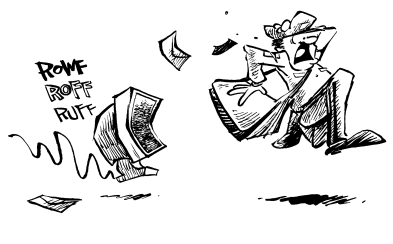

# 邮件：别跟我说话，我不是打字机


> 没有 sendmail 就像没有性病。
>
> ——Ron Heiby
>
> 计算机新闻组 comp.newprod 前版主

> 日期：1992 年 3 月 26 日 星期四 21:40:13 -0800
>
> 发件人：Alan Borning [borning@cs.washington.edu](mailto:borning@cs.washington.edu)
>
> 收件人：Unix 痛恨者
>
> 主题：延迟：不是打字机
>
> 当我试图给一台宕机的 Unix 系统上的某人发送邮件时（这并不少见），邮件程序有时会给出一个完全无法理解的错误提示，例如：
>
> ```sh
> 邮件队列（1 个请求）
> --QID-- --Size-- -----Q-Time----- --------Sender/Recipient--------
> AA12729 166 Thu Mar 26 15:43 borning
> （Deferred: Not a typewriter）
> bnfb@csr.uvic.ca
> ```
>
> 这到底是什么意思？Unix 系统当然不是打字机！如果它是，它的在线时间反而会更长一些（虽然功能上会有些小损失）。

## sendmail：伯克利 Unix 的越南战争

在 Unix 出现之前，电子邮件是直接能用的。不同网络站点的管理员会就发送和接收邮件的协议达成一致，然后编写遵循该协议的程序。在本地，他们也会建立简单直观的系统来管理邮件列表和邮件别名。

说真的：解析地址、解析别名，然后发送和投递一封邮件，能有多难？

事实上，如果你的操作系统恰好是 Unix，那就会非常难。

> 日期：1991 年 5 月 15 日 星期三 14:08-0400
>
> 发件人：Christopher Stacy
> [CStacy@stony-brook.scrc.symbolics.com](mailto:CStacy@stony-brook.scrc.symbolics.com)
>
> 收件人：Unix 痛恨者
>
> 主题：更难！更快！更深！Unix
>
> 还记得以前像 netmail 那样的东西是可以正常工作的吗？自从用了 UNIX，人们基本就不指望事情能顺利运行了。我的意思是，大多数时候，东西“差不多能用”，这样就够好了，不是吗？
>
> 邮件有点不可靠又有什么关系？不能回复消息又怎么样？丢几封邮件又能怎样？
>
> 前几天，我试图联系一个运行 sendmail 的站点的 postmaster。你看，每当我给他们站点的人发邮件时，收到的回复邮件的头部都会被破坏，我没办法再回复他们的回复。看起来问题可能出在他们那边——他认可吗？这是他回我的内容：
>
>> 日期：1991 年 5 月 13 日 星期一 21:28 EDT
>>
>> 发件人：silv@upton.com（Stephen J. Silver[^1]
>>
> >收件人：mit-eddie!STONYBROOK.SCRC.Symbolics.COM!CStacy@EDDIE.MIT.EDU[^2]
>>
>>主题：Re: mangled headers
>>
> >毫无疑问，是我们系统的邮件程序干的。如果你收到了，那就好。如果没收到，那你是怎么知道的？如果收到了，那又有什么问题？只是看起来不好看而已？我不是 sendmail 专家，也没有 sendmail 专家。邮件凑合能用，大多数时候都行，在我能投入的时间内，这就够好了。祝你好运。
>>
>> Stephen Silver

编写一款可靠遵循协议的邮件系统根本没那么难。我不明白，为什么在 Unix 世界里，二十年来竟然没有人能一次性把它做好。


[^1]: 化名

[^2]: 本书的大部分内容中，我们为了清晰起见都对繁杂的邮件头进行了编辑。但在这封邮件里，我们决定完整保留由这个站点的 sendmail 所制造出的成果——编者注。

## 一段惊心动魄的历史

> 日期：1993 年 10 月 12 日 星期二 10:31:48 -0400
>
> 发件人：[dm@hri.com](mailto:dm@hri.com)
>
> 收件人：Unix 痛恨者
>
> 主题：sendmail 简化版
>
>
> 我曾参加过一个与 Unix 有关的讲座。幸运的是，除了讲者的开场白，我成功地把其他内容都压抑住了：
>
> > 我很惊讶 sendmail 的作者居然还能活着走来走去。
>
> 真让我困惑的是，Robert Morris（“互联网蠕虫”的作者）被判入狱，其中一个理由就是他那场恶作剧耗费了系统管理员们大量时间。
>
> 而 sendmail 的作者至今还自由自在地活着，甚至连额头上都没被烙个“U”（代表 Unixery，指 Unix 的乱七八糟）。

Sendmail 是 Unix 的标准邮件传送程序，并且很可能在后续许多年内继续保持这一地位。虽然也有其他邮件程序（比如 MMDF 和 smail）被开发出来，但它们既没有 sendmail 那样的普及度，也没有像 sendmail 那样引发广泛的争议。

Sendmail 由 Eric Allman 于 1983 年在伯克利大学编写，并被包含在伯克利 4.2 Unix 发行版中，作为 BSD 的“互联邮件路由器”。该程序设计为单一的“交叉开关”，用于连接不同的邮件网络。在其最初版本中，sendmail 连接了 UUCP、BerkNet 和 ARPANET（互联网的前身）网络。尽管存在问题，sendmail 仍比它所取代的 Unix 邮件程序 delivermail 更好。

在 1983 年 1 月的 USENIX 论文中，Allman 为 sendmail 设定了八个目标：

1. sendmail 必须兼容现有的邮件程序。
2. sendmail 必须可靠，绝不丢失邮件。
3. 如果可能，现有软件必须负责实际的邮件投递。
4. sendmail 必须能在简单和极其复杂的环境中工作。
5. sendmail 的配置不能被编译进程序，必须在启动时读取。
6. sendmail 必须能让各个群体维护自己的邮件列表，并允许个人指定自己的邮件转发，而无需修改系统别名文件。
7. 每个用户都能指定执行某个程序来处理收到的邮件（这样用户就可以运行“休假”程序）。
8. 尽可能通过批量发送到单一主机来减少网络流量。

（Allman 1983 年论文中未明说的一个目标是，sendmail 还必须实现 ARPANET 初期的 SMTP（简单邮件传输协议），以满足支持伯克利 Unix 开发的军方将领们的要求）。

sendmail 诞生于互联网邮件处理系统仍在变化的时期，因此必须具备可编程性，以应对标准的任何可能变化。深入研究 sendmail 那些难以看懂的 *sendmail.cf* 文件，你会发现它能重新配置内部机制，使得 `@#$@$^%<<<@#) at @$%#^!` 这样的字符串也能成为有效的邮件地址。

这在 1985 年是很棒的功能。但到了 1994 年，互联网邮件标准已确定，这种灵活性已不再必要。不过，sendmail 仍保留着全部功能，就像一条绳索，随时准备打出绞刑结，以备不时之需。

sendmail 是那种聪明的程序，功能多样，具体执行什么任务取决于你调用它时用的名字。有时它是经典的 sendmail，有时是邮件队列查看程序，或者是别名数据库构建程序。《Sendmail Revisited》承认，把这么多功能捆绑到一个程序里可能是个错误：SMTP 服务器、邮件队列处理程序和别名数据库管理系统本应由不同程序负责（这也符合 Unix“工具”哲学）。但实际上我们得到了 sendmail，一款不断超出预期不断发展的程序。


> 日期：1994 年 2 月 6 日 星期日 14:17:32 GMT
>
> 发件人：Robert Seastrom [rs@fiesta.intercon.com](mailto:rs@fiesta.intercon.com)
>
> 收件人：Unix 痛恨者
>
> 主题：智能？友好？不，我才不这么认为……
>
> 令我懊恼的是，最近我所在站点的人们要求我让我们的邮件程序不再遵守 RFC821 标准，改为支持 8 位邮件。显然，越来越流行的 ISO/LATIN1 编码格式是 8 位的（为什么呢？我记得罗马字母表只有 26 个字符），当第 8 位被剥除时，用这种编码的邮件内容会被完全破坏。我不是说剥除高位是好事，只是那是标准，我们制定标准是有原因的，而且 ISO 那些人也不该把脑袋扎得那么深。不过你还能指望那些带给我们 OSI 的人有什么好标准呢？
>
> 所以我决定升级到最新版本的伯克利 Sendmail（8.6.5），据说它对那个标准的遵守做得非常“不严谨”。它附带了一份 FAQ 文档。多好啊，我们有 FAQ，这样越来越无能的 Weenix Unix 用户就能安装和误配置越来越复杂的软件，有时候甚至能诊断出以前需要 <倒吸一口气> 阅读源代码才能解决的问题！
>
> 其中它推荐的一本书，供想成为真正 Sendmail 大师 的人阅读，是：Costales、Allman 和 Rickert 合著的《Sendmail》，由 O’Reilly & Associates 出版。
>
> 你见过这本书吗？它的页数比《战争与和平》还多。比我的 TOPS-10 系统调用手册还厚。用 .177 口径气枪近距离射击这书，它都能挡住弹丸，弹丸甚至连书的一半都没穿透（.22 口径测试安排在下周末）。对某些在互联网上跑机器的“蠢货”来说，可能需要这么详细的讲解，这更可怕。但我扯远了。
>
> 然后，在实际的“问题”章节，我看到：
>
>> 问：Costales 这本书为什么封面是蝙蝠？
>>
>> 答：你想要真实答案还是有趣答案？真实答案是 Bryan Costales 收到三张图片的选择，他选了最喜欢的蝙蝠。有趣答案是，尽管 sendmail 有吓人的名声，像蝙蝠一样，它其实是个相当友好且智能的怪物。
>
> 友好且智能？呸。我能想出一大堆更好的答案，尤其因为这明显是错的。譬如：
>
> * 北美常见的棕蝙蝠主要以虫子为食。Sendmail 是个主要由“虫子”组成的软件包。
> * Sendmail 和蝙蝠一样糟糕。
> * Sendmail 维护者和蝙蝠一样是夜行性生物，发出“eep eep”的声音，普通人根本听不懂。
> * 你看过蝙蝠飞吗？你看过 Sendmail 处理一堆未投递邮件的队列吗？证毕。
> * 蝙蝠和 Sendmail 都很快在被关押时死去。
> * 蝙蝠粪是硝酸钾的良好来源，硝酸钾是会“炸你脸”的东西的主要成分。Sendmail 也是。
> * 蝙蝠和 Sendmail 都被公众低估。
> * 驯服蝙蝠需要带十字架和大蒜的神秘仪式，Sendmail 同样需要诸如以下的神秘咒语：
>
>```ini
> R<$+>$*$=Y$~A$* $:<$1>$2$3?$4$5 Mark user portion.
>R<$+>$*!$+,$*?$+ <$1>$2!$3!$4?$5 is inferior to @
>R<$+>$+,$*?$+ <$1>$2:$3?$4 Change src rte to % path
>R<$+>:$+ <$1>,$2 Change % to @ for immed. domain
>R<$=X$-.UUCP>!?$+ $@<$1$2.UUCP>!$3 Return UUCP
>R<$=X$->!?$+ $@<$1$2>!$3 Return unqualified
>R<$+>$+?$+ <$1>$2$3 Remove '?'
>R<$+.$+>$=Y$+ $@<$1.$2>,$4 Change do user@domain
>```
>
> 农民把蝙蝠当朋友，因为蝙蝠吃虫子。农民把 Sendmail 当朋友，因为它激发更多受过大学教育的人对自给农业产生兴趣。
>
> 我还能继续说，但我想你已经明白了。敬请期待 .22 口径穿透测试的结果！
>
> ——Rob


## 主题：退回邮件：用户未知


邮件系统每次接收到一条邮件时，必须执行以下相对简单的任务，以将该邮件传递给预定的收件人：

1. 识别邮件中哪部分是地址，哪部分是正文。
2. 将地址拆分为两部分：姓名和主机（类似于美国邮政系统将地址拆分为姓名、街道及门牌号、城镇及州）。
3. 如果目标主机不是本机，则将邮件发送到指定的主机。
4. 否则，利用姓名确定邮件的收件用户，将邮件放入相应的邮箱或文件。

Sendmail 在每一步骤都搞砸了

### 第一步：识别什么是地址，什么是正文

这对人类来说很简单。例如，看看以下这条邮件：

> 日期：1991 年 10 月 16 日 星期三 17:33:07 -0400
>
> 来自：Thomas Lawrence [thomasl@media-lab.media.mit.edu](mailto:thomasl@media-lab.media.mit.edu)
>
> 收件人：[msgs@media.mit.edu](mailto:msgs@media.mit.edu)
>
> 主题：人行道障碍
>
> 建筑物前人行道上的木头将被用来替换一个即将坍塌的检查井。它们将在那里放置两到三周。


我们很容易判断这条邮件是由“Thomas Lawrence”发送的，收件对象是位于 MIT 媒体实验室的“msgs”邮件列表，邮件正文则是关于建筑外人行道上的一些日志。但对于 Unix 来说，这并不容易，它却产生了这样的结果：

> 日期：1991 年 10 月 16 日 星期三 17:29:01 -0400
>
> 来自：Thomas Lawrence [thomasl@media-lab.media.mit.edu](mailto:thomasl@media-lab.media.mit.edu)
>
> 收件人： [msgs@media.mit.edu](mailto:msgs@media.mit.edu)
>
> 抄送： [The@media-lab.media.mit.edu](mailto:The@media-lab.media.mit.edu), [logs.obstructing.the.sidewalk.in.front.of.the.building.will.be.used.in.the@media-lab.media.mit.edu](mailto:logs.obstructing.the.sidewalk.in.front.of.the.building.will.be.used.in.the@media-lab.media.mit.edu)
>
> 主题：人行道障碍

有时，sendmail 会把整个邮件正文（有时甚至是倒着的！）当作地址列表来解析：

> 日期：1990 年 9 月 13 日 星期四 08:48:06 -0700
>
> 来自： [MAILER-DAEMON@Neon.Stanford.EDU](mailto:MAILER-DAEMON@Neon.Stanford.EDU)
>
> 备注：由 CS.Stanford.EDU 转发
>
> 显示收件人： \<Juan ECHAGUE 电子邮件\:jve\@lifia.imag.fr 电话:76 57 46 68 (33)>
>
> 显示收件人： \<PS: 我会总结兴趣等[.@Neon.Stanford.EDU](mailto:.@Neon.Stanford.EDU)>
>
> 显示收件人： [Juan@Neon.Stanford.EDU](mailto:Juan@Neon.Stanford.EDU)
>
> 显示收件人： <提前感谢@Neon.Stanford.EDU>
>
> 显示收件人： <关于时态逻辑。欢迎评论和参考资料[.@Neon.Stanford.EDU](mailto:.@Neon.Stanford.EDU)>
>
> 显示收件人： <我对 Gentzen 和自然演绎风格的公理化感兴趣@Neon.Stanford.EDU>


### 第二步：解析地址

解析电子邮件地址其实就是找到将用户名和主机名分开的“标准”字符。不幸的是，因为 Unix 对标准的执着，它至少有三个分隔字符：“！”、“@”和“%”。符号 `@` 用于 Internet 路由，感叹号 `!`（Unix 用户奇怪地称之为“bang”）用于 UUCP 路由，而百分号 `%` 则是为了兼容早期 ARPANET 邮件系统而保留的。当机器 A 上的 Joe Smith 想给机器 B 上的 Sue Whitemore 发送邮件时，他可能会生成如下的邮件头：
`Sue@bar!B%baz!foo.uucp`。解析这些混乱内容，并尝试将邮件送到合理的地方，是 sendmail 的任务。

有时候，难免会为 sendmail 感到惋惜，因为它本身也是多重 Unix“标准”的受害者。当然，sendmail 也部分助长了这种混乱。如果 sendmail 不那么乐于为发件人“耍花招”，用户们也许就不会在地址里如此任性，或许他们会要求系统管理员正确配置邮件系统，网络邮件也许就能再次可靠地工作，无论邮件发送到哪里或从哪里接收。

不过，有时候 sendmail 做得过火了：

> 日期：1992 年 7 月 8 日 星期三 11:01 -0400
>
> 来自：Judy Anderson [yduJ@stony-brook.scrc.symbolics.com](mailto:yduJ@stony-brook.scrc.symbolics.com)
>
> 收件人：Unix 痛恨者
>
> 主题：今日邮件程序错误。我最近在自己的邮件程序错误上玩得很开心。似乎我收到来自“.at”域的邮件。那么当我尝试回复时，Unix 邮件程序对这个地址做了什么？它把“at”变成了“@”，然后抱怨没有这个主机！或者说地址格式无效？我忘了，失败的方法太多了。

……或者，也许 sendmail 只是觉得 Judy 不该给奥地利发邮件。

### 第三步：确定邮件的投递去向


正如美国邮政局愿意投递寄给“John Doe”、“John Q. Doe”或“J. Doe”的邮件一样，电子邮件系统也会处理同一个人的多个别名。像卡内基梅隆大学的 Andrew 系统这样先进的电子邮件系统会自动处理这些情况。但 sendmail 没那么智能：它需要明确告知 John Doe、John Q. Doe 和 J. Doe 实际上是同一个人。这是通过别名文件完成的，该文件指定了地址中的名字与计算机用户之间的映射关系。

别名文件功能相当强大：它们可以指定将发送到某个地址的邮件投递给多个不同用户。邮件列表就是这样创建的。例如，名字“QUICHE-EATERS”可能被映射到“Anton、Kim 和 Bruce”。发送邮件到 QUICHE-EATERS 就会导致邮件被投递到这三个人的邮箱。别名文件是个自然的想法，自从第一封电子邮件被发送以来就存在了。

不幸的是，sendmail 对这个概念理解得有些模糊，其别名文件格式堪称设计失败。我们本想说点侮辱性的话语，比如“这是计算机黑暗时代的产物”，但不能这么说：别名文件确实在计算机黑暗时代就能工作。而现在 sendmail 的现代别名文件却充满了问题。**图 1** 展示了某位既维护过旧系统又不得不使用 sendmail 的人的别名文件摘录。

sendmail 不仅别名数据库的文件格式糟糕透顶，而且许多常用版本在将别名文件编译成二进制格式的处理过程中，往往拒绝投递邮件或执行名称解析。


```
###############################################################
#
# 在修改此文件之前请阅读以下说明：谢谢！
#
# 由于别名通过 yellow pages 处理，修改文件后必须执行以下命令：
#
# /usr/local/newaliases
# （或者，在编辑此文件后，在 Emacs 中输入 m-x compile。）
#
# [注意，此命令不一定会告诉你
# 邮件列表文件的语法是否合法——它可能只是悄无声息地
# 损坏所有 Sun 机器上的邮件系统。
# 欢迎来到未来的世界。]
#
# 特别注意：确保所有最终的邮件地址都附带有主机名。
# 如果没有，sendmail 会附加 Yellow Pages 域名作为隐含主机名，
# 这是不正确的。因此，如果你在 wheaties 上接收邮件，
# 用户名是 johnq，则地址应写为 "johnq@wh"。
# 只写 "johnq" 会导致严重的问题。
# 另外要记住，任何不属于 "ai.mit.edu" 域的主机
# 必须使用完全限定的主机名。例如，"xx" 不是合法的主机名，
# 你必须使用 "xx.lcs.mit.edu"。
# 欢迎来到未来的世界。
##
# 关于大型列表的特别说明：
# 根据经验观察，在本文件中定义的任何超过五十（50）个收件人的列表，
# 运行 newaliases 时会报错 "entry too large"。
# 不幸的是，它不会告诉你具体是哪个列表太大，
# 如果你只编辑了一个列表，那么你就有线索了。
# 添加第五十一个收件人会导致此错误。
# 解决方法是使用 :include 文件，如其它地方所述，
# 这些文件允许的收件人数量更大甚至无限。
# [实际问题是此文件以 dbm(3) 格式存储给 sendmail 使用，
# 该格式限制了每个别名的长度为内部块大小（1K）。]
# 欢迎来到未来的世界。
#
# 关于注释的特别说明：
# 与 OZ 的 MMAILR 不同，你 -不能- 在一行代码末尾简单地
# 用 "#" 加注释。
# 邮件程序（或 newaliases）会将其视为地址中的一个字符，
# 而非注释。这意味着基本上你不能在代码行尾
# 添加注释。
# 这也可能意味着你不能在列表定义的中间
# （即使是单独一行）插入注释并期望剩下的列表
# 能正确处理。
# 欢迎来到未来的世界。
#
###################################################################
```

**图 1. sendmail 别名文件摘录**

> 日期：1991 年 4 月 11 日 星期四 13:00:22 EDT
>
> 来自：Steve Strassmann [straz@media-lab.mit.edu](mailto:straz@media-lab.mit.edu)
>
> 收件人：Unix 痛恨者
>
> 主题：疼痛、死亡与毁容
>
> 有时候，像一种罕见的真菌，Unix 必须在恰到好处的时刻才能被欣赏。比如，你可以给一个邮件列表发送邮件。但如果此时有人正在运行 newaliases 呢？
>
> 你知道，newaliases 就像处理一堆马肉一样处理 `/usr/lib/aliases`，骨头、皮肤一并处理。它会开心地忽略拼写错误，对危险的空白字符卡住，对注释做任何它想做的事情，却不把它们当注释处理，几乎不报任何错误或警告。它怎么可能报错呢？那就需要它真正理解它所读的内容。
>
> 我猜邮件程序如果能等这道“香肠”做完再用，那会太难了，但显然 Unix 付不起保持旧版本可用的代价，你看，这其实很简单，别介意，Unix 就做不到。
>
> 由于别名列表被宣告“死亡”，sendmail 应该怎么做？显然，视其为圣旨。如果你给别名文件末尾的 ZIPPER-LOVERS 发送邮件，而它正在处理 ACME-CATALOG-REQUEST，sendmail 会高兴地告诉你收件人未知。然后当处理完成后，新邮件数据库里有一些新 bug，而旧版本——最后一个实际可用的版本——永远丢失了。修改的人没收到任何 bug 警告，发送邮件给有效地址的人有时会收到退信。
>
> 但仅仅是有时。

### 第四步：将邮件放入正确的邮箱

你难道不希望如此吗？

几乎所有不幸通过 sendmail 转发消息的人，都经历过一条特别的消息被错误地发送给了收件人。通常这些消息非常私人，且不知为何偏偏送到了那个接收后会造成最大损害的精准对象。有时候，sendmail 只是弄糊涂了，根本不知道该把邮件送到哪里。还有时候，sendmail 就默默地把邮件扔掉了。很少有人会抱怨 sendmail 这种行为，因为很少有人知道邮件已经丢失。

由于 Unix 在很多方面都在“说谎”，而且 sendmail 极其脆弱，当它默默删除邮件时，几乎不可能调试这个系统：

> 日期：1991 年 4 月 30 日 星期二 02:11:58 EDT
>
> 来自：Steve Strassmann [straz@media-lab.mit.edu](mailto:straz@media-lab.mit.edu)
>
> 收件人：Unix 痛恨者
>
> 主题：Unix 与解析
>
> 你们中有些人可能会问，见鬼，为什么这个 straz 家伙给 Unix 痛恨者发这么多邮件？他每天甚至一天两次怎么总能想出新东西？为什么他这么充满愤怒？对这些问题的简单答案是：我用 Unix。
>
> 就拿今天来说。一个可怜无辜的用户问我，为什么她在过去的 48 小时突然收不到邮件了。与大多数用户不同，她有主机账号，但邮件是通过我的工作站收发的。
>
> 果然，当我给她发邮件时，邮件消失了。没有退信，没有错误，直接没了。我排查了常见嫌疑对象，在看了一个小时 sendmail 的 man 页和其他失误后，放弃了。
>
> 几小时后，在解决另一个无关的 Unix 问题时，我试着用“ps -ef”看进程，但我的进程并不属于“straz”，而是属于一个叫“000000058”的用户。于是我去看 /etc/passwd。
>
> 就在密码文件的第 3 行，是这个新用户，接下来（恐怖！）是一个空白行。我说了，一个空白行。接着是其他条目，顺序正常，显而易见，但对 Unix 来说不然。
>
> 哦不，调用 ps 获取用户名的程序无法读取空白行之后的内容，所以它决定“straz”根本不存在。你看，Unix 的解析能力，就像 Dan Quayle 知道量子力学一样。
>
> 这意味着——你猜对了。邮件系统在排队邮件之前，会检查 /etc/passwd。她的名字确实在 /etc/passwd 里，所以没理由因为“未知用户”而退信。
>
> 但当它真的要把邮件放到电脑上的某个地方，比如 /usr/mail/ 时，它却不能读过那个空白行来确认所有者，尽管它之前已经接受了邮件。那它怎么办？用 Unix 的方式处理：把邮件扔了，谁也不告诉，还希望邮件不重要！
>
> 那么这个多余的空白行怎么来的？我很高兴你问了。这个新用户，是由一位好心的同事用 ed [^3] 从一个终端添加的，这个终端设置了某些非标准环境变量，所以他不能用 Emacs、vi 或其他屏幕编辑器，没能看到那多余的空白行，而 Unix 宁愿在此死掉，也不愿跳过去。这就是原因。


[^3]: “Ed 是标准的 Unix 编辑器。”—— Unix 文档（约 1994 年）。

## 发件人：[MAILER-DAEMON@berkeley.edu](mailto:MAILER-DAEMON@berkeley.edu)

>sendmail 的问题在于，sendmail 配置文件是一款基于规则的专家系统，但电子邮件的世界并不合逻辑，但 sendmail 配置编辑器却非专家。
>
>—— David Waitzman，BBN


除了破坏既定的邮件投递协议之外，Unix 还发明了更新、更现代的方法来确保邮件不会送达预期目的地，比如邮件转发。

假设你搬了新家，想让邮局自动转发你的邮件。合理的方法是现在使用的方法：你向当地邮局管理员发送一条消息，管理员维护一个集中数据库。当邮局管理员收到你的邮件时，他会在上面贴上新地址，然后将邮件送到新家。

还有另一种不那么稳妥的邮件重定向方法：在你的邮箱附近放一条写有新地址的便条。当邮递员看到这条便条时，他不会把邮件放进你的邮箱，而是把新地址贴在邮件上，然后带回邮局。每次都是如此。
这种方法的缺陷显而易见。首先，开销很大。但更重要的是，邮递员不一定总能看到便条——可能下雨了，可能有人把垃圾桶放在了便条前面，或者他赶时间。当这种情况发生时，他会错误地把邮件放进你的旧邮箱里，而你除非亲自回去查看或邻居帮忙检查，否则再也收不到这些邮件了。

现在，我们不是发明了这种愚蠢的方法：是 Unix 发明的。他们把放在你邮箱附近的那条便条称为 .forward 文件。特别是在我们生活的这个分布式时代，邮件程序常常会错过这个转发便条，把你的邮件丢到你不希望的地方。


> 日期：1988 年 10 月 6 日 星期四 22:50:53 EDT
>
> 来自：Alan Bawden [alan@ai.mit.edu](mailto:alan@ai.mit.edu)
>
> 收件人：SUN-BUGS
>
> 抄送：Unix 痛恨者
>
> 主题：我有邮件吗？
>
>
> 每当我登录 Sun 计算机时，系统都会告诉我有邮件。我并不想在 Unix 上直接接收邮件，我想让我的邮件转发到“Alan\@AI”。
>
> 据我所知，我在 Sun 机的主目录里没有邮箱，但也许 Unix 会把邮箱放在别处？如果我发送测试邮件到“alan\@wheaties”，它会正确地送达 AI，正如我主目录里的 .forward 文件所指示的那样。我也在 inquir 条目里设置了邮件地址字段为“Alan\@AI”。
>
> 尽管如此，每当我登录 Sun 机，系统还是告诉我有邮件。（我在 aliases 文件中没有个人条目，我是否除了 .forward 文件和 inquir 条目之外，还需要一个 aliases 条目？）
>
> 所以，有谁能：
>
> A. 告诉我我应该忽略“你有邮件”的提示，因为实际上我没有邮件堆积在文件系统的某个隐秘角落；或者
>
> B. 找出那些邮件并转发给我，并修复问题，使这种情况不再发生。
>
> 谢谢。

第二天，Alan 自己回答了他的问题：

> 日期：1988 年 10 月 7 日 星期五 14:44 EDT
>
> 来自：Alan Bawden [alan@ai.ai.mit.edu](mailto:alan@ai.ai.mit.edu)
>
> 收件人：Unix 痛恨者
>
> 主题：我有邮件吗？
>
>
> 日期：1988 年 10 月 6 日 星期四 22:50:53 EDT
>
> 来自：Alan Bawden [alan@ai.mit.edu](mailto:alan@ai.mit.edu)
>
> …（我在 aliases 文件中没有个人条目，我是否除了 .forward 文件和 inquir 条目之外，还需要一个 aliases 条目？）…
>
>
> 显然，答案是“是”。如果包含你主目录的文件服务器宕机，邮件程序就找不到你的 .forward 文件，所以邮件会被投递到 /usr/spool/mail/alan（或其他地方）。因此，如果你真的不想学会如何在 Unix 上读邮件，你就必须在别名文件中添加一个个人条目。我猜，你主目录里的 .forward 文件不过是让 Unix 邮件程序行为更难预测的一种机制而已。
>
> 我倒是很好奇，如果存放别名文件的文件服务器宕机，会发生什么？

### 未遵循协议


每个社会都有规则以防止混乱并促进整体福祉。正如一个街区的居民可能来自欧洲、非洲、亚洲和南美一样，共享一条网络电缆的计算机群也常常来自不同地方，说着不同的语言。正如这些街区居民会形成一种共同的交流语言，计算机之间也应遵循一种称为协议的共同语言进行通信。

这种策略通常有效，直到混入了一个讨厌鬼，或者一台 Unix 机器接入网络。讨厌鬼和 Unix 都不遵守规则。他们会翻倒垃圾桶，开着大音响，让其他人生活痛苦，还吸引那些软弱的阿谀奉承者，通过和恶霸结盟来掩盖自身无能。

我们希望这是夸张的说法，但事实并非如此。协议是有明确规定的。你可以在计算机界的市政厅——RFC（请求注释）中查到它们。然后你可以用 Unix，并验证由 Unix 不愿遵守协议造成的损失。

例如，sendmail 的一种反社会且非法的行为是把邮件发送到错误的回信地址。假设你通过美国邮政寄了一封真实的信，信上有你的回信地址，但你是从街对面的邮箱投递，或者让朋友帮你寄的。假设收件人在信上标记“退回寄件人”。

一个智能系统会把信退回到回信地址；而一个不智能的系统会把信退回到寄出地，比如街对面的邮箱或你的朋友那里。

那个像发霉鳄梨一样的系统，当然就是 Unix，但实际情况更复杂，因为你可以让你的邮件程序完成你不可能让邮递员做的事情。比如，回复电子邮件时，你不用自己寄回信封；计算机会帮你完成。计算机作为吹毛求疵且记忆过人的存在，不仅记录了回复应寄给谁（即计算机语言中的“Reply-to:”字段），还记录了邮件的寄出地（“From:”字段）。计算机规则明确规定，回复电子邮件应使用“Reply-to”地址，而非“From”地址。许多版本的 Unix 违反了这条规则，给毫无防备的人带来了麻烦。那些虔诚信仰 Unix 的人认为它做得正确，却将其错误归咎于正常工作的软件，就像底特律的汽车无法竞争时怪罪日本一样。

例如，考虑一下 Devon McCullough 向一个名为 PAGANISM [^4] 的电子邮件列表订阅者投诉时的情况：该订阅者将一条信息发到了地址 [PAGANISM-REQUEST@MC.LCS.MIT.EDU](mailto:PAGANISM-REQUEST@MC.LCS.MIT.EDU)，而不是 [PAGANISM@MC.LCS.MIT.EDU](mailto:PAGANISM@MC.LCS.MIT.EDU)：


> 来自：Devon Sean McCullough [devon@ghoti.lcs.mit.edu](mailto:devon@ghoti.lcs.mit.edu)
>
> 收件人： <PAGANISM Digest Subscriber>
>
> 此邮件被发送到 PAGANISM-REQUEST，而非 PAGANISM。要么是你，要么是你的“r”键出了问题。或者是 digest 出了故障。无论如何，你可以尝试重新发送一次。
>
> ——Devon


那个毫无头绪的家伙回复了 Devon，抱怨问题不在他自己或 sendmail，而是在 PAGANISM 摘要本身：


> 日期：1991 年 1 月 27 日 星期日 11:28:11 PST
>
> 来自： <Paganism Digest Subscriber>

> 收件人：Devon Sean McCullough [devon@ghoti.lcs.mit.edu](mailto:devon@ghoti.lcs.mit.edu)
>
> 从我的角度来看，是 digest 出了问题。我用的是 Berkeley Unix Mail，它会忽略“Reply-to:”行，而使用“From:”行。所以我唯一能获得正确地址的方式是回退删除破折号，然后输入 @ 等符号，或者保存下来，再通过一些复杂步骤将编辑过的文件和旧的回显地址关联起来。为什么要让我这么麻烦？这就是我很少向 MIT 的 PAGANISM digest 投稿的主要原因。

这句话的含义非常容易理解：

> 日期：1991 年 1 月 28 日 星期一 18:54:58 EST
>
> 来自：Alan Bawden [alan@ai.mit.edu](mailto:alan@ai.mit.edu)
>
> 收件人：Unix 痛恨者
>
> 主题：令人沮丧
>
> 请注意这里典型的 Unix 小粉丝的推理：
>
> “digestifier 会生成带有正确 Reply-To 字段的头部，期望你的邮件阅读工具会按照文档、标准的 RFC822 方式解释该头部。Berkeley Unix Mail 违背所有标准，与所有合理的邮件阅读工具不同，它忽略 Reply-To 字段，错误地使用 From 字段。”
>
> 因此：
>
> “digestifier 是错误的。”
>
> 坦白说，我认为整个人类都注定要失败。在接下来的几百年里，我们除了被自己的废物噎死，几乎没有其他任何可能。

需要注意的是，Berkeley Mail 的这个特定问题已经得到修复；现在 Mail 会正确遵循邮件中存在的“Reply-To:”头字段。另一方面，认为 Unix 实现比标准本身更准确的态度至今仍在延续，这种现象普遍存在。互联网工程任务组（IETF）已经着手重写互联网的 RFC“标准”，以使它们符合实现这些标准的 Unix 程序。

[^4]: 这与 Unix 痛恨者几乎没有关系。

### `>` 来自 Unix 的爱


我们有法律禁止美国邮政服务修改其投递的邮件。它可以在信封上乱涂乱画，但不能打开信封更改内容。这似乎才算文明。但 Unix 却自以为有权修改消息内容。当然，这违反了计算机法规，Unix 无视这些法规。

例如，你注意到之前一条消息中的小“>”了吗？这既不是我们加的，也不是发送者加的，而是 sendmail 加上的，正如下面的消息所指出的：


> 日期：1988 年 6 月 9 日 星期四 22:23 EDT
>
> 来自： [pgs@xx.lcs.mit.edu](mailto:pgs@xx.lcs.mit.edu)
>
> 收件人：Unix 痛恨者
>
> 主题：邮件程序的毛病
>
> 你有没有想过 Unix 邮件阅读器是如何解析邮件文件的？你会看到这些来自 UUCP 领域的失败者发来的杂乱信息，它们总是插入其他消息的部分，并且在每条插入行前都有奇怪的字符。比如这样：
>
> 来自 Unix Weenie \<piffle!padiddle!pudendum!weenie>
>
> 日期：2 月 13 日 星期二 22:12:33 EDT
>
> 来自 Unix Weenie \<piffle!padiddle!pudendum!weenie>
>
> 收件人：net.soc.singles.sf-lovers.lobotomies.astronomy.laserlovers.unix.wizards.news.group
>
> 你在上次的帖子中本想攻击我，但当你说
>
>```sh
>> >> %> $> Received: from magilla.uucp by gorilla.uucp
>> >> %> $> via uunet with sendmail
>> >> %> $> …
>```
>
> 时，你显然不知道你在说什么，
> 所以发帖时要三思，
>
> 来自你的主机，当你发那条消息时，它被送到所有不想看你攻击的人那里，所以别这么做 ):-(

那么！为什么第二段开头那行的“From”前面会有一个尖括号呢？你可能会以为这和 Usenet 上 Unix 迷们相互交流时用的秘密代码有关，表示他们其实是在引用某个无休止的公共对话中前面第十五条消息，但事实并非如此。那个尖括号是邮件程序加上的。邮件阅读程序通过查找以“From”开头的行来解析邮件文件，所以邮件程序必须对以“From”开头的文本行进行变换，以免让邮件阅读器混淆。你可以自己验证这一点，给自己发一封邮件，邮件正文里包含一行以“From”开头的文本。

这是一个非常重要的点，因此值得反复强调。“>From”的原因来自 Unix 邮件系统区分单个邮箱中多封电子邮件的方式（按照 Unix 设计，邮箱只是另一个文件）。Unix 没有使用特殊的控制序列，也没有把控制信息放入单独文件，或者在邮件文件开头放置特殊头信息，而是假设任何以字母 F-r-o-m 后跟一个空格（“ ”）开头的行，标志着一封新邮件的开始。

利用邮件消息中可能包含的内容来表示关于邮件消息的信息，被称为带内通信（inband communication），任何上过电信课程的人都知道这是个坏主意。带内通信之所以不好，是因为通信消息本身有时会包含这些字符。因此，sendmail 会搜索以“From”开头的行并将其改为“>From”。

你可能认为这是个无害的小动作，就像有人在公共场合大声打嗝一样。但有时候这些“打嗝”会被保存在公开论文中，而这些论文的文本是通过 sendmail 传输的。收件人相信消息已经被发送者校对过了，因此会照原文打印。不同的文本处理系统对“>”字符有不同的处理方式。例如，LaTeX 会把它变成倒置问号（¿）。如果你不信，可以查阅 Paritosh Pandya 撰写的论文《Some comments on the assumption-commitment framework for compositional verification of distributed programs》，收录于《Stepwise Refinement of Distributed Systems》，Springer-Verlag，计算机科学讲义第 430 期，第 622–640 页。查看第 626、630 和 636 页——有三段以“From”开头，但前面都加了 ¿。

即使 sendmail 不是邮件的“最终投递代理”——也就是说，邮件是发往其他机器，仅经过某个带 sendmail 邮件程序的系统中转，sendmail 也会破坏邮件格式。例如，微软几乎所有人都用 DOS 或 Windows 程序发送和读取邮件，但内部邮件仍然满是那些“>From”。为什么？因为邮件在从一个 DOS 机器跳转到另一个时，会经过一个类似 Unix 的系统，邮件就被永久“毁容”了。

那么，当你向付费的电子邮件服务供应商投诉他的机器不遵守协议，甚至违法时，会发生什么？Jerry Leichter 向他的供应商投诉，得到如下回应：

> 日期：1992 年 3 月 24 日 星期二 22:59:55 EDT
>
> 发件人：Jerry Leichter [leichter@lrw.com](mailto:leichter@lrw.com)
>
> 收件人：Unix 痛恨者
>
> 主题：那个神奇的“>From”
>
> 发件人：<一位客户服务代表> [^5]
>
> 我和其他人都不认为这是个漏洞。如果你能找到某个 RFC 明确说明我们不应该这样做，我们肯定会修复它。在那之前，这将是我最后一次回复。正如我之前提到的，我已经把此事报告给了我的上司。正如我所说，这似乎是 Unix 处理此事的方式。我已经从运行最新软件的机器发送了测试邮件。最后附上 rfc976 的一段内容：
>
> \[已删除]


我不会引用那段精彩的话，因为它丝毫无法证明邮件转发代理修改邮件正文是合理的——它只是说，“From”行和“>From”行，不管它们来自哪里，都属于语法类别 From\_Lines。按照典型的 Unix 逻辑，因为它没有明确说你不能这么做，而且还提到这种行的存在，所以这一定是合法的，对吧？

我最近查到了 1982 年 7 月的 SMTP RFC 草案。它明确规定，邮件应当保持不变地投递，只有一些经过记录的例外情况。里面根本没有提到“>”字符。十年过去了，不仅这种做法仍然是错误的——而且还是在一个收费的商业系统里——而那些犯错的人甚至都看不出自己错在哪里。

我觉得我快要尖叫了。

[^5]: 这条消息是由一家大型互联网服务提供商的技术支持代表退回给 UNIX-HATER 订阅者的。我们省略了该公司的名称，并非为了保护有罪者，而是因为没有必要特别点名这家公司：“sendmail 总是对的”这一观念在所有互联网服务提供商中普遍存在。


### uuencode：又一个补丁，又一次失败


你可以分辨出住在 Unix 地狱中间圈层的人和那些在较低层的人。中间层的人知道 >From 导致的问题，但认为 uuencode 是避免问题的办法。Uuencode 将文件编码为只使用 7 位字符的格式，而不是 Unix 邮件系统或网络系统可能难以发送的 8 位字符格式。程序 uudecode 可以解码 uuencoded 文件，生成原始文件的副本。uuencoded 文件据说比纯文本更安全发送；例如，不能对这类文件发生“>From”的扭曲。不幸的是，Unix 邮件系统还有其他方法折磨用户：

> 日期：1992 年 8 月 4 日 星期二 16:07:47 HKT
>
> 发件人：“Olin G. Shivers” [shivers@csd.hku.hk](mailto:shivers@csd.hku.hk)
>
> 收件人：Unix 痛恨者
>
> 主题：需要你们的帮助。
>
> 任何认为 uuencode 可以保护邮件内容的人都活在梦里。uuencode 根本没用。这个蠢程序在编码中使用了 ASCII 空格。一连串的空字节会被映射为一连串的空格。而许多 Unix 邮件程序“体贴地”把邮件行末的空格删掉。这样你辛辛苦苦编码好的数据就完蛋了。
>
> 嗯，这就是 Unix，你还指望什么？
>
> 当然，你也可以去一点一点地翻那些数据，找出长度不对的行，然后重新补上空格——这样（几乎肯定？）能修好它。反正你还有别的事做吗？除了收拾多个脑残 Unix 所谓“工具”的互动烂摊子？
>
> 试着去找一份 uuencoded 数据的他妈的规范文件吧。man 手册？哈，别做梦了。去读源码吧——那才是“规范”。
>
> 我特别欣赏 uuencode 坚持要帮你创建一个文件，而不是作为 stdio 滤波器工作的方式。本可以把数据通过管道输送给 tar 来处理——tar 懂得如何创建文件、设置权限、处理目录之类的事情——但我们却非要把这些功能半吊子地直接塞进 uuencode，无论你需不需要，它都在那里。
>
> 而且我真的、真的很喜欢 uuencode 默认创建的是世界可写的文件。

也许这是 Unix 的反击，但这个确切的 bug 就在 1993 年 4 月，在编辑本书期间打中了本书的一位编辑。有人给他寄了一份 uuencode 编码的会议论文的 PostScript 版本，结果竟然有整整 12 行需要手动修补，才能在 uudecode 重建原始文件之前把行尾的空格补回来。


### 报错信息


Unix 邮件系统知道自己并不完美，而且它也愿意告诉你这一点。但它并不总是以直观的方式告诉你。以下是人们经常看到的一些错误信息的简短列表：

```sh
550 chiarell... User unknown: Not a typewriter
550 <bogus@ASC.SLB.COM>...
User unknown: Address already in use
550 zhang@uni-dortmund.de...
User unknown: Not a bicycle
553 abingdon I refuse to talk to myself
554 “| /usr/new/lib/mh/slocal -user $USER”...
unknown mailer error 1
554 “| filter -v”... unknown mailer error 1
554 Too many recipients for no message body
```

“Not a typewriter”（不是打字机）是 sendmail 最常见的报错信息。我们猜，“not a bicycle”（不是自行车）大概是某个系统管理员的幽默尝试。而“Too many recipients for no message body”（没有正文却有太多收件人）是 sendmail 在充当老大哥的角色。它自认为比无产阶级群众更懂得如何处理邮件，因此它拒绝发送仅包含主题行、没有正文的邮件。

结论显而易见：你能收到邮件，或者你发出的邮件能成功送达，都是幸运的事情。那些认为邮件系统本来就很复杂、难以正确实现的 Unix 狂热者是错误的。邮件系统曾经运作良好，并且非常可靠。直到 Unix 的出现，在“进步”的名义下破坏了一切。

> 日期：1991 年 4 月 9 日 星期二 22:34:19 -0700
>
> 发件人：Alan Borning [borning@cs.washington.edu](mailto:borning@cs.washington.edu)
>
> 收件人：Unix 痛恨者
>
> 主题：休假程序
>
> 我在前前周去参加了一个会议，决定试着做一回 Unix 呆瓜，设置“休假”自动回复消息。我本该早点知道会出事的。
>
> 休假程序有一个典型的 Unix 式接口（要创建一个带有晦涩咒语的 `.forward` 文件，一个带有回复信息的 `.vacation.msg` 文件，等等）。它还有一个 `-l` 初始化选项，我没能让它正常工作，据说这个选项是用来限制每个发件人每周只能收到一封休假回复的。我决定测试一下它的功能，给自己发一封邮件，想着他们肯定考虑到了这种情况，不会让 vacation 消息无限循环发送。发出测试邮件，快速瞄了一眼邮箱，哎呀妈呀，已经 59 封消息了。好吧。看起来它“确实”能用。

然而，这个程序真正令人恼火的地方在于它的标准 vacation 消息格式。来自手册页的描述如下：


> 发件人：[eric@ucbmonet.berkeley.edu](mailto:eric@ucbmonet.berkeley.edu)（Eric Allman）
>
> 主题：我正在休假
>
> 由休假程序大发慈悲地送达
> …

这取决于一个人的神学与政治观念：信息可能是凭借某位神明的恩典，或者某位王室人物的恩典而传达的——但绝不会是凭借 Unix 的恩典。这个概念本身就是一个矛盾修饰法。

## 苹果电脑在 1991 年的邮件灾难



Allman 接着写道：“邮件系统必须明确指出某个邮件是否已经被系统接收。一旦接收了邮件，就要为它负责。”这个观点听起来颇具正义感，但实际上却掩盖了 sendmail 最大的失败之一：它并不总是能明确告诉用户它是否“接受”了某封邮件。当用户将邮件发送出去时，他们往往不知道系统是否已经真正接收并处理了邮件。更糟的是，即使系统内部某个阶段出现了错误，也可能没有任何提示或回执告诉用户。换句话说，sendmail 所吹嘘的“责任”，并不总是可感知的或可靠的。邮件可能消失在中途、陷入死循环、被转发到错误的地址，甚至被误认为垃圾邮件而悄悄丢弃，却没人告诉你。Allman 所定义的“可靠性”，更像是一种自我辩护，而非真正用户可感知的系统行为。

>例如，在 sendmail 接受一封邮件之前（通过返回退出状态或发送响应代码），它会确保所有传递该邮件所需的信息都已写入磁盘。通过这种方式，sendmail 就“承担了传递该邮件的责任”（或者失败通知的责任）。如果邮件在被接受之前丢失，则是发送方的“过错”；如果在被接受之后丢失，则是接收方 sendmail 的“过错”。
>
>这一算法意味着存在一个时间窗口，在该窗口内发送方和接收方都会认为自己对这封邮件“负责”。如果在这个窗口期间发生故障，那么邮件的两份副本可能都会被传递。这通常不是灾难性事件，且远比邮件丢失要好得多。

这种设计选择——宁愿传递两份邮件副本也不传递任何副本——在大多数情况下确实要优越得多。当然，邮件丢失是件糟糕的事情。另一方面，保证同步、原子操作的技术，即使是对于运行在两台不同计算机上的进程，也是在 1983 年 sendmail 编写时就已经被理解和掌握的。

> 日期：1991 年 5 月 9 日 星期四 23:26:50 -0700
>
> 发件人：“Erik E. Fair”[^6]（你友好的邮局管理员） [fair@apple.com](mailto:fair@apple.com)
>
> 收件人：[tcp-ip@nic.ddn.mil](mailto:tcp-ip@nic.ddn.mil), [unicode@sun.com](mailto:unicode@sun.com), \[...]
>
> 主题：复制错误案例：
>
> 一位互联网邮局管理员的恐怖故事
>
> 这是网络：苹果工程网络。
>
> 苹果工程网络拥有大约 100 个 IP 子网，224 个 AppleTalk 区域，以及 600 多个 AppleTalk 网络。它的覆盖范围从日本东京到法国巴黎，在美国有六个地点，硅谷内有 40 栋建筑。它在三个地点与互联网相连：硅谷的两个和波士顿的一个。每天支持近 10,000 名用户。
>
> 当这个网络上的电子邮件出现问题时，责任归我。我叫 Fair，是这方面的负责人。
>
> 【插入《Dragnet》主题曲】
>
> 你即将读到的故事是真实的。名字未做更改，以便指认罪犯。
>
> 那是一个周一的傍晚。我在工程计算机操作部门值交接班，由 Richard Herndon 指挥。我没有搭档。
>
> 那天晚上读邮件时，我注意到我们 VAX-8650 服务器 apple.com 的负载平均值飙升到了 72 多，远超正常范围。
>
> 调查后发现，成千上万的互联网主机 [^7] 试图向我们发送错误消息。我还发现我们的邮件队列里已有 2000 多份该错误消息的副本。
>
> 我立即关闭了我们 VAX 上提供 SMTP 服务的 sendmail 守护进程。
>
> 我检查了错误消息，重构了事件的发生顺序：
>
> 我们有大量用户使用 QuickMail，这是 CE Software 出品的流行 Macintosh 邮件系统。为了让这些用户能和使用其他邮件系统的人通信，ECO 支持 QuickMail 到互联网邮件的网关。我们采用 RFC822 邮件格式和 RFC821 SMTP 作为通用中间邮件标准，尽可能将所有邮件网关转换到这一标准，以促进互操作性。
>
> 我们为此安装的网关是 Starnine Systems 的 MAIL\*LINK SMTP，也被称为 Cayman Systems 的 GatorMail-Q，负责苹果工程网络上 3500 个 QuickMail 用户的邮件网关功能。
>
> 许多用户通过 QuickMail 订阅了通过该网关发送的互联网邮件列表。其中一位用户 Mark E. Davis 订阅了 [unicode@sun.com](mailto:unicode@sun.com) 邮件列表，讨论 ASCII 替代方案。
>
> 周一的某个时间，他回复了邮件列表中的一条消息，写了一段评论后点击“发送”。
>
> 在回复的过程中，QuickMail 或 MAIL\*LINK SMTP 出现了“收件人 (To:)”字段的格式错误。
>
> 关键问题是“收件人”字段中有一个“<”符号，但缺少对应的“>”符号。这个小错误引发了巨大灾难，因为它触发了 sendmail 的一个漏洞。
>
> 注意，这个“收件人”字段的语法错误与实际收件人列表无关，后者是单独处理的，这次收件人列表是完全正确的。
>
> 这封邮件从苹果工程网络发出，传到 Sun Microsystems，再被爆炸式地转发给 [unicode@sun.com](mailto:unicode@sun.com) 邮件列表上的所有收件人。
>
> sendmail 是 UNIX 标准的 SMTP 守护进程和邮件传输程序，它无法正确处理上述格式错误的“收件人”字段。
>
> 它的做法是：向发件人发送一条错误消息，同时依然将原始邮件发送给收件人列表中指定的地址。
>
> 这极具破坏性。
>
> 结果是，所有收到该错误邮件的主机上的 sendmail 守护进程，都会向我们反馈错误消息。我一直担心有一天，互联网中所有 40 万台主机同时向我们发送邮件。
>
> 周一，我们尝到了这种“灾难”的滋味。
>
> 我不知道 [unicode@sun.com](mailto:unicode@sun.com) 邮件列表有多少人，但我收到了来自瑞典、日本、韩国、澳大利亚、英国、法国和美国各地的邮局管理员的来信。我猜这个列表至少有 200 个收件人，其中大约 25% 是通过 UUCP，使用 MX 记录连接互联网的站点。
>
> 我在苹果公司的邮件队列中删除了大约 4000 份错误消息副本。[^8]
>
> 关闭 SMTP 守护进程后，我们的次级 MX 站点遭受了影响。
>
> 我们设有次级 MX 站点，以便主站点宕机时，由其他地方集中收集邮件，再有序转发给我们，防止每台主机在我们恢复时同时冲击服务器。次级 MX 是 CSNET 中继服务器（relay.cs.net 和 relay2.cs.net）。它们队列中共删除了超过 11000 份错误消息。它们的邮局管理员对我说已经崩溃，不知道发生了什么。
>
> 原因是：每成功联系 apple.com 并发送错误消息的主机，背后大约有三台因服务器过载无法连接 apple.com 的主机转而联系 CSNET 中继。
>
> 我还听说，作为许多主机的主要 MX 站点的 UUNET 删除了 2000 份错误消息。我猜它们的调制解调器正忙着将这些错误消息从偏远 UUCP 站点传回苹果公司。
>
> 这场灾难暂时平息，但我仍在花大量时间回复全球邮局管理员的邮件。
>
> 第二天，我用 MAIL\*LINK SMTP 的测试版替换了现有版本。它目前尚未出现标题格式错误的漏洞。
>
> 这场恐怖故事的最后章节尚未书写。
>
> 具有此行为的 sendmail 版本仍存在数十万台计算机上，等待下一次机会，继续淹没某个不幸的站点于错误消息之中。下一个目标会是你吗？
>
> 【插入《阴阳魔界》主题曲】
>
> 就是那个 vax，女士，
>
> Erik E. Fair
>
> [fair@apple.com](mailto:fair@apple.com)


[^6]: Erik Fair 慷慨地允许我们转载这条出现在 TCP-IP、UNICODE 和 RISKS 邮件列表上的消息，尽管他补充道：“我并不在 Unix 痛恨者邮件列表中。我个人从未在那里发过任何东西。我不讨厌 Unix；我只是讨厌 USL、Sun、惠普以及所有那些把 Unix 搞得一团糟的厂商。”

[^7]: Erik 将这些机器简单地称为“互联网主机”，但你可以打赌，其中大多数都运行着 Unix。

[^8]: 现在主机数量已经超过 2,000,000 台。—— 编者注


