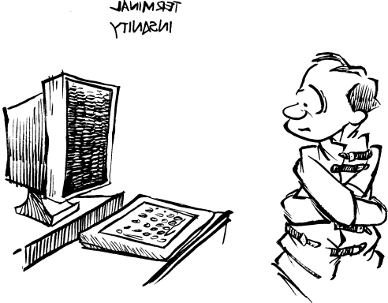

# 终端错乱：可恶！又挂了！

Unix 被宣传为一种交互式系统，这意味着程序与用户进行交互，而不仅仅是与文件系统交互。交互的质量取决于多方面因素，其中包括用户所拥有的显示和输入硬件的性能，以及程序使用这些硬件的能力。

## 原罪

不幸的是，Unix 是在电传打字机（teletype）时代设计的。电传打字机支持的操作包括打印字符、退格以及一次将纸张向上移动一行。自那以后，出现了两种不同的输入/输出技术：基于字符的视频显示终端（VDT），其输出字符速度远快于硬拷贝终端，且至少能够将光标放置在屏幕上的任意位置；以及位图屏幕，其中每个单独的像素都可以开或关（在彩色的情况下，每个像素还可以从颜色映射中拥有自己的颜色）。

一旦不止一家公司开始销售 VDT，软件工程师们立刻面临一个问题：不同厂商使用不同的控制序列来完成类似的功能。程序员必须找到应对这些差异的方法。

备受尊敬的 Digital Equipment Corporation（DEC）的程序员们采用了非常简单粗暴的办法来解决多样化终端的问题。由于他们公司同时制造硬件和软件，他们干脆不支持任何其他厂商生产的终端。于是，他们将显示信息的算法硬编码到他们的 VMS 操作系统、应用程序、脚本、邮件消息以及任何系统字符串中，这些算法只适用于标准的 DEC VT52（后来是 VT100、VT102 等）终端。实际上，在 DEC 的 ZK1、ZK2 和 ZK3 大楼内，每逢节假日，大家还会写一些动画“圣诞贺卡”并发送给其他毫无防备的用户。（可以把这些看作是计算机蠕虫和病毒的早期前身。）

在 MIT 人工智能实验室，采取了不同的解决方案。不是让每个应用程序学习如何在用户屏幕上显示信息，而是将这些算法内置在 ITS 操作系统本身。实验室 ITS 内核中的特殊输入/输出子系统会跟踪用户屏幕上显示的每一个字符，并自动处理不同终端之间的差异。新增一种终端只需要告诉 ITS 该终端的屏幕大小、控制字符和操作特性，现有的所有应用程序就能在新终端上无须修改地运行。
由于屏幕由操作系统管理，而不是每个应用程序管理，每个程序都可以做诸如刷新屏幕（如果你连接不稳定的话）或者与另一个程序共享屏幕部分的操作。甚至还有一个系统工具可以让一个用户看到另一个用户屏幕的内容，非常适合不必走到对方终端前就能回答问题的场景。

Unix（通过 Bill Joy）采取了第三种办法。操作视频显示终端的技术被写成一个库打包起来，但这个库并没有链接进本应在的内核（或者放入共享库），而是链接到了每个应用程序中。当 termcap 库发现 bug 时，使用该库构建的程序必须重新链接（有时还得重新编译）。由于屏幕是按应用程序来管理，不同应用程序无法在同一屏幕上协同工作。相反，每个程序都假设自己拥有完全控制权（鉴于当时 Unix 的状态，这并不是一个坏假设）。或许更重要的是，Unix 内核仍然认为自己是在传统的电传打字机上显示信息。

因此，Unix 从未制定出一个合理的计划或模型让程序与 VDT 交互。一个又一个半吊子的补丁（如 termcap）继之以另一个半吊子的补丁（如 curses），试图给程序一定程度的终端独立性，但根本问题始终未得到解决。几乎没有 Unix 应用能利用“智能”终端功能，除了光标定位、插入行、删除行、滚动区域和反转视频。如果你的终端支持画线、保护字段、双高字符或者可编程功能键，那就很遗憾：这就是 Unix。

这种捕风捉影、权宜之计的态度最终催生了 X Window System，一个庞大且笨拙的折衷方案，它通过带来更大更昂贵的问题来解决这些终端兼容性问题。

有趣的是，X Window System 来源于 MIT，而更加优雅的 NeWS 则由 James Gosling 编写并来自 Sun。真奇怪。
这正说明 Unix 世界有自己的愿景，并且会实现它想要的东西。

如今，Unix 对基于字符的 VDT 的处理糟糕到开玩笑都无法表达其恐怖程度。X 和位图屏幕的出现并不会让这个问题消失。办公室、管理层的口袋里，以及调制解调器连接的另一端，仍然有大量 VDT 连接到 Unix。如果 Unix 爱好者说得没错，每台 Unix 机器真的有许多用户（相比每台 DOS 机器只有一个用户），那么使用 Unix 的人中有超过三分之二正被困在对 VDT 支持不足的环境中。他们使用的最具交互性的工具很可能是 vi。

事实上，使用最频繁的 X 应用程序是 xterm，一款 VT100 终端模拟器。猜猜用来控制文本显示的软件是什么？正是 termcap 和 curses！

## 诅咒（curses）的魔力

交互式程序需要一个它们将控制的显示设备模型。系统支持显示设备最合理的方法是通过一个抽象的 API（应用程序接口），支持诸如“向后移动字符”、“清屏”和“定位光标”等命令。Unix 选择了最简单的方案——根本不提供 API。多年来，程序们通过硬编码最流行终端的转义序列来凑合解决缺乏图形 API 的问题。最终，随着 vi 的出现，Bill Joy 提供了基于一个名为 termcap 的终端描述文件的 API。这个 API 有两个根本缺陷：

1. termcap 文件的格式——包括光标移动命令、遗漏的命令，以及表示复杂转义序列的技术——是且至今仍然是为 vi 的特性量身定做的。它并没有尝试描述终端的多样功能，而只关注与 vi 相关的部分。时间在一定程度上缓解了这个问题，但不足以克服最初设计的缺陷。
2. 这个为 vi 设计的 API 引擎不能被其他程序员在他们的代码中使用。

因此，其他程序虽然可以读取存储在 termcap 文件中的转义序列，但必须自行判断在何时向终端 [^1] 发送哪些序列。

于是，Ken Arnold 亲自编写了一个名为 curses 的库，提供一个通用的 VDT API。这个库遇到了三个问题。首先，Ken 继承了 vi 的“脑残”设计，决定继续使用 termcap 文件。重新开始，从历史错误中学习，本该是正确的选择。其次，curses 代码并不专业。像大多数 Unix 工具一样，它偏重简洁而非健壮。第三，它只是一个普通库，就像 /etc/termcap 本身没有正式地位一样，因此它不是一个可移植的解决方案。由于这些问题，只有部分 Unix 社区使用 curses。你总能从其他程序中分辨出 curses 程序：它们屏幕更新缓慢，光标移动多余，避免使用那些能让屏幕更易理解的字符属性。它们用“|”、“-”、“+”等字符来画线，即使终端支持线条绘制字符集。直到 1994 年，基于字符的 VDT 依然没有标准的 API。

[^1]: 更糟糕的是，AT\&T 开发了自己不兼容的终端能力表示系统，称为 terminfo。

### 无意义的分隔符

关于终端处理的短视有其历史根源。它始于这样一个想法：查看文本文件的方式就是将其字符发送到屏幕。（这种态度与 Unix“一切都是字节流”的信条相符。）但问题就在于，这实际上违反了抽象原则。文本文件的逻辑结构是由某种换行分隔符分隔的一系列行。理解这一结构的程序理应负责显示文件。人们可以通过让换行分隔符变成发送到终端时会执行回车和换行的字符，来省去显示程序。这条路充满了善意，也充满了类似这种简单 hack 的陷阱。片刻的便利优先于健壮性和抽象性。

抽象（API）之所以重要，是因为它使系统能进一步扩展；它是构建的干净基础。将换行定义为“换行符加回车符”就是阻碍系统逻辑扩展的一个例子。例如，Unix 社区中最受微脑症影响的人喜欢用生成包含转义序列的文件的 hack，当这些文件被管道传给终端时，会显示某种动画效果。他们开心地把这些文件发给朋友，而不做作业。这是个有趣的 hack，但这些文件只在一种终端上有效。试想如果有一个用于控制终端的 API，且能把这些命令嵌入文件，这些文件就能在任何终端上使用。更重要的是，这个 API 构成了扩展、文件可移植性和相关产业的基础。比如，给 API 增加声音支持，系统就可以自豪地称为“多媒体”。

根本上，不仅需要 API，而且它必须在内核中或者作为标准的动态链接库存在。操作系统的某部分应该跟踪终端类型并提供必要的抽象屏障。一些 Unix 狂热者拒绝相信或理解这一点。他们认为每个程序都应该自己发送转义序列给终端，而不需要 API 的开销。我们给这些人一个建议：让他们拥有一个把磁盘也像终端一样对待的系统：没有 API。应用程序可以直接发送原始控制命令到磁盘。这样，当程序出错时，屏幕不是乱码，而是磁盘变成乱码。程序将依赖系统上安装的特定磁盘，有些能用，有些不能用。

当然，这样控制硬盘的提议是疯狂的。每个硬盘都有其自身特性，这些差异最好由设备驱动程序在一个地方处理。不是每个程序或程序员都能做到完美无误：读写磁盘操作应该只在操作系统的一个地方完成，写好、调试好、然后不再动。为什么终端就应该被区别对待呢？强迫程序员了解他们程序如何与终端通信，充其量只能说是中世纪的做法。Johnny Zweig 直言不讳地说：

> 日期：1990 年 5 月 2 日 17:23:34 GMT
> 
> 发件人：[zweig@casca.cs.uiuc.edu](mailto:zweig@casca.cs.uiuc.edu)（Johnny Zweig）
> 
> 主题：/etc/termcap
> 
> 新闻组：alt.peeves2[^2]
>
> 作为一名科学家兼软件工程师，我认为根本没有任何理由让任何人知道 /etc/termcap 的存在，更别说还得去折腾设置正确的环境变量才能用 vi 编辑文件。某个傻瓜还给我添乱，大多数 termcap 竟然把“xterm”当作 80x65 行显示器。对我们这些用 X WINDOWS 系统在工作站上显示窗口的人来说，80x65 行就像自行车上的可躺式桶形座椅一样毫无意义——太大了，屏幕根本放不下足够多的内容。这个笨蛋应该被杀两次。
>
> 弄清楚我到底用的是什么终端，似乎不该比发射核导弹精准到 10 码内、登月或者玩俄罗斯方块还难。
>
> 30 年来无数人在辛勤努力写软件，不让用户感到毛骨悚然，为什么这些狗屎问题还没被解决？第一个说“你只要输入‘eval resize’”的人，我会狠狠地打他一拳，真是个没抓住重点的呆瓜。这些东西本应在用户输入命令的 11 级软件以下层级被处理——该死的硬件应该能自动识别终端类型，如果不能，应该在我的控制台上显示一条消息：“你用的是烂硬件，而且你是个失败者；放弃吧，找份正经工作去。”
>
> ——Johnny Terminal

这种状况，就像体制化的官僚机构一样，虽然难以接受，但如果有解决办法的话，还是能勉强忍受的。然而 Unix 并没有提供任何解决办法，实际上，它通过随机扰乱发送给 VDT 的控制命令，使问题更加复杂。一个想要直接操作光标位置的程序，必须经历比奥运体操运动员还复杂的动作。

举例来说，假设一个程序通过发送转义序列，随后发送 x 和 y 的二进制编码，将光标定位到 (x, y) 位置。Unix 不允许任意的二进制值不受影响地发送到终端。GNU Termcap 文档描述了这个问题以及相应的解决方法：

> 使用‘%.’编码的参数可能会生成空字符、制表符或换行符。这些字符可能会引发问题：空字符会让 tputs 认为字符串结束，制表符可能被内核或其他软件展开为空格，换行符则可能导致内核添加回车符或通常用于换行的填充字符。为了防止这些问题，tgoto 会小心避免这些字符。具体做法是：如果目标光标位置的值会引起问题（也就是说，值为零、九或十），tgoto 会先将其加一，然后通过附加一个字符串来使光标向后或向上移动一个位置，以此进行补偿。

Alan Bawden 对这种情况的评价是：

> 日期：1991 年 11 月 13 日 14:47:50 EST
> 
> 发件人：Alan Bawden [Alan@lcs.mit.edu](mailto:Alan@lcs.mit.edu)
> 
> 收件人：UNIX-HATERS
> 
> 主题：别跟我说 curses
>
> 这话说得太脑残了，简直让我泪流满面。一方面，Unix 要求每个程序手动生成驱动用户终端所需的转义序列；另一方面，Unix 却让发送这些序列变得很困难。这就像去一家没有酒牌的餐厅，你得自己带啤酒，而餐厅却只给你一个小口杯来喝。

[^2]: 由  Olin Siebert 转发至 Unix 痛恨者

### 自定义你的终端设置

试图理解这些，你很快会发现你的 .cshrc 和 .login 文件堆满了各种陈旧杂乱的权宜之计，每一段都用来处理不同的终端或网络连接类型。问题在于，没有一个统一连贯的终端模型，不同负责不同任务的程序都必须被告知不同的关键参数。telnet 和 rlogin 维护一套自定义设置，tset 维护另一套，stty 又是一套。这些子系统就像属于不同工会的成员一样。更复杂的是，尤其是 stty，这些子系统根据它们所处的 Unix 版本（本地分会）采用不同的命令和选项。（Unix 中透明的网络环境简直就是自相矛盾。）我们的下一位通讯员就遭遇了这些程序的“弹片”纷飞：

> 日期：1991 年 1 月 31 日 11:06 -0500
> 
> 发件人：“John R. Dunning” [jrd@stony-brook.scrc.symbolics.com](mailto:jrd@stony-brook.scrc.symbolics.com)
> 
> 收件人：UNIX-HATERS
> 
> 主题：Unix 与终端设置
>
> 有一天我尝试 telnet 登录本地的 Sun 机器做点事情，但当我启动 emacs 时，它只在虚拟终端屏幕顶部显示了一个小小的窗口。我退出后确认了 TERM 和 TERMCAP 环境变量设置正确，重试，但不行，它仍然认为我的终端只有几行高。我挣扎了一阵无果，最后放弃，发邮件给本地 Unix 大师（匿名，他应该在名单上），问 Unix 到底怎么判断终端大小，我该怎么办，结果还是用回了 Zmacs，早该如此。
>
> 大师回复了我的邮件，回答有些隐晦：“大概是 Unix 默认值吧。你检查过 stty 的行数和列数设置吗？”我本该懂的，但没懂，于是去问他这是什么意思。我们登录问题的 Sun，果然，输入“stty all”显示 Unix 认为终端高度是 10 行。我问：“为什么设置环境变量不够？”他答：“因为信息存储在不同地方。你得运行 tset。”我说：“我在登录文件里运行了。”他说：“嗯，你确实运行了，没参数的 tset。我想知道它干什么？”我说：“不知道，我是从我在其他老 Unix 账户复制的这个文件。或许我该查查 tset 文档？还是会更糊涂？”他答：“别查，没用。”我问：“那我该怎么办？你登录文件里怎么做？”他把自己的登录文件打印出来。他说：“哦，我这里有一段神秘的壳代码，我也不知道怎么回事，只是多年来一直带着它……”
>
> 当时我觉得理解这一切毫无意义（即使本地大师都不懂，凡人就别尝试了），回办公室直接强制设置自己想要的值。登录后再“stty all”，看，终端高度变成了 48 行！那正是我们几分钟前输入的值。
>
> 我开始觉得软件状态有点腐败，做了些实验。发现很多终端设置其实是在某个低层终端端口对象里，登录时没人初始化它们，你可能会继承别人上次会话的遗留设置。由于终端特性信息散落各处，没有集中管理，就出现了各种临时的工具来协调不同数据库的一致性。真是糟糕透顶。
>
> 我不知道这对你们来说是否是旧闻，但我觉得很震惊。差点想念我的 VMS 机器了。

