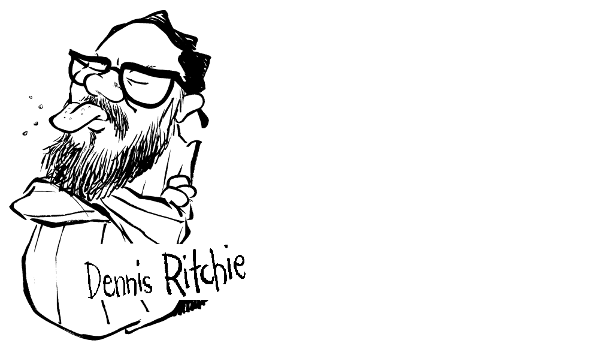

# 反序言（作者： Dennis Ritchie）

- 作者：Dennis Ritchie

>发件人：[dmr@plan9.research.att.com](mailto:dmr@plan9.research.att.com)
>
>日期：1994 年 3 月 15 日 星期二 00:38:07 EST
>
>主题：反序言
>
>致本书的贡献者们：
>
>我屈从于你们在序言中提出的诱惑：我确实把你们视作嫉妒不满者和浪漫的记忆守护者。你们如此怀念的那些系统（TOPS-20、ITS、Multics、Lisp Machine、Cedar/Mesa、Dorado）不仅仅是被遗弃的，它们正从底下肥沃着这片牧场。
>
>你们的判断并不敏锐，反而被隐喻迷醉了。在序言中，你们先是忍受炎热、虱子和营养不良，然后变成古拉格的囚犯。在第一章中，你们时而被病毒感染，时而深受毒瘾折磨，时而因基因组肿胀而头脑昏沉。
>
>然而，你们那没有连贯设计的监狱依旧囚禁着你们。既然它没有坚固之处，怎么会这样？理性的囚犯会利用薄弱环节，从混沌中创造秩序；相反，像自由软件基金会这样的集体却通过构建几乎与现存牢房兼容、但功能更多的牢房来证明其狱卒的正当性。那位拥有麻省理工学院三个本科学位的记者、那位微软的研究员以及那位苹果的高级科学家或许愿意说几句他们被转移至的新“监狱”的规章制度。
>
>你们对可能性的认知一点也不纯粹：有时你们想要的正是自己已有的，只是希望能由自己来完成；有时你们想要不一样的东西，却似乎无法让人们去使用；有时人们不禁怀疑，为什么你们不闭嘴，让大家买台装有 Windows 的 PC 和 Mac 就好了。没有古拉格，没有虱子，只有由《刺猬索尼克》所设定的未来，那里的知识氛围和交互风格。你们声称追求进步，但主要是在不断地抱怨。
>
>这是我的隐喻：你们的书是一锅塞满了细致入微观察的布丁，很多都构思巧妙。就像屎一样，它含有足够多未被消化的营养块，能养活某些人。但它绝非一道可口的馅饼：它散发着太多的轻蔑和嫉妒的气味。
>
>祝胃口好！
