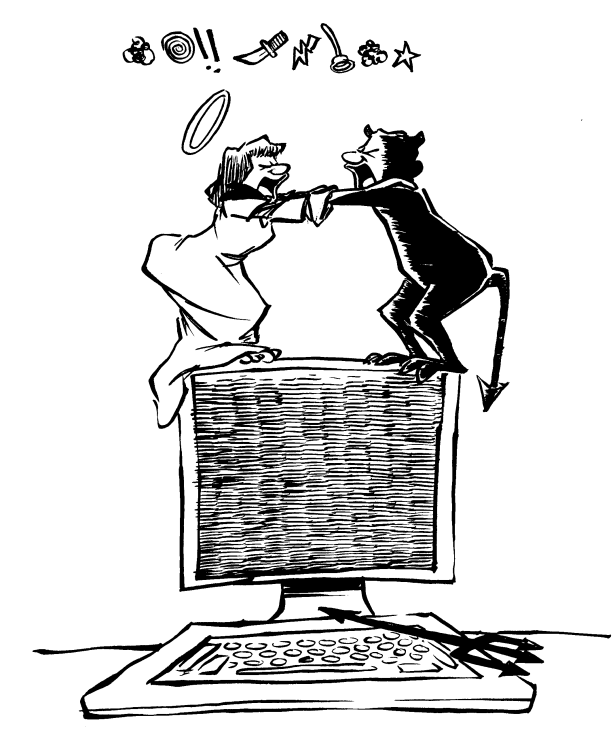

# 前言

- 作者：Donald A. Norman

《Unix 痛恨者手册》？为什么？这能有什么用？读者又会是谁？真是个变态的想法。但话说回来，我已经坐在自己客厅里——还穿着外套——看了这份手稿一个多小时了。准确说，一个半小时。真是本怪书。但又很吸引人。两个小时。好吧，我认输了：我喜欢它。这是一本变态的书，但它也有种同样变态的吸引力。谁能想到呢：Unix，黑客们的色情读物。

当这帮爱扔石头的暴民邀请我加入他们时，我想起了自己当年写过的一篇经典文章，经典到甚至被收录进选集。但它在这本书里居然连个引用都没有。好吧，我来补上这一笔：

>Norman, D. A.《Unix 的麻烦：用户界面糟透了》。发表于 *Datamation*，第 27 卷第 12 期，1981 年 11 月，第 139–150 页。
重印于 Pylyshyn, Z. W. 与 Bannon, L. J. 主编的《计算机革命的多元视角》（第二版修订版），新泽西州希尔斯代尔，Ablex 出版社，1989 年。

人们对 Unix 这种破烂系统的痴迷到底是怎么回事？这是上世纪六十年代的操作系统，却在九十年代仍然日益流行。一款糟糕透顶的系统——只是因为其他商用系统更烂罢了。这可能是世界上唯一一款烂到让人愿意花上百万美元去改进的操作系统。让它变成图形化的（这简直是个悖论：为 Unix 做图形用户界面）。

你知道 Unix 真正的问题所在是什么吗？真正的问题是它太流行了。它本来就不是顺应流行而设计的。它只是给一小撮人用的，那些躲在实验室里鼓捣 DEC 的旧 PDP-11 计算机的人。我曾经也有一台。那是一台让人安心的、屋子大小的机器。速度快——一条指令大约一微秒。指令集很优雅（真正的程序员，懂吧，是写汇编代码的）。面板上有拨动开关，还有指示灯能显示寄存器里的内容。你再也不需要像 PDP-1 和 PDP-4 那样用开关输入启动程序了，除此之外它还是一台“真”电脑。不像现在这些玩具，没有闪灯，没有寄存器开关。你甚至不能单步调试当今的计算机了。它们永远全速运行。

PDP-11 有 16000 字的内存。这比我以前的 PDP-4 的 8000 字可是巨大的进步。我现在用来打字的 Macintosh 有 64MB 内存：Unix 压根不是为 Mac 这种机器设计的。当你有这么多内存的时候，还会有什么困扰？Unix 是在控制台还没有 CRT 显示器的年代设计的。对我们很多人来说，主要的输入/输出设备是每秒打印 10 个字符的全大写电传打字机（进阶用户用的是每秒 30 字符的，区分大小写）。我得赶紧补充一句，那些机器配有纸带阅读器。没错，那才是真正的计算时代。而那也是 Unix 的年代。你看看今天的 Unix：它的残骸还在那里。试着用全大写登录，许多 Unix 系统仍然会切换成全大写模式。真诡异。

Unix 曾是程序员的天堂。底层结构简单而优雅。用户界面的确垃圾得不行，但那时没人关心这些。就我所知的范围内，第一位写文章抱怨这点的人就是我（就是那篇臭名昭著的 Unix 文章）：那篇文章从我的电脑上被偷走了，随后在 UUCP-Net 上传播开来，我收到三十多页密密麻麻的讽刺挖苦回复。我甚至被拉到贝尔实验室，当着挤满礼堂的人辩解。我活下来了。更糟的是，Unix 也活下来了。

Unix 是为当时的计算环境设计的，而不是为今天的机器而生。Unix 之所以还活着，只是因为其他人做得太差了。我们可以从 Unix 身上学到很多东西：为什么就没人吸取了那些优点，然后做得更好？从零开始，造出一款真正优秀、现代化、图形化的操作系统？哦对了，还有 Unix 成功的另一秘诀：把它免费送给全世界的大学。

我必须承认我与 Unix 有一种深刻的爱恨关系。无论我多努力想逃离，它总会如影随形。而且，我确实怀念那种能力（其实是不得不）写出冗长怪异的命令串，带着神秘又不一致的参数、管道、过滤器、重定向的时代。Unix 的持续流行依然令人费解，尽管我们都知道，胜出的并不一定是最好的技术。我本想说，本书的作者们可能也和我有类似的爱恨交织，但当我在前言草稿里试图表达这一点时，他们把我怼了回去：

“当然，我们喜欢你的前言，”他们说，“但唯一真正惹人恼火的部分是‘你其实是爱 Unix 的，对吧’。不，真的不。我们真的真的讨厌它。别跟我们来‘你否认它——你看，这就说明你其实承认’那一套。”

我还是抱有怀疑：如果他们真的不爱 Unix，又怎么可能花这么多时间写这本书来痛骂它呢？这就留给读者自行判断吧。不过归根结底，这其实无所谓：如果连这本书都杀不死 Unix，那就没人能杀死它了。

至于我？我已经转向 Macintosh。不再有 grep，不再有管道，不再有 SED 脚本。只有一种简单优雅的生活方式：“您的应用程序已意外退出，错误编号 -1。确定？”

——Donald A. Norman

苹果院士

苹果电脑公司

顺便一提：

加州大学圣地亚哥分校

认知科学名誉教授
