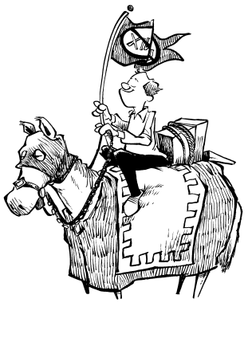

# 我们是谁

我们是学者、黑客和专业人士。我们当中没有人是在 Ken Pier 所说的计算机“东非”环境中出生的。我们都曾接触过比 Unix 更先进、更易用、更优雅的系统，而 Unix 无论过去还是将来，都无法媲美那些系统。这些系统中的许多名字如今已逐渐被遗忘，比如 TOPS-20、ITS（不兼容分时系统）、Multics、Apollo Domain、Lisp 机、Cedar/Mesa 和 Dorado。我们中有些人甚至使用 Mac 和 Windows 机器。我们当中的许多人是高水平程序员，曾在 Unix 系统上努力实践自己的技术。把我们一棒子打死，认为我们是嫉妒的抱怨者，是怀念那些被 Unix 商业成功所取代的系统的浪漫守护者，是错误的：我们的判断敏锐，对可能性的认知纯粹，我们的愤怒真实。我们追求进步，而非复兴古老遗物。

我们的故事开始于计算机经济学一步步将我们送进 Unix 古拉格（劳改营）的过程。我们开始彼此传递纸条。起初，那些纸条谈论文化孤立、原始的仪式和礼节——我们曾以为那只存在于神话和幻想中——谈论贫困和屈辱。随着时间推移，纸条成了振奋士气的工具，常带着基于观察的黑色幽默。最后，正如策划越狱的囚犯必须比狱卒更加了解监狱的结构一样，我们挖掘并探索了每一个角落。令我们震惊的是，我们发现我们的监狱没有连贯的设计。因为没有牢固的支撑，没有理性的基础，它对有计划的攻击免疫。我们的理性无法扰乱它的混乱，传递的信息变得充斥着失败主义，记录着混乱和损失。

这本书讲述的是那些被 Unix 虐待的人们的故事，围绕着 Unix 痛恨者邮件列表中的内容展开。这些笔记读起来不总是赏心悦目，有些灵感迸发，有些粗鄙，有些令人沮丧，几乎没有希望。如果你想听听另一面的故事，可以去读 Unix 的使用手册和销售宣传册。

这本书不能提升你的 Unix 技能。如果你够幸运，也许你最终会完全放弃使用 Unix。
