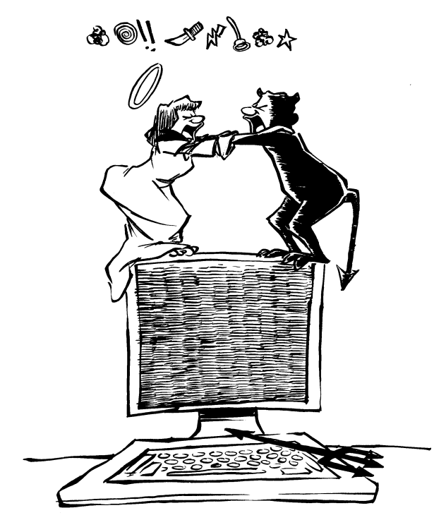
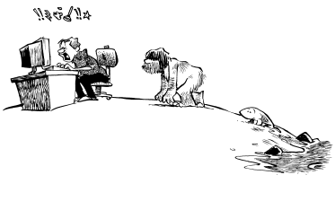

# 序言

>“我把一个人的计算机生涯从 Unix 开始——比如从本科阶段开始——比作在东非出生。那里热得令人难以忍受，身上爬满虱子和苍蝇，营养不良，还患有多种本可以治愈的疾病。但对东非的年轻人来说，这就是自然的生活状态，他们就在其中度日。当他们意识到原来世界并非如此时，已经太晚了。他们已经认为编写 shell 脚本是一种天经地义的事情。”
>
>—— Ken Pier，施乐帕洛阿尔托研究中心（Xerox PARC）

现代 Unix[^1] 是一场灾难。它是一个“非操作系统”：不可靠、反直觉、不宽容、不友好、功能薄弱。几乎没有什么比试图强迫 Unix 做一些有用又不简单的事更令人沮丧了。现代 Unix 阻碍了计算机科学的发展，浪费了数十亿美元，还摧毁了许多认真使用它的人的常识。

夸张吗？读完本书你就不会这么想了。

[^1]: 从前，Unix 是 AT\&T 的商标。后来是 Unix Systems Laboratories 的商标。随后又成为 Novell 的商标。据我们所知，Novell 曾考虑将该商标转交给 X/Open，但由于最近各种交易的频繁变动，很难确定目前商标的具体归属。

## 设计缺陷

最初的 Unix 解决了一个问题，而且解决得很好，就像罗马数字系统、梅毒的水银治疗法和复写纸一样。和这些技术一样，Unix 也理应成为历史。它是为一台内存少、磁盘小、没有图形界面、没有网络、没有电源的机器开发的。那时候，人们必须采取以下态度：

* “小而简单比完整且正确更重要。”
* “只需要解决问题的 90%。”
* “一切都是字节流。”

这些态度对于承载复杂且重要应用的操作系统来说，已经不再适用。当 Unix 被未经培训的操作员用于安全关键任务时，这些态度甚至可能致命。

具有讽刺意味的是，正是那些让 Unix 在计算机更小、功能更少时取得成功的特质和设计目标，现在却阻碍了它的实用性和易用性。每次在底层核心上添加新的子系统，都导致了要么被拒绝，要么出现“移植与宿主病”，伴随着大量使系统瘫痪的瘢痕组织的增生。Unix 的网络模型是一场杂乱无章的不可靠巴别塔，使 Unix 那个著名的小巧内核体积增加了四倍。它的窗口系统继承了字符界面的神秘且不友好的特性，同时又创造了新的方式，使高速计算机变得缓慢。新的系统管理工具花费的时间比节省的还多。它的邮件系统让美国邮政服务看起来异常出色。

随着时间推移，这些缺陷只会更加明显。使用 Unix 对初学者和专家来说依然是令人不愉快的体验。尽管有大量优秀的相关书籍，Unix 的安全性依然是难以捉摸的目标。尽管外设越来越快、越来越智能，高性能异步输入/输出仍然是幻想。即使厂商投入数百万开发“易用”的图形用户界面，绝大多数 Unix 版本仍然只能通过 1970 年代风格的电传打字机界面完成琐碎的系统管理工作。事实上，随着 Unix 功能的不断扩展，它反而变得越来越糟糕。Unix 无法从内部修复，必须被抛弃。

## 我们是谁

我们是学者、黑客和专业人士。我们当中没有人是在 Ken Pier 所说的计算机“东非”环境中出生的。我们都曾接触过比 Unix 更先进、更易用、更优雅的系统，而 Unix 无论曾经还是将来，都无法达到那些系统的高度。这些系统中的许多名字如今已逐渐被遗忘，比如 TOPS-20、ITS（不兼容分时系统）、Multics、Apollo Domain、Lisp 机、Cedar/Mesa 和 Dorado。我们中有些人甚至使用 Mac 和 Windows 机器。我们中的许多人是高水平程序员，曾在 Unix 系统上努力实践自己的技术。把我们一棒子打死，认为我们是嫉妒的抱怨者，是怀念那些被 Unix 商业成功所取代的系统的浪漫守护者，是错误的：我们的判断敏锐，对可能性的认知纯粹，我们的愤怒真实。我们追求进步，而非复兴古老遗物。

我们的故事开始于计算机经济学一步步将我们送进 Unix Gulag（Unix 劳改营）的过程。我们开始彼此传递纸条。起初，那些纸条谈论文化孤立、原始的仪式和礼节——我们曾以为那只存在于神话和幻想中——谈论贫困和屈辱。随着时间推移，纸条成了振奋士气的工具，常带着基于观察的黑色幽默。最后，正如策划越狱的囚犯必须比狱卒更了解监狱的结构一样，我们挖掘并探索了每一个角落。令我们震惊的是，我们发现我们的监狱没有连贯的设计。因为没有强点，没有理性的基础，它对有计划的攻击免疫。我们的理性无法扰乱它的混乱，传递的信息变得充满了失败主义，记录着混乱和损失。

这本书讲述的是那些与 Unix 处于虐待关系中的人们的故事，围绕着Unix 痛恨者邮件列表中的内容展开。这些笔记读起来不总是赏心悦目，有些灵感迸发，有些粗俗，有些令人沮丧，几乎没有希望。如果你想听听另一面的故事，可以去读 Unix 的使用手册或者销售宣传册。

这本书不会提升你的 Unix 技能。如果你幸运，也许你最终会彻底放弃使用 Unix。

## Unix 痛恨者往事

那是 1987 年，迈克尔·特拉弗斯（Michael Travers）还是麻省理工学院媒体实验室的一名研究生，正在迈出通往未来的第一步。多年来，特拉弗斯一直在他那台 Symbolics Lisp 机（昵称 LispM）的控制台上编写庞大且优美的程序，LispM 是实验室的两台最先进人工智能工作站之一。但这一切即将结束。出于成本和效率的考虑，媒体实验室决定淘汰 LispM。特拉弗斯发现，如果他想继续在麻省理工进行研究，就必须使用实验室的 VAX 大型机。

这台 VAX 运行的是 Unix。

麻省理工有着悠久的传统，维护着专门针对特定操作系统的邮件列表。这些列表面向系统黑客，例如 ITS-LOVERS，专为麻省理工人工智能实验室的 Incompatible Timesharing System（不兼容分时系统）的程序员和用户组织。这些列表针对的是专家，是那些能够且确实编写过自己的操作系统的人。迈克尔·特拉弗斯决定创建一个新的列表，他称之为 Unix 痛恨者：

>日期：1987 年 10 月 1 日 星期四 13:13:41 EDT
>
>发件人：Michael Travers <mt>
>
>收件人：Unix 痛恨者
>
>主题：欢迎加入 Unix 痛恨者
>
>遵循 Unix 痛恨者的传统——这是一个面向那些难以接受最新操作系统技术的倔强人士的邮件列表。
>
>如果你实际上并不是 Unix 痛恨者，请告诉我，我会将你移除。请添加你认为需要情绪发泄渠道的其他人。

Michael 发送给 Unix 痛恨者的第一封信中，包含了另一位刚加入 Unix Gulag 的新成员写的一篇关于 Suns 的合理愤怒控诉：John Rose，是马萨诸塞州一家知名计算机制造商的程序员（该公司律师承诺只要我们不公布公司名称，就不会起诉我们）。和 Michael 一样，John 最近也被迫放弃了 Lisp 机器，改用运行 Unix 的计算机。经过一周的工作受阻，他向公司内部支持邮件列表发送了这条消息：

>日期：1987年2月27日 星期五 21:39:24 EST
>
>发件人：John Rose
>
>收件人：sun-users，systems
>
>主题：Suns 的利弊

好吧，我这里正好有点空闲，因为我的 Sun 机上的编辑器窗口在我眼前突然消失了，带走了我一天的 Emacs 状态。

所以，问题自然来了，Suns 究竟有什么优点和缺点？

这是我用 Sun 的第五天。巧合的是，我的 Emacs 也是第五次崩溃。所以我觉得我开始有点了解 Suns 的优点了。

Suns 的一个不错的地方是它们启动真的很快。如果你还没见过它启动，你应该看看。对我们这些 LispM 要整个上午才能启动的人来说，简直令人振奋。
另一个好处是 Suns 的简洁。你知道 LispM 总是跳进那个糟糕、复杂的调试器里，显示令人困惑的回溯信息，还期待你告诉它下一步怎么做？Suns 总是知道该怎么做。它们会生成一个核心文件并终止出错进程。还能有什么比这更简单？如果有窗口，它就会立刻关闭。（我刚才是不是感到一阵寒意？）

这种简洁大大减少了调试时间，因为你立刻放弃了找出问题的希望，只能从头开始重新执行你刚才正在进行的复杂任务。实际上，这个时候，你干脆重启吧。去吧，启动真的很快！
Suns 启动快的一个原因是它们加载的东西更少。LispM 把代码加载到内存里时，还加载了大量调试信息。比如，每个函数都会记录参数和局部变量的名字、所有宏展开成该代码的名称、文档字符串，有时还有解释型定义，纯粹是为了保险起见。
哦，每个函数还会记住它定义在哪个文件里。你完全不知道这有多有用：有一个编辑器命令叫“meta-point”，它可以让你立刻跳转到任何函数的源代码，过程流畅不中断。任何函数，都不是某些特别预设的函数。同样，还有一个按键可以瞬间显示函数的调用序列。

过去几天我一直登录在 Sun 上，我的 Meta-Point 反射动作依然不减，但完全被挫败了。

我正在做的程序大约有 80 个文件。想要编辑函数 Foo 的代码，我得切换到 shell 窗口，在各种文件中用 grep 搜索 Foo 的名字。然后我得输入合适的文件名。然后我得纠正拼写错误。最后再在文件里搜索。过去只需五秒的事，现在要花一两分钟。（不过朋友之间一个数量级的差别算什么呢？）

到这时候，我真想看看 Sun 的最佳表现，于是忍不住想重启它几次。

Unix 有一个很棒的命令叫“strip”，用它可以强制程序去掉所有调试信息。Unix 程序（比如 Sun 的窗口系统）通常都是 stripped 的，因为调试信息占用磁盘空间，且会拖慢启动速度。这意味着你不能用调试器调试它们。但这无所谓，你见过 Unix 的调试器吗？真的。

你知道所有标准的 Sun 窗口应用程序（“tools”）其实是一个庞大的 3/4 兆字节二进制文件吗？这让这些工具共享代码（里面有大量代码）。Lisp 机器也是通过这种方式共享代码的。工作站保护我们内存投资的方式就是代码共享，挺不错的。

但所有标准的 Sun 窗口应用程序（“tools”）都不支持 Emacs。Unix 应用程序也不能被打补丁；你必须有源代码，才能打补丁，然后从源代码重新生成应用程序。

但我真想让 Sun 的鼠标能跟 Emacs 通信。于是我找来了几百行代码（来自 GNU 源码），编译并链接到所有标准 Sun 窗口应用程序（“tools”）共享的那段代码里。结果很快！Emacs 终于能用鼠标了！就像 LispM 一样；我记得当年为了让 LispM 的终端程序和 Emacs 配合也做过类似的破解。只用了大约 20 行 Lisp 代码。（虽然这比起刚才几百行代码简单多了，不过朋友之间数量级差别算什么呢？）

好了，我运行了我的 Emacs-with-mice 程序，开心地玩着鼠标。不久 Emacs 开始报错，提示“内存耗尽”和“段错误，生成核心转储”。小小的 Unix 控制台安慰自己说“clntudp\_create：内存不足”。

最终，我的 Emacs 窗口决定该结束一天的工作了。

发生了什么？显然是两件事。首先，当我为窗口系统创建自定义补丁，使鼠标点击能够传递给 Emacs 时，我生成了另一个巨大的三四百兆字节的二进制文件，这个文件并不与标准的 Sun 窗口应用程序（“tools”）共享空间。

这意味着，与其说窗口系统运行时只占用一个庞大的共享对象代码块，并占据我的交换盘空间，不如说我有了两个这样庞大的代码块，除了几页代码之外几乎完全相同。

所以，为了能够用鼠标操作编辑器，我额外支付了一个兆字节的交换空间。（Emacs 本身又是第三个庞大的代码块。）

Sun 内核显然快要没空间了。你对窗口系统做的每一个微小修改，都会复制整个窗口系统。

但这还不是全部：显然还有其他占用大量交换空间的庞然大物。某些网络程序的数据段异常巨大，而且随着时间推移会不断增长，最终我猜会占满整个交换空间。所以你无法让 Sun 机器长时间开机。这也是我很庆幸 Sun 机器启动很方便的原因！

但为什么网络服务器的内存占用会随着时间增长？你必须知道，Sun 软件会动态分配非常复杂的数据结构。你应该对每个分配的结构调用“free”，但程序员的疏忽或冷漠使得一些垃圾数据不可避免地残留。最终交换空间就被填满了！

这让我开始幻想一种工作站架构，专门优化用于创建和操作大型、复杂、相互关联的数据结构，同时有某种魔法般的机制能在无需程序员干预的情况下自动释放存储。这样的工作站可以连续运行数天，自动回收垃圾，不必频繁重启。

但当然，Sun 机器非常擅长启动！它们甚至有时会自发重启，让你知道它们处于巅峰状态！

控制台刚又抱怨内存不足。

天哪，我都没时间谈论过去一周里那些我不用操心的 LispM 功能了。比如增量重编译和加载，或者从 Lisp Listener 进行程序的增量测试。或者一个你真正可以教会新东西的窗口系统（我怀念那个对鼠标敏感的 Lisp 窗体）。或者严格区分指针和整数的安全标签架构。或者 Control-Meta-Suspend 键。或者手册。

是时候重启了！

John Rose 给公司内部邮件列表发了封邮件。不知怎么的，这封邮件被转发给了媒体实验室的 Michael Travers。John 并不知道 Michael 会为他自己和其他痛恨 Unix 的朋友创建一个邮件列表并发出邮件。但 Michael 做了，而且七年后，John 仍然在Unix 痛恨者邮件列表上，和其他数百人一起。

在那场火爆讨论的末尾，John Rose 加了这样一段免责声明：

【说真的，伙计们：我正在尽力从这台机器上榨取价值，上述某些问题是有解决办法的。特别感谢 Bill 为我增加了交换空间。从原始 CPU 性能来看，Sun 机器确实能快速完成任务。但我需要发泄一下，因为这个“编辑器突然消失”的状况真的让我火大。】

这算什么免责声明。相关公司买 Unix 工作站是为了省钱，但他们在硬件成本上节省的很快就被支持费用和程序员生产力损失的更高开销远远抵消了。不幸的是，现在我们知道了，却已经太晚。Lisp 机器在公司里成为了渐行渐远的回忆：每个人都用 Unix。大多数人认为 Unix 是个不错的操作系统，毕竟它比 DOS 好。

或者真是这样吗？

### 你并不孤单

如果你用过 Unix 系统，你大概经历过我们和别人听说过的那些噩梦。你可能删除了重要文件，求助时却被告知是你自己的错，或者更糟，被说成是“成长的必经之路”。你可能花了几个小时写给朋友的催人泪下的信件，却因邮件服务器出错丢失，或者更糟，发给了别人。我们的目的就是告诉你，你并不孤单，你遇到的 Unix 问题不是你的错。

## 贡献者与致谢

为了撰写这本书，编辑们整理了Unix 痛恨者邮件列表六年来的档案。这些投稿者在每条收录的邮件中都有提及，并且在本书末尾设有索引。在这些邮件的基础上，Unix 痛恨者的专家们撰写了章节，出于揭露真相的使命感贡献了自己的力量。我们是：

**Simson Garfinkel**，一名记者兼计算机科学研究员。Simson 获得了麻省理工学院的三个本科学位和哥伦比亚大学的新闻学硕士学位。他本应在研究生院攻读博士学位，但因为这本书的出现，他觉得写书更有趣。Simson 还是《Practical Unix Security》（O’Reilly and Associates，1991 年）和《NeXTSTEP Programming》（Springer-Verlag，1993 年）的合著者。除了担任编辑工作外，Simson 还撰写了关于文档、Unix 文件系统、网络和安全的章节。

**Daniel Weise**，微软研究实验室的研究员。Daniel 获得了麻省理工学院人工智能实验室的博士和硕士学位，曾是斯坦福大学电气工程系的助理教授，后来决定进入 DOS 和 Windows 的真实世界。在安逸的学术职位上，Daniel 有时间参与本项目。离开斯坦福，来到多雨的华盛顿湖畔后，一个挑战性的工作和一个活泼好动的婴儿男孩成为了他的重点。除了初期编辑，Daniel 还撰写了《欢迎，新用户》、《邮件》和《终端疯狂》中的大量内容。

**Steven Strassmann**，苹果公司的高级科学家。Steven 拥有麻省理工学院媒体实验室的博士学位，是一位教会计算机良好礼仪的专家。他于 1992 年在Unix 痛恨者邮件列表上发起了这本书的倡议。目前他正在苹果公司从事 Dylan 开发环境的工作。

**John Klossner**，常驻剑桥的漫画家，他的作品散布在美国东北部大部分地区。业余时间，John 喜欢乘坐公共交通工具。

**Donald Norman**，苹果公司的 Apple Fellow 以及加州大学圣地亚哥分校的名誉教授。他著有 12 本以上的书籍，包括《The Design of Everyday Things》。

**Dennis Ritchie**，AT\&T 贝尔实验室计算技术研究部门负责人。他和 Ken Thompson 被许多人视为 Unix 之父。出于公平考虑，我们请 Dennis 撰写了本书的反序言。

**Scott Burson**，Zeta C 的作者，这是 Lisp 机器上的第一个 C 编译器。如今，他作为硅谷的顾问从事 C++ 编程。Scott 撰写了大部分关于 C++ 的章节。

**Don Hopkins**，资深用户界面设计师和图形程序员。Don 在马里兰大学获得计算机科学学士学位，同时在人体计算机交互实验室任职研究员。曾在 UniPress Software、Sun Microsystems、Turing Institute 和卡内基梅隆大学工作。Don 曾将 SimCity 移植到 NeWS 和 DUX Software 的 X11 上。他目前在 Kaleida 工作。Don 撰写了关于 X-Windows 灾难的章节。（为了惹恼 X 狂热粉，Don 特别要求章节标题中“X”后保留连字符，且“Windows”使用复数形式。）

**Mark Lottor**，自 1984 年首次参加 Usenix 会议起就积极痛恨 Unix。Mark 曾在 TOPS-20 系统做了八年系统程序员，之后又做了几年 Unix 系统管理员。因对 Unix 感到沮丧，他现在用汇编语言编写微控制器程序，不必担心操作系统、shell、编译器或窗口系统干扰工作。Mark 撰写了系统管理的章节。

**Christopher Maeda**，操作系统专家，希望在本书出版前获得卡内基梅隆大学的博士学位。Christopher 撰写了大部分关于编程的章节。

**Rich Salz** 是开放软件基金会（Open Software Foundation）的一名首席软件工程师，负责分布式计算环境（Distributed Computing Environment）的工作。Rich 多年来一直活跃于 Usenet，在担任 comp.sources.unix 版主的多年任期内，他制定了至今仍在使用的 Usenet 源代码分发事实标准。他还负责 InterNetNews，这是 Usenet 上最活跃的 NNTP 实现之一。更重要的是，他曾两次当选大学报纸 The Tech 的总编辑，但两次都在任期内选择退学。Rich 撰写了 Snoozenet 一章。

在制作本书过程中，我们使用并经常采纳了以下人员的邮件内容：**Phil Agre**, **Greg Anderson**, **Judy Anderson**, **Rob Austein**, **Alan Bawden**, **Alan Borning**, **Phil Budne**, **David Chapman**, **Pavel Curtis**, **Mark Friedman**, **Jim Davis**, **John R. Dunning**, **Leonard N. Foner**, **Simson Garfinkel**, **Chris Garrigues**, **Ken Harrenstien**, **Ian D. Horswill**, **Bruce Howard**, **David H. Kaufman**, **Tom Knight**, **Robert Krajewski**, **James Lee Johnson**, **Jerry Leichter**, **Jim McDonald**, **Dave Mankins**, **Richard Mlynarik**, **Nick Papadakis**, **Michael A. Patton**, **Kent M. Pitman**, **Jonathan Rees**, **Stephen E. Robbins**, **M. Strata Rose**, **Robert E. Seastrom**, **Olin Shivers**, **Patrick Sobalvarro**, **Christopher Stacy**, **Stanley’s Tool Works**, **Steve Strassmann**, **Michael Tiemann**, **Michael Travers**, **David Vinayak Wallace**, **David Waitzman**, **Dan Weinreb**, **Daniel Weise**, **John Wroclawski**, **Gail Zacharias**, 和 **Jamie Zawinski**。

Unix Barf Bag 的灵感来自 **Kurt Schmucker**，一位世界级的 C++ 反感者，也是臭名昭著的 C++ Barf Bag 的设计者。感谢 Kurt。

我们还收到了许多未在此列出人员的建议与支持，包括 **Beth Rosenberg**, **Dan Ruby**, **Alexander Shulgin**, **Miriam Tucker**, **David Weise**, 和 **Laura Yedwab**。

许多人阅读并评论了本稿的多个版本。我们特别感谢 **Judy Anderson**, **Phil Agre**, **Regina C. Brown**, **Michael Cohen**, **Michael Ernst**, **Dave Hitz**, **Don Hopkins**, **Reuven Lerner**, **Dave Mankins**, **Eric Raymond**, **Paul Rubin**, **M. Strata Rose**, **Cliff Stoll**, **Len Tower Jr.**, **Michael Travers**, **David Waitzman**, 和 **Andy Watson**。非常感谢你们提出的许多修改建议以及帮助我们纠正错别字。

我们特别感谢 **Matthew Wagner** 来自 Waterside Productions。Matt 在 1992 年五月便立刻对本书产生兴趣。一年多后，当 Simson 接手本项目时，他仍然持续关注。Matt 帮助我们联系了 IDG Programmers Press 的 **Christopher Williams**。Chris 毫不犹豫地签下了本书，并将项目转交给 **Trudy Neuhaus**，她一直负责直到项目完成。**Amy Pedersen** 是我们的出版经理。

Unix 痛恨者手册封面由 The Stock Illustration Source 的 **Ken Copfelt** 绘制。

## 排版惯例

在本书中，我们使用这种罗马字体来排版大部分正文内容，而对 Unix 痛恨者邮件列表中的恐怖故事则使用另一种无衬线字体。我们尝试将出现的命令名称加粗，将 Unix 系统函数名称用斜体表示。此外，还有一种 Courier 字体用于计算机输出，对于用户输入的信息则采用加粗的 Courier 字体。

就是这样。本书不是那种难以阅读、使用五种不同字体风格、十几种字体的晦涩计算机手册。我们讨厌那些看起来像和图坦卡蒙国王圣物一起被发掘出来的计算机手册。

本书排版时没有借助 troff、eqn、pic、tbl、yuc、ick 及任何其他愚蠢的 Unix 缩写。实际上，本书使用 FrameMaker 在 Macintosh、Windows 机器和 NeXTstation 上排版完成。
